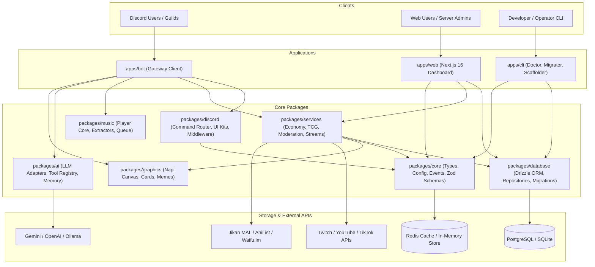

# System Architecture Specification — Ririko AI 2.0.0

## 1. Architectural Vision & Principles

Ririko AI 2.0.0 is re-architected from the ground up to modernize the legacy 1.4.0 bot into a high-performance, maintainable, production-ready platform. It adheres strictly to the comprehensive architectural guidelines set forth in `BLUEPRINT.md`.

### Core Architectural Principles:
1. **KISS (Keep It Simple, Stupid)**: Avoid over-engineered enterprise patterns (such as excessive microservices, message brokers, or heavy NestJS metadata reflection). Prefer straightforward composition, small modules, and strongly typed interfaces.
2. **Modular Monorepo**: Decouple the bot (`apps/bot`), web dashboard (`apps/web`), developer CLI (`apps/cli`), and shared domain libraries (`packages/*`) into isolated, independently testable workspaces via pnpm.
3. **Dual-Dialect Data Layer**: Design the database layer using Drizzle ORM to seamlessly support **PostgreSQL** in production environments and **SQLite** for development, CI, and low-resource self-hosting.
4. **Command Parity & O(1) Dispatching**: Provide 100% parity between Slash Commands (`/command`) and Prefix Commands (`!command`), routed via constant-time hash map lookups rather than legacy O(N) regex evaluation.
5. **Reactive Event Flow**: Replace polling intervals (e.g. 10-second music message edits) with event-driven state updates.
6. **Zero-Trust Security**: Ensure no plaintext credentials are stored in database records; enforce AES-256-GCM encryption at rest or environment variable injection.
7. **LLM Is Never the Security Boundary**: The AI suggests actions, but application security middleware verifies Discord permissions, role hierarchies, and module flags before execution.

---

## 2. High-Level Architecture Diagram



---

## 3. Monorepo Package Topology

```text
ririko-v2-2026/
├── apps/
│   ├── bot/                      # Discord Bot Gateway application
│   │   ├── src/
│   │   │   ├── commands/         # Command registration & domain bindings
│   │   │   ├── events/           # Discord Gateway event listeners
│   │   │   └── index.ts          # Main lifecycle bootstrapper
│   │   └── package.json
│   ├── web/                      # Next.js 16 Web Dashboard (React 19)
│   │   ├── app/                  # App Router pages (admin, tcg, leaderboards)
│   │   ├── components/           # UI components (Tailwind, Radix)
│   │   └── package.json
│   └── cli/                      # Developer & Operator CLI
│       ├── src/
│       │   ├── commands/         # doctor, migrate, generate, config
│       │   └── index.ts
│       └── package.json
├── packages/
│   ├── core/                     # Foundational domain contracts & config
│   │   ├── src/
│   │   │   ├── config/           # Validated environment schemas (Zod)
│   │   │   ├── errors/           # Standardized application error classes
│   │   │   ├── events/           # Typed EventEmitter / EventBus
│   │   │   └── types/            # Universal domain primitives & capabilities
│   ├── database/                 # Drizzle ORM dual-dialect database layer
│   │   ├── src/
│   │   │   ├── schemas/          # Dual-dialect schema definitions
│   │   │   │   ├── postgres/     # PostgreSQL pgTable schemas (40+ tables)
│   │   │   │   └── sqlite/       # SQLite sqliteTable schemas (40+ tables)
│   │   │   ├── migrations/       # Drizzle migration files
│   │   │   ├── repositories/     # Domain data access repositories
│   │   │   └── client.ts         # Dialect connection factory
│   ├── discord/                  # Discord UI & Command Dispatch Engine
│   │   ├── src/
│   │   │   ├── command/          # BaseCommand, SlashCommand, PrefixCommand
│   │   │   ├── router/           # O(1) interaction & prefix router
│   │   │   ├── middleware/       # Permission, cooldown, maintenance hooks
│   │   │   └── components/       # EmbedBuilder, Paginator, ButtonMatrix
│   ├── ai/                       # Multi-Provider AI & Tool Calling Core
│   │   ├── src/
│   │   │   ├── providers/        # GeminiProvider, OpenAIProvider, OllamaProvider
│   │   │   ├── memory/           # Sliding-window & persistent conversation store
│   │   │   ├── tools/            # Safe tool definitions with Zod schemas
│   │   │   └── engine.ts         # Conversational agent coordinator
│   ├── music/                    # Audio & Music System
│   │   ├── src/
│   │   │   ├── extractors/       # Multi-source resolvers (YouTube, Spotify, SoundCloud, Deezer)
│   │   │   ├── queue/            # Guild audio queue manager
│   │   │   └── player.ts         # Audio playback controller (@discordjs/voice)
│   ├── graphics/                 # Visual Card & Meme Synthesis
│   │   ├── src/
│   │   │   ├── cards/            # RankCard, WelcomeCard, TCGCard (@napi-rs/canvas)
│   │   │   └── memes/            # 11 Meme synthesis templates
│   └── services/                 # Business Domain Services
│       ├── src/
│       │   ├── economy/          # Atomic balance ledger, bank, anti-spam XP
│       │   ├── waifu-tcg/        # Ingestion, 8-tier rarity, combat, trading, market
│       │   ├── moderation/       # Case tracking, warning escalation, auto-mod
│       │   ├── stream/           # Multi-platform stream watcher & thumbnail cache
│       │   ├── giveaways/        # Database-backed giveaway scheduler
│       │   ├── free-games/       # Epic Games, Steam, GOG promotions collector
│       │   ├── avc/              # Auto Voice Channels (Join to Create)
│       │   └── reminder/         # Persistent reminder cron service
├── docs/                         # Detailed subsystem documentation
│   ├── architecture.md           # This document
│   ├── development.md            # Developer manual, CLI commands & doctor
│   ├── commands.md               # Command & Help system specification
│   ├── modules.md                # 20+ module catalog & feature flags
│   ├── adapters.md               # Provider adapter & fallback architecture
│   ├── database.md               # 40+ table schema & transaction specifications
│   ├── migrations.md             # 1.4.0 to 2.0.0 migration runbook
│   ├── testing.md                # Quality gates, deterministic RNG testing
│   ├── deployment.md             # Docker compose, health probes, runbooks
│   ├── dashboard.md              # Next.js 16 App Router & OAuth2
│   ├── ai.md                     # AI chatbot, #ririko-ai channel, safe tools
│   ├── music.md                  # Multi-source music engine & player
│   ├── moderation.md             # Case logs, warning escalation & AutoMod
│   ├── economy.md                # Double-entry ledger, bank & anti-spam XP
│   ├── waifu-tcg.md              # Ingestion, rarities, combat, marketplace
│   ├── contributing.md           # Engineering guidelines & Git standards
│   ├── legacy-feature-inventory.md # 141 command audit & mapping
│   ├── dependency-evaluation.md  # 2026 dependency justification matrix
│   ├── implementation-roadmap.md # Phases 0 through 7 Gantt schedule
│   └── adr/                      # ADR-001 through ADR-012+
└── .gemini/agents/               # 18 specialist agent configurations
```

---

## 4. Key Subsystem Architectures

### 4.1. Command Dispatch & Interaction Pipeline
1. Commands register their primary name and aliases into an in-memory hash map (`Map<string, Command>`).
2. Incoming interactions (Slash commands, Autocomplete, Buttons, Select Menus) resolve immediately in **O(1)** time.
3. Message prefix commands split arguments cleanly, perform O(1) lookup, and pass through a typed **Middleware Pipeline**:
   - `RateLimitMiddleware`: Prevents spam across user, guild, and channel buckets.
   - `GuildOnlyMiddleware`: Verifies guild context.
   - `PermissionMiddleware`: Checks member Discord bitfields, bot bitfields, role hierarchy, and blacklists.
   - `CooldownMiddleware`: Enforces per-user command cooldowns.
   - `MaintenanceMiddleware`: Bypasses only for bot owners during maintenance.

### 4.2. Database & Dialect Abstraction Strategy
- Fully cataloged in [docs/database.md](file:///Z:/Projects/ririko-v2-2026/docs/database.md) across 40+ domain tables.
- Dual-Dialect Support: PostgreSQL for production; SQLite (WAL mode, foreign keys enabled) for local dev and self-hosting.
- All balance modifications, card trades, and market purchases execute within ACID transactions with negative balance checks.

### 4.3. AI Chatbot & Safe Tool Calling
- Fully detailed in [docs/ai.md](file:///Z:/Projects/ririko-v2-2026/docs/ai.md).
- **Dedicated AI Channel (`#ririko-ai`)**: Messages trigger conversational AI without a prefix.
- **Isolated Context**: Memory is strictly isolated per `(guild_id, user_id, channel_id)`. Alice's context is never leaked to Bob.
- **Deterministic Time Tool**: `get_current_time()` resolves UTC, guild timezone, and user timezone.
- **Security Barrier**: LLM is never the security boundary; application verifies permissions before invoking tools. Shell, raw SQL, and destructive actions are strictly blocked.

### 4.4. Audio & Music Architecture
- Fully detailed in [docs/music.md](file:///Z:/Projects/ririko-v2-2026/docs/music.md).
- **Multi-Source Resolver**: Resolves queries across YouTube, Spotify, SoundCloud, Deezer, Bandcamp, and direct audio streams.
- **Audio Pipeline**: Dispatches audio streams through `@discordjs/voice` with native Opus transcoding, with optional Lavalink 4 adapter.
- **Zero Polling UI**: Eliminates legacy 10-second polling loops. Embeds update reactively on `trackStart`, `trackEnd`, and user button interactions. Volume is strictly clamped (0–150%).

### 4.5. Waifu Trading Card Game (Flagship System)
- Fully detailed in [docs/waifu-tcg.md](file:///Z:/Projects/ririko-v2-2026/docs/waifu-tcg.md).
- **Ingestion Pipeline**: Asynchronously ingests character metadata from waifu.im, computes SHA-256 hashes, and caches assets locally.
- **Attribution & Removal**: Embeds include `Image source: waifu.im`. If an artist requests image removal, `is_deleted_by_request` activates a fallback silhouette without breaking cards or stats.
- **8-Tier Rarity Curve**: Common (60%), Uncommon (20%), Rare (10%), Super Rare (6%), Ultra Rare (3%), Secret Rare (0.9%), Special Illustration Rare (0.09%), Mythic (0.01%).
- **Elemental Matrix (7 Elements)**: Fire > Ice > Earth > Lightning > Water > Fire; Light <> Shadow (mutual high-risk bonus).
- **Trading & Player Marketplace**: Atomic P2P trades with card state locking (`state = 'IN_TRADE'`) and marketplace listings (`state = 'IN_MARKET'`).
- **Player Factions**: In-game guilds are named `WaifuGuild` to avoid confusion with Discord guilds (`DiscordGuild`).

### 4.6. Centralized Economy & Leveling Engine
- Fully detailed in [docs/economy.md](file:///Z:/Projects/ririko-v2-2026/docs/economy.md).
- **Event-Driven**: Modules publish `EconomyEvent` (`MESSAGE_SENT`, `VOICE_MINUTE`, `GAME_WON`, etc.).
- **Anti-Spam Invariant**: Repeated messages, bursts, copy-paste spam, and automated activity award zero XP and zero coins.
- **Voice Anti-AFK**: Requires minimum 2 unmuted members; excludes deafened/muted members and AFK channels.
- **Banking**: Safe bank accounts, deposit/withdraw, interest rates, daily claim streaks.
- **Double-Entry Ledger**: Every balance change is recorded in `economy_transactions` with `balanceBefore` and `balanceAfter`.

### 4.7. Moderation 2.0 & AutoMod
- Fully detailed in [docs/moderation.md](file:///Z:/Projects/ririko-v2-2026/docs/moderation.md).
- Dynamic warning escalation policies (e.g. 1-2 warn, 3 10m timeout, 4 1h timeout, 5 1d timeout, 6 ban).
- Case audit logging, staff user notes, and deep integration with Discord native AutoMod plus custom anti-raid/phishing filters.

### 4.8. Stream Notification & Thumbnail Caching
- Fully detailed in [docs/adapters.md](file:///Z:/Projects/ririko-v2-2026/docs/adapters.md).
- Multi-platform adapters: Twitch, YouTube Live, TikTok Live.
- **Idempotency Key**: `platform + stream_id + guild_id + announcement_target` prevents duplicate notifications.
- **Thumbnail Reupload**: Live preview thumbnails are downloaded, validated, cached, and re-uploaded as Discord attachments so embeds never break after streams end.

### 4.9. Web Dashboard & Management Portal
- Fully detailed in [docs/dashboard.md](file:///Z:/Projects/ririko-v2-2026/docs/dashboard.md).
- Next.js 16 (App Router) + React 19. Discord OAuth2 with `ManageGuild` permission verification.
- 20+ module management tabs. Shared Zod validation schemas ensuring full parity with CLI configuration commands.
- Zero secret exposure: API keys are displayed as `Configured ✓`.

---

## 5. Configuration Hierarchy & Precedence

System configuration follows a predictable precedence order:
```text
System Defaults (Hardcoded fallbacks)
    ↓
Bot-Owner Defaults (Environment variables / global config)
    ↓
Guild Settings (Stored in `guild_settings`)
    ↓
Channel Settings (Stored in `command_settings` overrides)
    ↓
User Settings (Personal preferences, e.g. timezone)
    ↓
Command Invocation (Explicit command arguments / flags)
```
Ordinary users can never override guild-level or system-level security constraints.

---

## 6. Developer CLI & Observability

- Fully detailed in [docs/development.md](file:///Z:/Projects/ririko-v2-2026/docs/development.md) and [docs/deployment.md](file:///Z:/Projects/ririko-v2-2026/docs/deployment.md).
- **Diagnostics (`ririko doctor`)**: Validates Node, TypeScript, Database, Discord credentials, Migrations, Storage, and Audio decoders.
- **Code Scaffolding (`ririko generate:*`)**: Scaffolds commands, modules, adapters, services, games, cards, and migrations.
- **Health Probes**: `GET /health` and `GET /ready` endpoints reporting live shard status, database latency, and provider health.
