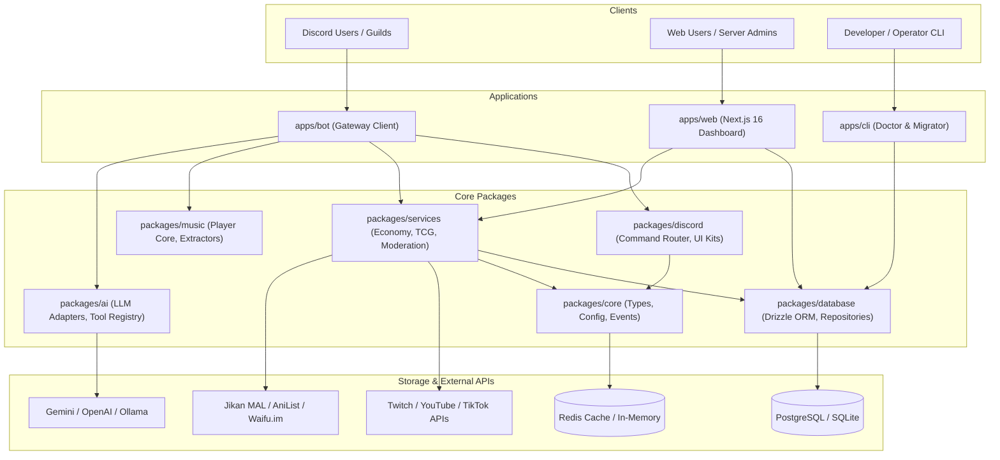
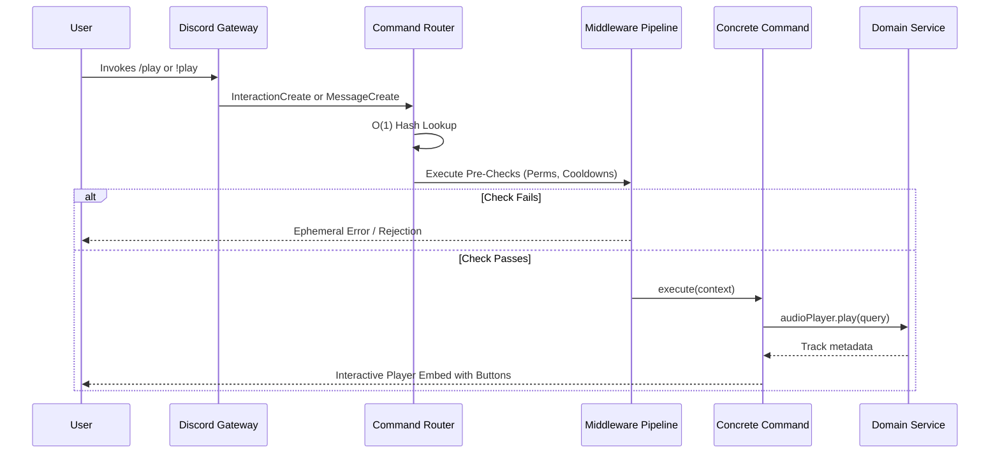

# System Architecture Specification — Ririko AI 2.0.0

## 1. Architectural Vision & Principles

Ririko AI 2.0.0 is re-architected from the ground up to modernize the legacy 1.4.0 bot into a high-performance, maintainable, production-ready platform.

### Core Architectural Principles:
1. **KISS (Keep It Simple, Stupid)**: Avoid over-engineered enterprise patterns (such as excessive abstract factory chains or heavy NestJS metadata reflection). Prefer straightforward composition and strongly typed interfaces.
2. **Modular Monorepo**: Decouple the bot, dashboard, CLI, and shared domain libraries into isolated, independently testable workspaces via pnpm.
3. **Dual-Dialect Data Layer**: Design the database layer using Drizzle ORM to seamlessly support **PostgreSQL** in production environments and **SQLite** for development, CI, and low-resource self-hosting.
4. **Command Parity & O(1) Dispatching**: Provide 100% parity between Slash Commands (`/command`) and Prefix Commands (`!command`), routed via constant-time hash map lookups rather than legacy O(N) regex evaluation.
5. **Reactive Event Flow**: Replace polling intervals (e.g. 10-second music message edits) with event-driven state updates.
6. **Zero-Trust Security**: Ensure no plaintext credentials are stored in database records; enforce AES-256-GCM encryption at rest or environment variable injection.

---

## 2. High-Level Architecture Diagram



---

## 3. Monorepo Package Topology

```text
ririko-v2-2026/
├── apps/
│   ├── bot/                      # Discord Bot Gateway application
│   │   ├── src/
│   │   │   ├── commands/         # Command registration & domain bindings
│   │   │   ├── events/           # Discord Gateway event listeners
│   │   │   └── index.ts          # Main lifecycle bootstrapper
│   │   └── package.json
│   ├── web/                      # Next.js 16 Web Dashboard
│   │   ├── app/                  # App Router pages (admin, tcg, leaderboards)
│   │   ├── components/           # UI components (Tailwind, Radix)
│   │   └── package.json
│   └── cli/                      # Operational CLI
│       ├── src/
│       │   ├── commands/         # doctor, migrate, generate
│       │   └── index.ts
│       └── package.json
├── packages/
│   ├── core/                     # Foundational domain contracts & config
│   │   ├── src/
│   │   │   ├── config/           # Validated environment schemas (Zod)
│   │   │   ├── errors/           # Standardized application error classes
│   │   │   ├── events/           # Typed EventEmitter / EventBus
│   │   │   └── types/            # Universal domain primitives
│   ├── database/                 # Drizzle ORM database layer
│   │   ├── src/
│   │   │   ├── schemas/          # Dual-dialect schema definitions
│   │   │   │   ├── postgres/     # PostgreSQL pgTable schemas
│   │   │   │   └── sqlite/       # SQLite sqliteTable schemas
│   │   │   ├── migrations/       # Drizzle migration files
│   │   │   ├── repositories/     # Domain data access repositories
│   │   │   └── client.ts         # Dialect connection factory
│   ├── discord/                  # Discord UI & Command Dispatch Engine
│   │   ├── src/
│   │   │   ├── command/          # BaseCommand, SlashCommand, PrefixCommand
│   │   │   ├── router/           # O(1) interaction & prefix router
│   │   │   ├── middleware/       # Permission, cooldown, maintenance hooks
│   │   │   └── components/       # EmbedBuilder, Paginator, ButtonMatrix
│   ├── ai/                       # Multi-Provider AI & Tool Calling Core
│   │   ├── src/
│   │   │   ├── providers/        # GeminiProvider, OpenAIProvider, OllamaProvider
│   │   │   ├── memory/           # Sliding-window & persistent conversation store
│   │   │   ├── tools/            # Safe tool definitions with Zod schemas
│   │   │   └── engine.ts         # Conversational agent coordinator
│   ├── music/                    # Audio & Music System
│   │   ├── src/
│   │   │   ├── extractors/       # Multi-source resolvers (YouTube, Spotify, SoundCloud)
│   │   │   ├── queue/            # Guild audio queue manager
│   │   │   └── player.ts         # Audio playback controller
│   ├── graphics/                 # Visual Card & Meme Synthesis
│   │   ├── src/
│   │   │   ├── cards/            # RankCard, WelcomeCard, TCGCard (@napi-rs/canvas)
│   │   │   └── memes/            # 11 Meme synthesis templates
│   └── services/                 # Business Domain Services
│       ├── src/
│       │   ├── economy/          # Atomic balance ledger, bank, inventory
│       │   ├── waifu-tcg/        # Ingestion, 8-tier rarity math, card drops, trading
│       │   ├── moderation/       # Case tracking, warning escalation, auto-mod
│       │   ├── stream/           # Multi-platform stream watcher & thumbnail cache
│       │   ├── giveaways/        # Database-backed giveaway scheduler
│       │   ├── free-games/       # Epic Games & Steam promotions collector
│       │   ├── avc/              # Auto Voice Channels (Join to Create)
│       │   └── reminder/         # Persistent reminder cron service
```

---

## 4. Key Subsystem Architectures

### 4.1. Command Dispatch & Interaction Pipeline
The legacy bot evaluated command regexes sequentially in an array for every message (`for (const command of this.commands)`). In Ririko 2.0:
1. Commands register their primary name and aliases into an in-memory hash map (`Map<string, Command>`).
2. Incoming interactions (Slash commands, Autocomplete, Buttons, Select Menus) resolve immediately in **O(1)** time.
3. Message prefix commands split arguments cleanly, perform O(1) lookup, and pass through a typed **Middleware Pipeline**:
   - `RateLimitMiddleware`: Prevents spam.
   - `GuildOnlyMiddleware`: Verifies guild context.
   - `PermissionMiddleware`: Checks member permissions and bot self-permissions.
   - `CooldownMiddleware`: Enforces per-user cooldowns.



### 4.2. Database & Dialect Abstraction Strategy
To support both high-throughput PostgreSQL for cloud hosting and lightweight SQLite for local development:
- Table schemas share unified domain interfaces and column specifications.
- Drizzle ORM provides type-safe SQL construction with zero runtime overhead.
- All balance modifications, shop purchases, and card trades execute inside explicit transactions:
  ```typescript
  await db.transaction(async (tx) => {
    await balanceRepo.debit(tx, senderId, amount);
    await balanceRepo.credit(tx, receiverId, amount);
    await transactionRepo.log(tx, { senderId, receiverId, amount, type: 'TRANSFER' });
  });
  ```

### 4.3. AI Engine & Safe Tool Calling
Legacy Ririko concatenated chat prompts in RAM and relied on regex parsing to extract music commands (`🎵 song 🎵`).
In Ririko 2.0:
- Conversations maintain stateful sessions in the database (`ai_conversations` and `ai_messages`).
- LLM outputs use standard function calling schemas (Gemini function declarations, OpenAI tool calls).
- Available tools are registered in a declarative registry with strict Zod validation:
  - `get_weather(location)`
  - `search_anime(keyword)`
  - `queue_music(song_title)`
  - `check_balance()`
- Destructive tools (kick, ban, delete) are strictly prohibited from autonomous execution.

### 4.4. Audio & Music Architecture
1. **Multi-Source Resolver**: Resolves queries across YouTube, Spotify, SoundCloud, Bandcamp, and direct audio URLs.
2. **Audio Pipeline**: Dispatches audio streams through `@discordjs/voice` with native Opus transcoding.
3. **Reactive Embeds**: Eliminates legacy 10-second polling loops. The player embed updates only when:
   - A track starts (`trackStart` event).
   - Playback is paused/resumed by a user.
   - Queue finishes or player disconnects.

### 4.5. Waifu TCG Engine
- **Ingestion**: Ingests characters from Jikan (MAL), AniList, and Waifu.im into a verified card catalog.
- **Rarity Curve**:
  - Common: 40%
  - Uncommon: 25%
  - Rare: 15%
  - Super Rare: 10%
  - Ultra Rare: 5%
  - Epic: 3%
  - Legendary: 1.5%
  - Mythic: 0.5%
- **Card Graphics**: Pre-renders card frames with element icons (Fire, Water, Earth, Wind, Light, Dark) and holographic foils using `@napi-rs/canvas`.
- **Trading & Market**: Multi-party atomic trades and global server marketplace with trade lock guarantees.

---

## 5. Security & Secret Management

1. **No Database Plaintext Secrets**: The legacy `Configuration` table stored Twitch secrets and Stable Diffusion tokens in plaintext. In 2.0, secrets are loaded strictly from environment variables (`.env`) or stored using an AES-256-GCM encrypted vault with rotating master keys.
2. **Input Sanitization**: All user inputs are validated via Zod schemas to eliminate injection attacks.
3. **Hierarchy Permissions**: Moderation commands check target user role position relative to both the invoking moderator and the bot before executing.
