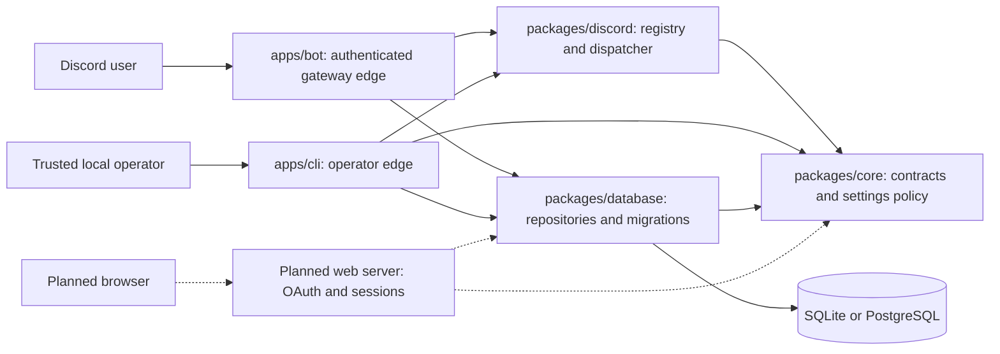

# Ririko AI 2.0.0 architecture

## Status, scope and reading order

This document separates the **implemented foundation** from **proposed platform contracts**. Working commands are `ping`, `prefix`/`setprefix` and `help`; the full 2.0 platform remains unfinished. A diagram or interface does not certify a feature. Consult [requirements](requirements.md), [roadmap](implementation-roadmap.md) and [test evidence](testing.md) before making release claims.

The immutable legacy reference is Ririko 1.4.0 at `0d8be25b17e25dfa61812d6e7b5aaf8497687257` under `.audit/RirikoBot`; `.local/` is also read-only. Preserve [audited names, aliases, options, assets and data](legacy-feature-inventory.md), including deliberate repairs to broken prefix handlers. This architecture responds principally to blueprint BP-04–09, BP-47–59, BP-68, BP-73–78 and BP-85. The blueprint's directory tree and configuration chain are examples; boundaries and authority are the requirements.

Read [the summary](architecture-summary.md) for decisions, this document for cross-domain contracts, then the domain guide. [ADR-001](adr/ADR-001-runtime-and-monorepo-toolchain.md) explains toolchain/import choices; [ADR-013](adr/ADR-013-configuration-permissions-and-concurrency.md) explains settings authority and concurrency. Domain documents own detailed provider limits, balance rules and schema catalogs.

## 1. Processes and trust boundaries

The initial topology is one modular bot process plus short-lived CLI processes sharing a database. A separate Next.js dashboard process is planned. There is no implemented dashboard, independent API service, shared cache service, message broker or distributed worker fleet. Add a process for a demonstrated lifecycle/resource boundary, not merely a new feature name.

Arrows to packages denote code dependencies, not network hops. The bot constructs one `SettingsService` over `database.settings`. The CLI creates equivalent objects per invocation and closes its database in `finally`. Future domain services receive narrow repository/provider capabilities; applications own concrete composition and secret access.

| Boundary | Trusted facts established here | Input still requiring validation | Failure responsibility |
|---|---|---|---|
| Discord gateway | User, guild/channel context, fetched actor/bot permissions and roles | Message text, options, component IDs, target IDs | Authenticate context, acknowledge interaction, render safe errors |
| Local CLI | OS/deployment access and configured operator audit identity | Arguments, environment and stored data | Exit nonzero, close DB, avoid pretending supplied IDs prove guild membership |
| Shared service | Actor facts from its authenticated caller | Mutation intent, settings and external results | Enforce operation policy and invariants before effects |
| Repository | Explicit transaction/schema contract | Rows, revisions and scope IDs | Validate, commit atomically or reject; conceal raw driver secrets |
| Planned web server | Session identity and current guild access | Browser body, route guild ID, CSRF context, stale revision | Authorize every mutation and expose typed conflict/validation results |
| Planned worker/tool adapter | Service-issued job and permitted capability | Provider result, generated content, model tool arguments | Bound work, validate output, reauthorize effects, record ambiguous outcomes |

`ActorContext` is a trust contract, not cryptographic proof: any TypeScript caller can construct it. Only authenticated production adapters may do so. Never deserialize an actor from browser JSON, slash options or a model response. The current CLI deliberately acts as a privileged local operator: it uses the first configured `BOT_OWNER_IDS` entry and supplies `ManageGuild`; it does not fetch that person's Discord guild membership. A remote API must never inherit this shortcut.

## 2. Package responsibilities and import direction

| Workspace | Implemented responsibility | Dependencies | Must not own |
|---|---|---|---|
| `apps/bot` | Discord.js client, event conversion, rendering, help sessions, startup, health HTTP | Core, database, command package, Discord.js | SQL transactions or duplicate settings policy |
| `apps/cli` | Diagnostics, explicit migrations, config, registry sync, command generator | Core, database, command package, operator integrations | Browser authorization or independent command catalog |
| `packages/core` | Actor/settings/store/module contracts, validation, permission helpers, config, safe errors/logging | Zod, Pino, runtime primitives | Discord objects, SQL drivers, web requests/sessions |
| `packages/database` | Connection factory, separate Drizzle schemas, migrations, settings/audit transactions | Core, Drizzle, drivers | Authenticating a guild manager |
| `packages/discord` | Command metadata, parsing, registry, access rules, dispatch, built-ins | Core | Discord.js client, database drivers or HTTP handlers |

Despite its name, `packages/discord` has **no Discord.js dependency**. Wire conversion/presentation live in `apps/bot`; command synchronization lives in `apps/cli`. Its contract supports prefix/slash/context invocation but does not implement every interaction type or legacy command. Inspect [its manifest](../packages/discord/package.json) and [contracts](../packages/discord/src/contracts.ts) before adding imports.

Proposed workspaces are `apps/web`, `packages/ai`, `packages/music`, `packages/graphics` and `packages/services`. Create each when working code requires it. Moderation, economy, jobs, streams and TCG can begin as service directories; separate packages when isolation, tests or resource ownership justify it. Browser bundles may import deliberately safe types/schemas, never database factories, tokens, encryption keys or server composition.

Use package exports such as `@ririko/core`, not cross-workspace `src/` or `dist/` paths. Internal source imports use emitted `.js` paths. Domain contracts contain IDs, values and typed results rather than Discord `Guild`, SQL transaction or provider SDK objects. Keep domain-specific interfaces with the domain unless multiple implemented consumers need a shared contract. Folder boundaries and project references aid review; they do not prove every prohibited import is mechanically impossible.

## 3. Implemented request traces

### Slash prefix change

`/prefix newprefix:?` follows [gateway.ts](../apps/bot/src/gateway.ts), [dispatcher.ts](../packages/discord/src/dispatcher.ts), [builtins.ts](../packages/discord/src/builtins.ts), [settings.ts](../packages/core/src/settings.ts) and a dialect repository:

1. The gateway resolves metadata and defers the interaction. `prefix` is private by default; deferral precedes member/database work.
2. It fetches member, bot member and channel, constructing effective channel permissions and roles. Missing context or lookup failure is an error, not a permissive empty actor.
3. The dispatcher resolves the command, loads guild settings, checks scope, owner restriction, actor/bot permissions, module and command policy, then validates arguments and claims cooldown.
4. The handler receives canonical name, normalized arguments, frozen actor arrays and a settings copy. It calls `SettingsService.setPrefix`, not SQL.
5. The service validates the prefix, requires `ManageGuild`/`Administrator` again, invalidates cache and reads the current revision. The repository conditionally inserts/updates and appends the audit record in one transaction.
6. Cache is invalidated after success or failure. The gateway edits the deferred reply. Unexpected errors are concealed; gateway-level failures include a correlation reference.

A failed Discord confirmation after step 5 does not prove the setting failed: the database may already contain the new prefix. Do not undo committed state because acknowledgement delivery failed. Read current settings and audit data to reconcile. A future generic mutation API needs a durable request ID if replay-safe confirmation is required.

### Prefix alias and simultaneous users

For `!setprefix ?`, bot/webhook messages are ignored, guild prefix is read, and only matching messages trigger actor lookup. The dispatcher resolves `setprefix` to `prefix`, so policy and cooldown use the canonical identity. Foundation prefix commands are guild-only, even when a slash command explicitly supports DMs. See [commands](commands.md) for argument parsing and exact usage.

Shared command definitions carry no mutable per-request actor/argument fields. Each invocation owns its context. Cooldowns are keyed by `(command, guild-or-null, user)` and capped at 10,000 entries. When active restrictions occupy capacity, dispatch returns `BUSY` instead of evicting one. Alias changes cannot bypass cooldown, but process restart clears it. This is not durable economic claim protection, provider quota accounting or a complete multi-axis rate limiter.

### Help component after permissions change

Help entries use the same registry/access function as execution. A random session ID is bound to user, guild and channel, expires after ten minutes, and is stored in a map capped at 1,000 sessions. Another context/user or an expired session is rejected. Valid controls defer their update, fetch actor permissions and redispatch `help`; the old rendered list is not continuing authority. Settings still obey the cache behavior below. Restart intentionally discards help sessions; rerun `/help` to recover.

## 4. Configuration is a typed policy

### Current schema and defaults

`GuildSettings` has only `guildId`, `prefix`, `modules`, `commands` and `revision`, with strict top-level validation. IDs are strings of 1–20 digits: syntax validation is not proof Discord has that object. Prefix bounds are 1–16 JavaScript string code units, excluding whitespace/control characters. Revision zero means unsaved defaults. Repositories advance revisions; callers cannot choose the next revision freely.

| Value | Current resolution | Authority and limitation |
|---|---|---|
| Process settings | `loadConfig` validates selected environment fields; bot entry loads `.env` if present | Operator configuration, never copied wholesale into guild JSON |
| Prefix | Stored guild prefix → `DEFAULT_PREFIX` → `!` | Guild manager via service; no channel/user prefix field |
| Module flag | Stored value supplemented by installed defaults; essential core forced enabled on read | Toggle accepts installed IDs only; unknown persisted keys do not install code |
| Command enabled | Canonical-name policy; explicit false denies | No complete policy-editing interface yet |
| Allowed roles | Nonempty role list requires intersection | Additional gate; never substitutes for built-in Discord permissions |
| Channels | Explicit `channels[channelId] === false` denies | A true value does not create an exclusive allowlist; unspecified channels remain otherwise eligible |
| User/provider/invocation preference | No general preference hierarchy exists | Future fields need explicit delegation rules |

The intended production database is PostgreSQL; the **actual config default** is SQLite at `data/ririko.db`. Selecting PostgreSQL without a valid PostgreSQL URL fails. Offline config parsing does not require Discord credentials; gateway startup requires token/application ID separately. Errors identify invalid field names without echoing values. Exact defaults live in [config.ts](../packages/core/src/config.ts).

### Proposed override rules

The blueprint's defaults → owner → guild → channel → user → invocation chain is field-specific delegation, not arbitrary object merging. Every new field needs allowed scopes, schema, default, bounds, merge rule, reset semantics and audit sensitivity.

| Proposed field class | Resolution rule | Forbidden example |
|---|---|---|
| Presentation, e.g. timezone | Most specific valid choice within permitted scopes | Invalid timezone or another user's private preference |
| Provider selection | Choice within operator/guild-enabled capabilities | User selects disabled provider or unauthorized paid capability |
| Resource ceiling | Constrained by all applicable administrative ceilings | Invocation exceeds guild/operator output limit |
| Security/module state | All required gates must allow the action | Channel preference re-enables globally disabled module |
| Secret | Server-side reference with permitted usage scope | Browser receives decrypted secret or writes it to ordinary settings |

These are proposed rules, not implemented fields. If a guild disables a provider, a user preference cannot reactivate it. Unavailability may invoke an explicitly configured fallback with the same consent/billing constraints; it must not silently spend against another provider. Domain adapter specifications own that choice.

### Authorization and targets

The predicate is a conjunction: authenticated context, built-in permission, enabled module, allowed command policy and target-specific checks. `Administrator` satisfies named Discord permission checks but does not skip Ririko module/role/command restrictions. `isOwner` satisfies only `ownerOnly`; bot ownership is not a guild-permission bypass.

Discord permission bits and role hierarchy are separate. The foundation `assertTargetHierarchy` rejects protected/self targets and equal-or-higher target positions for both actor and bot, with the documented guild-owner actor exception. It is a helper, not an implemented moderation service. Future target actions must fetch authoritative target state and check at the effect boundary. See [Discord permissions and hierarchy](https://docs.discord.com/developers/topics/permissions).

A disabled operation cannot become accessible through an alias, context menu, component or planned AI tool. Tools call application authorization with an adapter-established actor, never privileged repositories directly. Queued work must recheck relevant policy before execution: enqueue-time permission is not permission hours later.

## 5. Concurrency, transactions and ownership

### Settings transaction and stale intent

`GuildSettingsStore.save(settings, expectedRevision, actorId)` verifies the input revision, computes the next revision, conditionally writes the row and inserts audit data. SQLite uses an immediate transaction. PostgreSQL uses a transaction and revision-qualified update. Concurrent initial creation uses conflict-safe insertion. A lost race returns `CONFLICT`; failed audit insertion rolls back the settings change.

Example: both writers read revision 7. A changes prefix and commits revision 8 with audit `7 → 8`. B's `WHERE revision = 7` cannot overwrite A. B must reload/review before retrying. The current service fresh-reads before narrow prefix/module changes, but does **not** accept the caller's displayed revision. A future form opened at revision 7 and submitted after revision 8 needs an explicit client-revision contract to detect stale user intent. A fresh internal read alone cannot supply that protection.

### Cache contract

The settings cache has a five-second default TTL and at most 10,000 guild entries. It evicts an oldest insertion at capacity and returns defensive copies. Writes invalidate before the fresh read and again in `finally`. Cross-process edits become visible when subsequent access fetches after expiry; no timer continuously refreshes entries. Concurrent in-flight reads may finish after a write, so this is not linearizable invalidation.

An absent row legitimately uses defaults. A failed read or wrong guild/schema does not. An unexpired cache hit can still serve without touching an unavailable database. The TTL describes cache behavior, not immediate revocation or zero stale authorization. Future high-impact services need a fresh policy read before effects and an explicit policy for external permission changes racing an action.

### Proposed domain transaction ownership

These domains are **not implemented**. They define where future responsibilities belong; [database](database.md), [economy](economy.md) and [TCG](waifu-tcg.md) own detailed schema rules.

| Domain | Authoritative records | Atomic operation | Outside the transaction |
|---|---|---|---|
| Economy/XP | Accounts, ledger/reward identity, abuse state | Validate source/idempotency, change conserved amounts, append records | Discord reply/rendering/provider calls |
| TCG | Owned-card state, trade/listing revision, ownership | Verify participants/states, transfer cards/currency, settle once | Card rendering and notifications |
| Moderation | Case, attempt and audit | Record permitted intent and subsequent outcome separately | Discord action cannot be rolled back with SQL |
| Jobs/notifications | Due time, attempt, lease token, delivery state | Claim/fence completion and record retry/terminal transition | Network delivery or media generation |
| AI | Conversation ownership, message/tool records | Append scoped request/result with identity | Model request and service-mediated tool effect |
| Media | Validated metadata, attribution, lifecycle references | Commit reference after safe storage succeeds | Download/decode/transform/physical cleanup |

Provider calls must not hold a long database transaction. Renderers do not own cards; LLM output does not write balances. A purchase spanning ownership and currency needs one explicit application transaction, not two independent service commits. `GuildSettingsStore` is not a generic transaction manager: design the actual domain operation when implementation begins.

## 6. Proposed durable work and provider contracts

In-process notifications suit replaceable presentation, such as refreshing a now-playing view. They do not survive crashes. Rewards, delivery, retention or billing work needs durable committed intent and replay-safe consumers. No general event bus, outbox or durable worker exists in the foundation.

A future event envelope should include event ID, type/version, occurrence time, tenant scope, correlation/causation IDs and minimal payload. The producer commits domain change and durable intent together. Consumers record handling identity and tolerate duplicates. Old queued payload versions need deliberate compatibility or quarantine; renaming a TypeScript type is not migration. Do not broadcast tokens or private conversation bodies as shared event data.

A proposed job lifecycle is `scheduled → leased → succeeded`, with failure leading to bounded retry, cancellation or terminal failure. Completion includes the claimed lease token/version so an expired worker cannot overwrite a later attempt. Cancellation prevents effects not begun; after an external request might have succeeded, record uncertainty instead of promising rollback. Lease duration, heartbeat, limits and retry budget belong to the specific domain/provider contract.

| Crash window | Required recovery interpretation |
|---|---|
| Before intent commit | No accepted job; retry according to request identity |
| After commit, before execution | Restart rediscovers durable due work |
| After lease, before external request | Lease expiry permits safe reclaim |
| After external success, before outcome commit | Ambiguous/possibly duplicate delivery; reconcile with provider/message identity where possible |
| After outcome commit, before acknowledgement | Return recorded result rather than repeat effect |

This gives repeatable internal transitions, not universal exactly-once external delivery. A unique stream key `(platform, streamId, guildId, targetId)` prevents duplicate intent rows, but cannot prove whether Discord received a message before a crash. [Adapters](adapters.md) must define the ambiguity policy.

Provider packages should distinguish unsupported capability, missing configuration, authentication failure, quota/rate limit, transient failure, timeout and ambiguous completion. Retry only when provider semantics and request identity make it safe. Fallback preserves authorization, billing and content constraints. Specific obligations:

- **Music:** assess required YouTube, Spotify, Deezer and SoundCloud, separating metadata from playable audio. A metadata match proves neither audio availability nor permission to use it. Playback selection and reactive display remain planned. See [music](music.md).
- **AI:** isolate `(guildId, channelId, userId)` memory, separate personality from authority, and mediate bounded tools through services. No arbitrary SQL/shell/filesystem/unconstrained HTTP tools. See [AI](ai.md).
- **Images/media:** bounded queues, validated storage, attribution/removal and request limits; local ComfyUI still costs hardware and has licensing constraints. No unlimited hosted generation claim. See [adapters](adapters.md) and [TCG](waifu-tcg.md).
- **Streams:** assess Twitch, TikTok and Facebook independently. Adding YouTube does not replace the required Facebook assessment. Unsupported access remains visibly unavailable.

## 7. Lifecycle and operational consequences

### Implemented startup/readiness/shutdown

The bot loads optional `.env`, validates config/credentials, constructs database/settings/gateway/health objects, checks migrations and database health, starts health HTTP, installs signal handlers and logs into Discord. Pending migrations stop startup with explicit operator guidance. Connection creation does not migrate automatically. The foundation runner refuses unrecognized legacy schemas; legacy import is a separate operation.

`GET /health/live` reports process liveness. `GET /health/ready` combines database, Discord client readiness and shutdown state, returning 503 when not ready. These are the real paths, not `/health` and `/ready`. The DB probe races a two-second default timeout and permits only one outstanding probe. Timeout does not cancel the driver operation; later requests fail while it remains stuck. Provider health, per-shard metrics and detailed latency export are not implemented.

SIGINT/SIGTERM invokes memoized shutdown: mark not ready, close gateway and HTTP concurrently, settle tracked event promises, clear help sessions, then close DB even when gateway shutdown failed. There is **no global shutdown deadline** or cancellation for every pending handler, and no worker-drain protocol yet. Add bounded drain/cancellation and durable recovery before future long provider jobs promise finite shutdown under failure.

### Resource and observability policy

Current bounded resources include settings/cooldown/help maps, Discord REST timeout/retries, PostgreSQL pool and health probes. They are not measured capacity claims. SQLite enables foreign keys and a five-second busy timeout; code does **not** enable WAL. It is the small single-process operating mode, with CLI access still subject to database locking. PostgreSQL supports the intended production/multi-process direction but does not replace application revision/transaction rules.

Future decoding/rendering needs bounded worker concurrency and input/memory limits to protect gateway responsiveness. Add a worker process after workload measurements or isolation requirements justify it. Redis is optional: additional process count alone does not invalidate a database-backed lease/intent design. Sharding requires assignment ownership and cross-process quotas; an in-memory map does not automatically coordinate shards.

Current logs include service/version and selected command/correlation fields. Known `AppError` text can be shown; unexpected errors are hidden. Pino redacts configured key paths, not every nested string automatically. Avoid raw message bodies, provider errors and environment objects. Proposed metrics should use bounded operation labels; user/channel/correlation IDs and prompts are unsuitable high-cardinality metric labels.

## 8. Extension example and acceptance gates

A **proposed reminder** illustrates boundaries; it is not callable today:

1. Read audited behavior, blueprint and the active estimated ticket. Define normalized actor/destination/due-time/text/request-ID input and typed failures in the owning domain.
2. Define one repository operation for reminder plus delivery intent, scoped to the permitted destination. A date parser cannot decide authorization; the handler cannot own SQL.
3. Implement service tests with fixed clock and fake repository/provider. Define acceptance as durable scheduling, not confirmed future delivery.
4. Bind slash/prefix metadata to the same service, preserving aliases/options. Help discovers registered implementations; generating a file does not register it automatically.
5. Implement lease/retry/ambiguity behavior, execution-time destination checks and retention. Inject a crash after Discord send but before commit.
6. Add web/CLI controls using shared validators and service policy. Web establishes its own actor and cannot reuse the privileged CLI adapter.

This requires real persistence and lifecycle code before exposure. It needs no generic `BaseService`, mutable global container or API microservice. Introduce interfaces for credible variation, such as two dialect repositories or replaceable providers; avoid wrapping every pure function.

| Acceptance scenario | Required outcome | Existing evidence / remaining gap |
|---|---|---|
| Canonical command and alias | Same policy/options/cooldown | [Dispatcher tests](../packages/discord/src/dispatcher.test.ts) |
| Missing settings versus unavailable DB | Defaults only for absent row | [Core tests](../packages/core/src/core.test.ts) |
| Two saves from revision N | One wins; loser conflicts; atomic audit | [Shared dialect contract](../packages/database/test/settings-contract.ts) |
| Bot owner lacks guild permission | Shared service rejects mutation | Core tests; CLI has distinct operator trust model |
| Component used by another actor/context | Reject without privileged execution | [Gateway tests](../apps/bot/src/gateway.test.ts) |
| DB probe never settles | Fail readiness without probe accumulation | [Health tests](../apps/bot/src/health.test.ts) |
| Browser submits stale displayed revision | Conflict with refreshed values and explicit reapply | Planned caller-revision API and web tests |
| Privilege revoked while job waits | Effect-time policy blocks new action | Planned worker/domain tests |
| Worker crashes after send | Reconciliation/ambiguity, no false exactly-once claim | Planned adapter/job tests |
| Source-mode success hides production import failure | Build/entry-point check finds discrepancy | Build and CLI E2E; image execution remains a separate gate |
| Domain reaches into driver/Discord internals | Review rejects coupling | Source/package review; comprehensive automated import checker not claimed |

These are review obligations, not an assertion all scenarios passed. Exact executions live in [testing](testing.md). Revisit decisions when measurements reveal a bottleneck, an accepted feature requires stronger consistency, or multi-instance operation changes ownership. Record the failing scenario, alternatives, migration/rollback and validation in an ADR. Architectural changes still follow the [single-ticket delivery protocol](../.workboard/PROTOCOL.md).
