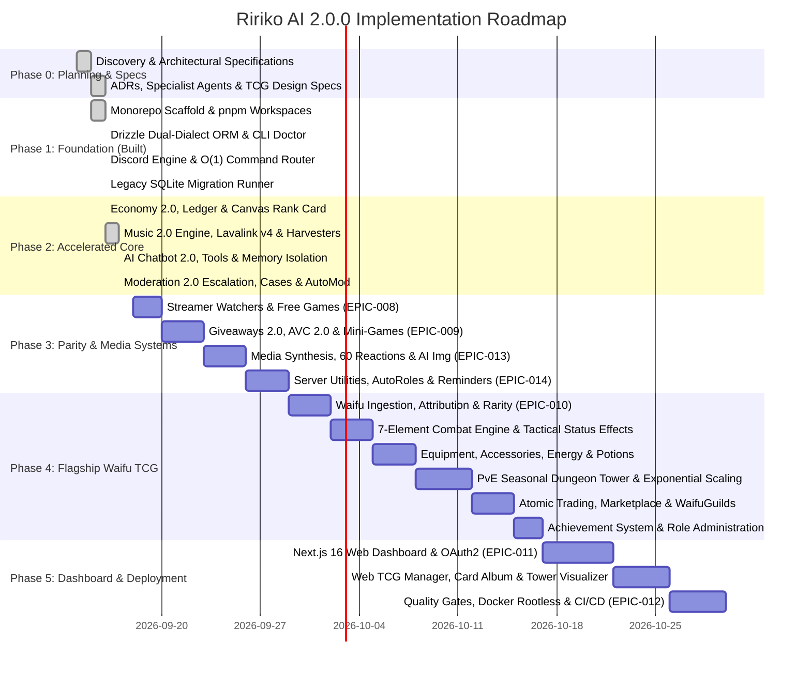

# Implementation Roadmap (Ririko AI 2.0.0)

> **Effective Date / Roadmap Start**: September 15, 2026 (`2026-09-15`)  
> **Current Date**: September 17, 2026 (`2026-09-17`)  
> **Target Release**: November 2026  
> **Main Development Branch**: `develop/2.0.0`

## Phase Overview & Timeline

---

## Phase Breakdown & Acceptance Criteria

### Phase 0: Discovery, Architecture & Agent Definitions
- **Status**: ✅ **Complete** (`EPIC-000`, 13 pts)
- **Deliverables**:
  - `docs/legacy-feature-inventory.md` (141 commands & 17 entities audited).
  - `docs/architecture.md` (Clean architecture, monorepo topology, O(1) command router).
  - `docs/migration-1.x-to-2.0.md` and `docs/dependency-evaluation.md`.
  - `docs/waifu-tcg.md` (Comprehensive 15-subsystem flagship specification).
  - `docs/database.md`, `docs/commands.md`, `docs/economy.md`, `docs/dashboard.md`, `docs/adapters.md`, `docs/ai.md`, `docs/music.md`, `docs/moderation.md`, `docs/modules.md`.
  - `docs/adr/` (ADR-001 through ADR-012).
  - `GEMINI.md`, `AGENTS.md`, and 18 specialist agent definitions in `.gemini/agents/`.
- **Exit Gate**: All architectural decisions documented, approved, and registered in canonical board.

---

### Phase 1: Foundation Scaffold & Toolchain
- **Status**: ✅ **Complete** (`EPIC-001`, `EPIC-002`, `EPIC-003`, 55 pts total)
- **Deliverables**:
  - `packages/core`: Zod config validation, typed asynchronous `EventBus`, standardized error codes hierarchy.
  - `packages/database`: Drizzle ORM dual-dialect abstraction (PostgreSQL & SQLite), 70+ normalized table schemas, ACID transaction helpers, and `ririko migrate legacy` CLI runner with `--dry-run` and data verification (`STORY-023`).
  - `packages/discord`: Discord.js 14 Gateway harness, dual-dispatch command router with O(1) hash map lookups, composable middleware pipeline (permissions, maintenance, cooldowns, rate limits), and interactive dynamic help center (`/help`).
  - `apps/cli`: Scaffolding with `ririko doctor` comprehensive diagnostic harness.
  - `apps/bot`: Dev entrypoint and `/ping` diagnostic command (`CHORE-0301`).
- **Exit Gate**: `pnpm build`, `pnpm typecheck`, and `ririko doctor` run cleanly without errors.

---

### Phase 2: Centralized Economy & Music 2.0 Audio Core
- **Status**: ✅ **Complete** (`EPIC-004`, `EPIC-005`, 34 pts total)
- **Deliverables**:
  - `packages/services/economy`:
    - Double-entry financial ledger (`economy_transactions`, `economy_balances`) with ACID constraints.
    - Anti-spam text heuristics and voice participation anti-AFK quorum state machine.
    - Daily streak multiplier engine (+5%/day up to 30 days, 36h reset grace period).
    - Transactional banking service (deposit, withdraw, level-scaled capacity, deadlock-free P2P transfers).
    - Leveling 2.0 progression formula ($5L^2 + 50L + 100$) and materialized leaderboard snapshots for $O(1)$ dense rank queries.
    - Shop catalog repository, inventory bags, and SSRF-validated custom profile backgrounds.
    - High-performance 1200x400 `@napi-rs/canvas` Profile Card 2.0 synthesizer.
    - Dual-dispatch economy command suite (/balance, /daily, /deposit, /withdraw, /pay, /leaderboard, /profile, /shop, /inventory, /use, /karma).
  - `packages/music`:
    - Multi-source extractors: YouTube, Spotify (Official Web API + LavaSrc precision matching), SoundCloud, Deezer.
    - Session cookie rotation, mobile client spoofing, and automated PO-Token background provider with Playwright Chrome/Chromium credential harvester.
    - Voice lifecycle state machine with 3-minute idle auto-disconnect and audio queue with loop modes and volume clamping (0%–150%).
    - Lavalink v4 backend integration (`TASK-0530`) with automated installer script.
    - Reactive embed controller and interactive button matrix updating without `setInterval` polling.
    - 17 dual-dispatch music commands (/play, /pause, /skip, /back, /stop, /queue, /volume, /loop, /shuffle, /seek, /filter, /lyrics, /join, /leave, /playlist, etc.).
- **Exit Gate**: 100% verified against unit tests, Playwright audio streams, and Discord Gateway voice events.

---

### Phase 3: AI Chatbot 2.0 & Moderation 2.0
- **Status**: ✅ **Complete** (`EPIC-006`, `EPIC-007`, 26 pts total)
- **Deliverables**:
  - `packages/ai` & `apps/bot/commands/ai`:
    - Multi-provider AI core supporting Google Gemini (`@google/genai`), OpenAI (`openai`), and local Ollama with automatic failover chain.
    - Per-user context isolation engine in `ai_conversations` and `ai_messages` preventing prompt/memory leakage across shared channels.
    - System safety prompts and customizable guild persona engine.
    - Safe function tool calling with bi-directional name sanitization and security mediation (verifying Discord permissions before tool execution).
    - Explicit time tool (`get_current_time`) with timezone resolution, anime search, coinflip, and reminder tool definitions.
    - Dedicated `#ririko-ai` gateway listener with debounced streaming message edits.
    - Dual-dispatch AI command suite (`/ai chat`, `/ai model`, `/ai channel`, `/ai persona`, `/ai clear`) and `ririko ai:configure` CLI setup wizard (`CHORE-0601`).
  - `packages/services/moderation` & `apps/bot/commands/moderation`:
    - 5-tier centralized permission and role hierarchy verification service (`PermissionService`).
    - Discord punitive actions core (kick, ban, softban, unban, timeout, nick, lock, unlock) with structured results and event bus emission.
    - Atomic sequential per-guild case numbering (Case #N) with mod log channel dispatches and persistent staff notes.
    - Dynamic warning escalation engine with threshold mappings and sliding-window expirations.
    - Disciplinary purge sanitizer supporting multi-filter bulk deletes (user, bots, links, invites) respecting Discord 14-day API limits.
    - Real-time AutoMod pipeline: invite filter with whitelist, scam/phishing URL shield with homoglyph normalization, mention spam detector, and burst spam limiter.
    - Anti-raid mass join monitor detecting coordinated account floods.
    - Dual-dispatch moderation commands suite (/warn, /timeout, /kick, /ban, /purge, /lock, etc.).
- **Exit Gate**: All moderation actions audited, AutoMod filters verified against malicious inputs, and AI chat tests passing.

---

### Phase 4: Core Parity & Community Media Systems
- **Status**: 🔄 **In Progress / Partially Complete** (`EPIC-008` & `EPIC-009` ✅ Complete, `EPIC-013` & `EPIC-014` 📋 Backlog)
- **Scope**:
  - **`EPIC-008`: Streamer Notifications & Free Games Announcer (8 pts)**: ✅ **Complete**
    - `STORY-080`: Multi-platform live stream watcher (Twitch EventSub, YouTube Live PubSubHubbub, TikTok Live) with persistent idempotency keys and local thumbnail CDN re-uploader.
    - `STORY-081`: Free games announcer for Epic Games Store and Steam promotional specials feed with duplicate suppression.
  - **`EPIC-009`: Giveaways 2.0, Auto Voice 2.0 & Mini-Games Suite (13 pts)**: ✅ **Complete**
    - `STORY-090`: Crash-resilient database-backed giveaways surviving bot restarts with button entry and role gates.
    - `STORY-091`: Dynamic "Join to Create" temporary voice channels (Auto Voice 2.0) with permission inheritance and orphan channel cleanup.
    - `STORY-092`: Interactive Mini-Games Suite: unbeatable Minimax AI Tic-Tac-Toe, Rock Paper Scissors, HighLow card wagering, CoinFlip, and Dice wagers with escrow.
  - **`EPIC-013`: Media Synthesis, Anime Reactions & AI Image Generation (13 pts)**: 📋 Backlog
    - `STORY-130`: All 60 legacy anime reaction commands (`airkiss`, `hug`, `slap`, `pat`, etc.) via unified factory backed by `api.otakugifs.xyz` with local fallback GIF cache.
    - `STORY-131`: All 11 legacy meme template canvas synthesizers (`0days`, `allmyhomies`, `always-been`, `chad`, `undertaker`, etc.) using `@napi-rs/canvas`.
    - `STORY-132`: Multi-backend AI image generation service (`/imagine`) supporting Google Gemini Imagen, local ComfyUI/SD-WebUI, and Replicate with background job queue (`image_jobs`).
    - `STORY-133`: Welcomer and Farewell dynamic canvas cards featuring user avatar, member count, and SSRF-validated background imagery.
  - **`EPIC-014`: Server Utilities, AutoRoles & Community Systems (13 pts)**: 📋 Backlog
    - `STORY-140`: Automatic Role System & Reaction Roles (Join roles, verification roles, button/select-menu component roles, tiered progression roles, temporary expiring roles).
    - `STORY-141`: Persistent natural language reminders engine (`!remindme in 2 hours`) with timezone awareness surviving bot reboots.
    - `STORY-142`: Anime & Manga search service (`/anime`, `/manga`, `/anime-character`, `/wallpaper`, `/waifu`) via Jikan API v4 and AniList.
    - `STORY-143`: Server utility & identity commands parity (`/get-avatar`, `/guild-info`, `/member-info`, `/prefix` with memory cache).
- **Exit Gate**: 100% of all 141 legacy commands and all reaction/meme assets fully ported with verified dual-dispatch parity.

---

### Phase 5: Flagship Waifu TCG Subsystem
- **Status**: ✅ **Complete** (`EPIC-010`, 21 pts total)
- **Synchronized Stories**:
  - **`STORY-100`: Waifu Ingestion Pipeline, Asset Validation & Attribution (3 pts)**:
    - Asynchronous worker harvesting `waifu.im`, AniList, and Jikan; magic bytes and dimension validation, SHA-256 deduplication, attribution overlay (`Image source: waifu.im`), graceful silhouette fallback for takedown requests (`is_deleted_by_request`).
  - **`STORY-101`: 8-Tier Rarity Math, Card Attribute Generation & Automated Drops (5 pts)**:
    - Mathematically balanced 8-tier rarity curve (Common 50.0% to Mythic 0.05%), dynamic stat calculations (HP 500–15k, ATK 50–2.5k, DEF 30–1.8k, SPD 10–300, CRIT 5%–50%, MP 100), active skills and passive traits.
    - Guild drops generator: configurable `#waifu-drops` channel, activity threshold (50–100 messages), 60s interactive `[Claim Card]` button, anti-sniping cooldown (5 min).
    - Commands: `/card collection`, `/card inspect`, `/card equip`, `/card favorite`, `/card dismantle`.
  - **`STORY-102`: 7-Element Combat Engine & Tactical Status Effects (3 pts)**:
    - 7-element affinity loop featuring Ice: Fire > Ice > Earth > Lightning > Water > Fire (1.5x damage); Light <> Shadow mutual catastrophe axis.
    - Status effects: Burn DoT, Freeze/Chill (25% slow, 15% turn-skip), Fortify shielding, Surge (+15% CRIT), Purify (8% regen), Radiance, Decay (20% lifesteal).
  - **`STORY-103`: Equipment, Accessories, Consumables & Daily Energy Lifecycle (3 pts)**:
    - 3 Equipment slots (Weapon, Armor, Relic) with rarity-scaled Battle Perks (*Vampiric Touch*, *Glacial Counter*, *Mana Conduit*, *Phoenix Ward*, *Cosmic Cataclysm*).
    - 3 Accessory slots (Ring, Amulet, Talisman) with % stat multipliers. +0 to +10 enhancement with Crafting Dust.
    - Consumables: HP potions, Mana draughts, Energy restores (strictly capped at 3/day).
    - Player Energy: Level-scaled capacity formula ($\min(300, 100 + \lfloor(\text{Level}-1)\times 2\rfloor + \text{Bonus})$), 00:00 UTC daily replenishment with lazy recovery.
  - **`STORY-104`: PvE Seasonal Dungeon Tower: Tutorial, Seasons & Exponential Scaling (5 pts)**:
    - Tutorial Prologue (Floors T1–T4, 0 energy onboarding: elements, mana, potions, break shields).
    - Seasonal framework (60–90 days per cycle, archived to Hall of Fame) with active environmental affixes (*Scorched Earth*, *Heat Haze*, *Torrential Deluge*, *Tidal Barrier*).
    - Anti-powercreep architecture: multi-layer elemental wards, seasonal affix penalties, turn-10+ soft enrage (+100% ATK/turn and true damage).
    - Configurable exponential difficulty scaling ($\text{Stat}(F) = \text{Base} \times (1 + r)^{F - 1} \times \text{BossMultiplier}$, $r=0.085$) via `/tcg-admin config dungeon`.
    - `BUG-0008`: Starter card seeding, random starter pool selection, and `$climb` prefix alias tutorial gating.
  - **`STORY-105`: Atomic Trading, Marketplace, WaifuGuilds & Achievements Dispatch (5 pts)**:
    - P2P Trading (`/trade`): interactive modal, state locking (`IN_TRADE`), dual-party confirmation, atomic ACID settlement.
    - Player Marketplace (`/market`): credit pricing, `IN_MARKET` locking, 5% coin sink tax, 7-day auto-expiration.
    - WaifuGuilds (`/waifuguild`): dedicated player factions (`WaifuGuild`), leveling progression, shared guild bank, cooperative raid bosses.
    - Achievement System (`/achievement`): 6 tracks across 5 tiers with multi-asset reward dispatch (XP, credits, cards, gear, accessories, consumables, canvas badges).
    - Role-guarded administration: `/tcg-admin` guarded by `tcg_manager_role_id` or Discord Administrator.
    - TCG Info Hub (`/tcg-info`): Interactive 10-topic strategy guidebook and type advantage tutorial.
    - Visual Card Synthesis Engine (`TASK-1061`): 800×1200 px `@napi-rs/canvas` physical-style card renderer with 8-layer stack, rarity foiling, 237 anime character catalog (`characters.json`), manifest (`manifest.json`), `CardImageService` attachment in `/card claim` & `/card inspect`, and Card Builder CLI (`scripts/tcg-card-builder.ts`).
- **Exit Gate**: ✅ Concurrency-tested trading and marketplace (zero race conditions), full 7-element combat validated, floor 50+ scaling proven, and real card visual synthesis verified.

---

### Phase 6: Web Dashboard, Comprehensive Testing & Production Deployment
- **Status**: 📋 **Backlog** (`EPIC-011`, `EPIC-012`, 34 pts total)
- **Scope**:
  - **`EPIC-011`: Next.js 16 Web Dashboard & Management Portal (21 pts)**:
    - `STORY-110`: Next.js 16 App Router, React 19, Tailwind CSS, Discord OAuth2 authentication flow (`identify`, `guilds`), session cookies, and guild permission evaluation (`ManageGuild`).
    - `STORY-111`: Server Management Portal covering dedicated setting views for all 20+ modules (Overview, General, Moderation, AutoMod, Music, AI Chatbot, Image Gen, Economy, Ranking, Games, Giveaways, AutoVoice, ReactionRoles, Streams, FreeGames, Welcomer, Logs, Command Overrides).
    - `STORY-112`: Waifu TCG Web Management: web-based card collection album, marketplace portal, interactive Dungeon Tower difficulty curve visualizer, seasonal affix editor, and shop catalog manager.
    - `STORY-113`: Server analytics telemetry, live moderation case logs, shared Zod schema validation between dashboard and CLI, and secret redaction (`Configured ✓`).
  - **`EPIC-012`: Quality Gates, Docker Rootless & Production Verification (13 pts)**:
    - `STORY-120`: End-to-end Vitest test suites (target 80%+ coverage across core services, deterministic RNG seeds for TCG drops and gambling).
    - `STORY-121`: Multi-stage rootless Dockerfile (Node.js 22 LTS, unprivileged user `nodejs`, minimal image size) and `docker-compose.production.yml`.
    - `STORY-122`: Health and readiness probe endpoints (`/health`, `/ready`), GitHub Actions CI/CD workflows (`ci.yml`, `release.yml`), and deployment documentation runbook.
- **Exit Gate**: Production Docker container boots in under 3 seconds, all automated tests pass, and dashboard SSR renders flawlessly with zero secret leakage.
