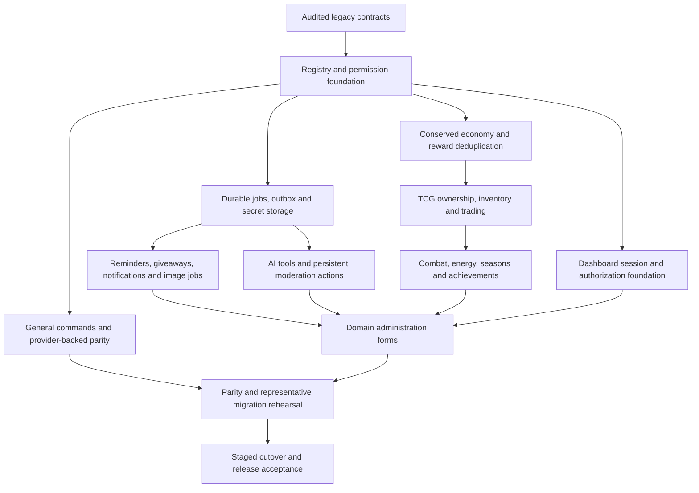

# Implementation roadmap
Updated 2026-09-14. This replaces the draft schedule, which incorrectly marked unverified work complete. There are no estimated completion dates.

## Current checkpoint
The full original specification is preserved in [BLUEPRINT.md](../BLUEPRINT.md); [requirements.md](requirements.md) maps all sections and final acceptance criteria to evidence and remaining work. [The pinned branch comparison](branch-comparison.md) distinguishes implemented Astra foundation code from Gemini's planning scaffold and explains the RIR-110 improvements. No documentation count certifies product completion.

The source audit and executable foundation are implemented. This is not a complete Ririko 2.0 release. Only ping, prefix/setprefix and help are registered in the new runtime. The authoritative inventory contains all 141 legacy command files; their presence in the inventory is not a claim of working parity. New code never imports the legacy runtime.

| Phase | State | Scope and remaining acceptance evidence |
|---|---|---|
| 0 — Audit and decisions | Source audit complete | 141 command manifests, 17 tables/108 columns/11 FKs, source hashes, assets, providers, deployment, migration risks. Legacy runtime was inspected, not deployed. Representative production data is absent. |
| 1 — Foundation | Implemented; live deployment validation pending | ESM pnpm workspaces; config/logging; PostgreSQL and SQLite repositories; explicit checksummed migrations; transactional revision/audit; permissions; metadata registry; parser/dispatcher; ping/prefix/help; Discord transport; CLI; generators; health/lifecycle; CI/Docker definitions. See testing.md for actual local results. |
| 2 — Compatibility | Pending | get-avatar, guildinfo/memberinfo, anime/manga/wallpaper/waifu, all 68 reactions, 11 meme interfaces/96 meme assets, welcome/farewell, reaction roles, reminders, basic guild behavior. Keep exact aliases/options from manifest; repair broken handlers with documented compatibility behavior. |
| 3 — Rewritten systems | Pending | Music (YouTube, Spotify, Deezer, SoundCloud), moderation, AI, image generation, giveaways, auto voice, Twitch/TikTok/Facebook capability assessments, stream notifications and free games. Persistent recovery, authorization, idempotency and real adapter tests required. |
| 4 — Central systems | Pending | Transactional global/guild economy, bank/ledger, anti-spam rewards, voice XP, rankings, profile/background cache and mini-games. Preserve global legacy balances without multiplying them into guild wallets. |
| 5 — Waifu TCG | Pending | Attribution-preserving ingestion/cache, configurable rarity/elements, transactional claims/equip/trades/market, collection, combat, quests, expeditions/dungeons/bosses, player guilds and achievements. |
| 6 — Dashboard | Pending | Next.js/React, Discord OAuth, fresh guild authorization, sessions/CSRF, shared schema forms, every implemented module's config, diagnostics, user collection/market. Playwright browser E2E required. |
| 7 — Migration and release | Pending | Legacy importer dry-run/apply/verify/rollback; representative DB and giveaway snapshot; restore rehearsal; parity matrix completed; real Discord/provider smoke tests; Docker image build/start; rollout flags and release checklist. |

## Foundation boundary
Implemented CLI commands are documented in development.md. The generator currently creates commands, tests and dual-syntax documentation. Other generator families and operator commands remain pending. No fake legacy importer, provider, game, dashboard, or placeholder command is registered.

The foundation migrator refuses legacy/unrecognized schemas and never imports user data. There is no representative 1.4.0 database or giveaway JSON in this workspace. The compiled bot requires credentials and an explicitly migrated database. Command synchronization is a separate operator action and has not been performed against Discord.

The foundation is now tracked at `801103c0e4c70eca6a380d7d1122b11234695bb1` on `develop/2.0.0-astra`. The independent legacy checkout remains pinned and immutable. [The work board](../.workboard/BOARD.md) is the authoritative execution record; its initial governance chore uses a separate topic branch. PR publication requires the user's delivery checkpoint decision.

## Phase gates
Each phase requires lint, strict typecheck, unit tests, integration tests, applicable E2E and production builds; failures are not hidden by pass-with-no-tests switches. Match tests to failure modes: concurrent writes, permission bypass, cross-user data isolation, provider errors, duplicate events and crash recovery. A passing fake/provider fixture is not evidence that live authentication or streaming works.

Before a feature becomes visible, add its service contract, persistence/migrations if needed, permission rules, metadata, slash/prefix docs and tests. Before legacy cutover, every inventory item must have verified parity or an explicit compatibility/deprecation path. Full release acceptance also includes every new system in the original specification; this checkpoint does not waive those requirements.

## Next implementation slice
This describes backlog order, not permission to start work. Groom estimates and dependencies through the [standing protocol](../.workboard/PROTOCOL.md), then complete the current PR checkpoint before selecting another story or epic.

Port remaining general/guild commands through transport adapters, then anime/reactions/memes with validated cached providers/assets. Add the durable job foundation before reminders, giveaways or notifications. Implement service/schema changes in bounded groups and review before registering features. The source inventory and migration manifests are the continuing checklist.

## Dependency order and boundaries

The phases are capability gates, not a calendar promise. Work may be decomposed differently during grooming, but prerequisites cannot be skipped because a UI mockup or adapter interface exists.

Music queue state and voice recovery are a separate vertical slice using the same configuration, authorization and provider budget boundaries. It need not wait for combat; it does need its own measured engine selection. Migration design begins before new schema work even though final rehearsal follows domain completion. Dashboard authentication may precede domain forms; an editable form cannot ship before its domain write contract and permissions exist.

## Deliverable slices and proof of completion

Each row is a future grooming input, not an already estimated or authorized ticket. Split a row when executable work exceeds 13 points. Keep the delivery scope to one approved story or epic, with a checkpoint at its end.

| Slice | Entry condition | Reviewable increment and exit evidence |
|---|---|---|
| General/guild parity | Exact manifest names, arguments, aliases and permissions reviewed | One bounded family registered in both transports; malformed argument, DM, denial and dependency-failure cases verified; manifest-to-test mapping updated |
| Reactions, memes and information | Provider/cache and asset contracts defined | All 68 audited reactions accounted for; 11 meme interfaces mapped to the 96 audited meme assets; attribution, missing asset and unavailable provider responses tested |
| Durable work | Job schema, lease/clock and outbox semantics approved | Restart after claim and after external action; duplicate execution, lease expiry, cancellation and unknown delivery outcome demonstrated without promising exactly-once external sends |
| Guild automation | Durable work and configuration authorization available | Reminder timezones/DST policy, giveaway eligibility/settlement, reaction-role removal, auto-voice orphan cleanup and welcome/farewell fallback each have explicit state transitions |
| Moderation | Staff/bot hierarchy checks and immutable action evidence defined | Concurrent warning threshold, timeout expiry, failed external sanction and audit dispatch recovery tested; no automatic blind repeat of an uncertain sanction |
| Music | Engine experiment and required-source assessment complete | YouTube, Spotify, Deezer and SoundCloud results classified honestly; queue ordering and stale controls tested; reconnect, unavailable track and permission loss exercised in an authorized voice environment |
| AI and graphics | Secret handling, quotas and capability registry available | Isolated context, bounded tool loop, cancellation and budget exhaustion verified; image jobs validate files and prevent unauthorized backend requests; live capability evidence separated from fixtures |
| Streams/free games | Persistent deduplication and subscription policy available | Twitch, TikTok and Facebook eligibility assessed; YouTube may be additional; duplicate, missed/replayed event, destination deletion and ambiguous send covered |
| Economy and games | Account scope, currency units and idempotency settled | Conserved transfers, insufficient funds, duplicate rewards, concurrent wagers, voice/XP abuse and crash settlement tested in both dialects; no silent legacy balance multiplication |
| TCG catalog/ownership | Attribution policy and economy transaction boundary available | Versioned catalog, generated asset cache, atomic claim, ownership locks, equip/trade/market races and deletion policy verified before combat consumes cards |
| TCG progression | Deterministic combat and inventory rules specified | Replay fixtures and seeded balance simulations; energy reset/overflow, seasonal rollover, floor growth, equipment/consumable caps, achievement replay and player-guild settlement tests |
| Dashboard | Session/CSRF model and server domain API available | Guild switching and revoked access tests; conflict-aware forms for every implemented module; accessible loading/empty/error states; secret fields never reveal stored values |
| Legacy importer | Representative redacted snapshot and source/version match available | Dry-run report, identity map, conserved values, quarantine, restart checkpoints, verification and tested restore; original source remains unchanged |
| Release | Domain gates and complete requirement ledger satisfied | Built artifact started in target environment, current test evidence, authorized Discord/provider smoke, backup restoration, monitored staged rollout and exercised rollback/forward repair |

## Requirement and parity accounting

Use [requirements.json](requirements.json) for all blueprint sections and final acceptance criteria; use [legacy-command-manifest.json](legacy-command-manifest.json) for exact source command records. A feature is not complete because a similarly named new command exists. Review argument order/types/defaults, aliases, guild/DM restrictions, caller/bot permissions, response visibility, persisted side effects and failure behavior.

For each port, retain the source evidence and add a mapping to the new registration, service and tests. If slash constraints cannot express a legacy interface literally, record an explicit compatible routing design; do not silently drop options. Broken legacy behavior needs a documented repair with preserved user intent. Deprecation or removal needs an explicit decision and migration path, not an unchecked `done` label.

Source-audited, designed, implemented, fixture-tested, integration-tested and live-verified are different evidence states. A mock proves the code's response to the modeled API; it does not prove account access, production latency or real provider terms. A skipped PostgreSQL suite remains missing evidence for that run. Generated requirement reports must be rebuilt from the manifest and checked; do not edit the report to conceal a gap.

## Unresolved decisions that block implementation

| Decision | Needed before | Decision artifact / discriminating evidence |
|---|---|---|
| Durable queue topology and clock/lease policy | Persistent reminders, settlements and notifications | ADR-012 plus competing-worker and restart experiment; choose whether one process or dedicated worker owns execution |
| Secret storage/rotation and operator recovery | Stored provider credentials or OAuth tokens | ADR-011 with key loss, rotation interruption and redaction tests |
| Audio engine/source access | Public music registration | ADR-004 with actual playback/reconnect and source capability records |
| AI data policy and tool permissions | Persisted conversation or state-changing tools | ADR-005 plus isolation/consent/budget contract; no implicit cross-provider fallback |
| Global versus guild account semantics | Economy schema/importer | ADR-009 with conserved migration examples and account identity rules |
| Rarity, elements, energy and seasonal balance | TCG writes or reward issuance | ADR-010, versioned configuration and deterministic simulation; candidate numbers are not production tuning |
| Dashboard concurrency token | Editable administration forms | ADR-013 and server write contract accepting the displayed revision; current SettingsService alone does not protect an old browser form |
| Representative migration data and cutover window | Release readiness | Signed-off dry-run/reconciliation and restore evidence; never claim an empty fixture represents production |

Resolve these inside an authorized groomed scope. Recording an unresolved decision does not grant permission to implement it during the documentation epic.

## Review demonstrations and release decision

Reviewers should be able to reproduce a successful path and at least one consequential failure from the same artifact. Examples: two transfers competing for the last balance; two trade confirmations after expiry; a duplicate stream event after restart; a revoked administrator submitting a stale form; a music provider returning metadata but no playable source. Retain commands, environment, fixture IDs, expected and observed state, and remaining limits in the ticket handoff.

Before release, all 35 original final acceptance criteria need evidence or an explicitly recorded user decision about scope. No date, total test count or comparison with another branch substitutes for that review. Define canary guilds, migration freeze, backup location/restore access, error and backlog thresholds, observation duration and rollback owner before cutover. Thresholds require measured baselines; they are not invented guarantees such as sub-100ms controls or a three-second boot.

Abort a rollout when authorization isolation fails, data reconciliation differs, balances/ownership lose invariants, migration identity/checksums mismatch, or health fails persistently. Disable an optional provider when access, quota or response integrity fails while preserving recoverable job state. Roll back only to a compatible artifact/schema; after irreversible data changes use a reviewed forward repair or tested backup restoration, including a plan for writes after the snapshot. See [deployment](deployment.md), [testing](testing.md) and [migration](migration-1.x-to-2.0.md).

## Current documentation delivery scope

RIR-800 is the explicitly approved documentation epic. Its sequential leaves RIR-801 through RIR-807 cover foundations, data, providers, economy/TCG, dashboard/security, operations/testing and final evidence reconciliation. RIR-808 is the approved five-point prerequisite for fresh stacking consent after a closed parent batch. Completing these documents advances design/review evidence only; it does not mark the product phases above implemented.

The epic is stacked above PR #557 and its preserved local publication receipt with user consent. All agents work on bounded assignments under the same active leaf. At epic completion, preserve the local changes, prepare the exact diff and verification results, and stop for the user's PR decision. Neither a lengthy session nor this roadmap authorizes a second epic, a merge, an automatic push or a different base branch.

