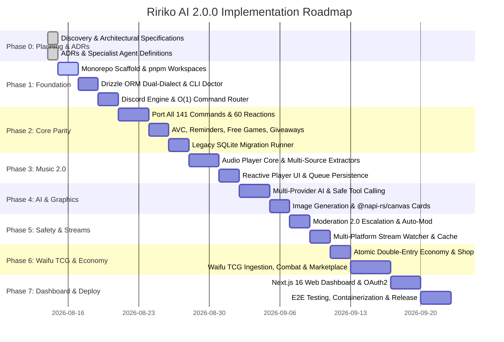

# Implementation Roadmap (Ririko AI 2.0.0)

## Phase Overview & Timeline

---

## Phase Breakdown & Acceptance Criteria

### Phase 0: Discovery, Architecture & Agent Definitions
- **Status**: Complete
- **Deliverables**:
  - `docs/legacy-feature-inventory.md`
  - `docs/architecture.md`
  - `docs/migration-1.x-to-2.0.md`
  - `docs/dependency-evaluation.md`
  - `docs/implementation-roadmap.md`
  - `docs/adr/ADR-001` through `ADR-012`
  - `GEMINI.md`, `AGENTS.md`, and 18 specialist agents in `.gemini/agents/`.
- **Exit Gate**: All architectural decisions documented and approved.

---

### Phase 1: Foundation Scaffold & Toolchain
- **Scope**:
  - Initialize pnpm workspace with `apps/` and `packages/`.
  - Implement `packages/core` (Zod config validation, typed event bus, standard error hierarchy).
  - Implement `packages/database` (Drizzle ORM PostgreSQL & SQLite schemas, connection factory).
  - Implement `packages/discord` (Slash & Prefix command router with O(1) lookups, middleware pipeline).
  - Implement `apps/cli` with `ririko doctor` (environment and database diagnostic checks).
- **Exit Gate**: `pnpm build`, `pnpm typecheck`, and `ririko doctor` run cleanly without errors.

---

### Phase 2: Core Command Parity & Legacy Migrator
- **Scope**:
  - Port all 141 commands with 100% slash/prefix parity.
  - Implement all 60 anime reaction commands via `packages/services/reactions` with local cache fallback.
  - Modernize AVC (Auto Voice Channels) with instant cleanup and permission cloning.
  - Modernize Reminders with persistent timezone-aware scheduler.
  - Modernize Free Games notifications with Epic Games Store API + Steam Store API.
  - Modernize Giveaways to database state (surviving bot restarts).
  - Implement `ririko migrate legacy` CLI runner with `--dry-run` and verification checks.
- **Exit Gate**: Verified 100% parity with legacy 1.4.0 commands and successful dry-run migration of legacy SQLite.

---

### Phase 3: Music 2.0 & Audio Core
- **Scope**:
  - Implement audio playback core using `@discordjs/voice` with native Opus transcoding.
  - Build multi-source resolvers: YouTube, Spotify, SoundCloud, Bandcamp, and direct URLs.
  - Create interactive now-playing controller with responsive action buttons (Play/Pause, Skip, Back, Loop, Volume, Lyrics).
  - Eliminate legacy 10-second polling interval; implement pure event-driven embed updates.
  - Add optional Lavalink 4 adapter for enterprise sharding.
- **Exit Gate**: Audio streams smoothly across voice channels with zero event-loop blocking and sub-100ms button response latency.

---

### Phase 4: AI Chatbot 2.0 & Graphics Synthesis
- **Scope**:
  - Build unified `AiProvider` interface supporting Google Gemini, OpenAI, and local Ollama.
  - Implement conversational memory with sliding-window context and persistent database sessions.
  - Implement safe function tool calling (`get_time`, `search_anime`, `queue_song`, `check_balance`) with Zod validation.
  - Overhaul visual card generation (`RankCard`, `WelcomeCard`, `GoodbyeCard`) using high-speed `@napi-rs/canvas`.
  - Port and modernize all 11 meme template generators.
  - Build multi-backend image generation service (Gemini Imagen, ComfyUI, Replicate, HuggingFace).
- **Exit Gate**: Conversational AI responds with streaming tokens, tool calling triggers successfully, and rank cards render in under 150ms.

---

### Phase 5: Moderation 2.0 & Multi-Platform Streams
- **Scope**:
  - Implement automated warning escalation engine (warn thresholds triggering timeout, kick, ban).
  - Implement auto-moderation regex/trie engine (excessive mentions, invite links, scam URLs, spam).
  - Build immutable moderation audit logging with dedicated mod log channel dispatches.
  - Modernize Admin Notes with multi-moderator edit history and user menu shortcuts.
  - Build multi-platform live stream watcher (Twitch, YouTube Live, TikTok Live) with persistent idempotency and thumbnail asset caching.
- **Exit Gate**: Auto-mod filters bad links instantly, warnings escalate cleanly, and stream notifications deliver exactly once with cached thumbnails.

---

### Phase 6: Waifu TCG & Centralized Transactional Economy
- **Scope**:
  - Ingest anime character database from Jikan (MAL), AniList, and Waifu.im.
  - Implement 8-tier rarity mathematical curve (Common 40% to Mythic 0.5%).
  - Implement 6-element affinity interaction matrix (Fire, Water, Earth, Wind, Light, Dark).
  - Build dynamic collectible card generator with holographic foils and stats.
  - Implement card drops, hourly claims, and inventory viewer.
  - Build atomic P2P trading engine with confirm/cancel buttons.
  - Implement community marketplace with buy-it-now and auction listings.
  - Implement Waifu Guilds and cooperative raid bosses.
  - Build transactional double-entry ledger for economy (wallets, bank interest, daily streak multipliers).
- **Exit Gate**: Zero-race-condition card trading and coin transfers; card collection viewer pagination works seamlessly.

---

### Phase 7: Web Dashboard, Comprehensive Testing & Production Deployment
- **Scope**:
  - Build Next.js 16 management dashboard in `apps/web` with Discord OAuth2 authentication.
  - Build server configuration portal for guild admins (prefix, welcomer, logs, AI settings).
  - Build web-based Waifu card collection album, marketplace viewer, and economy leaderboards.
  - Author comprehensive Vitest test suites (target 80%+ coverage on core domain services).
  - Create multi-stage rootless `Dockerfile` and `docker-compose.production.yml`.
  - Configure GitHub Actions CI/CD workflows (`ci.yml`, `release.yml`).
- **Exit Gate**: Production Docker container boots in under 3 seconds, all automated tests pass, and dashboard renders SSR flawlessly.
