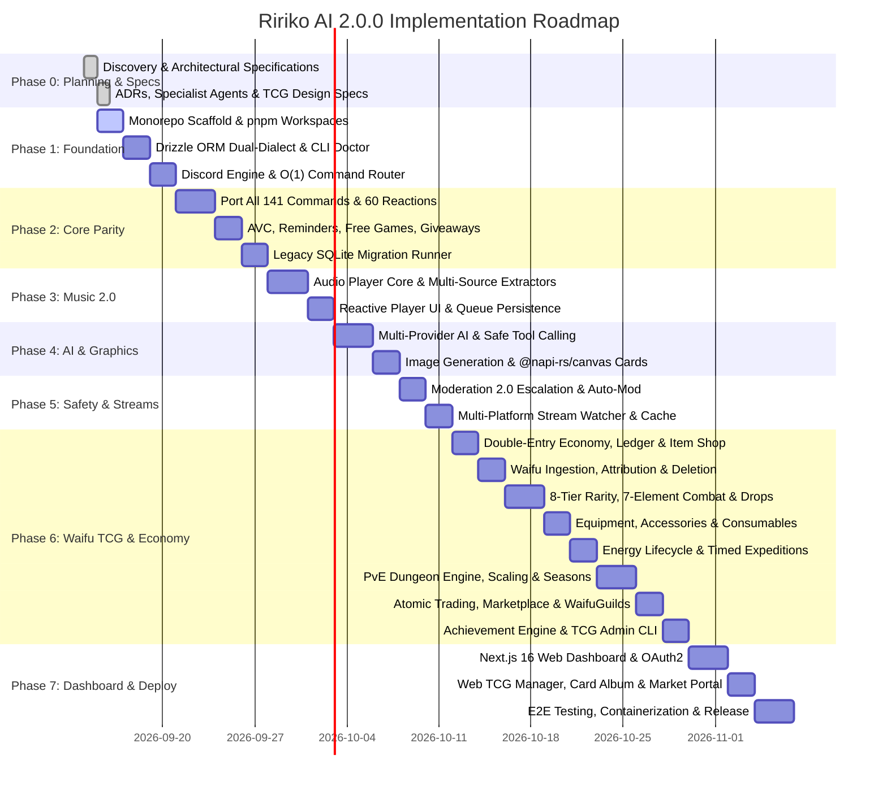

# Implementation Roadmap (Ririko AI 2.0.0)

> **Effective Date / Roadmap Start**: September 15, 2026 (`2026-09-15`)  
> **Target Release**: November 2026  
> **Main Development Branch**: `develop/2.0.0`

## Phase Overview & Timeline

---

## Phase Breakdown & Acceptance Criteria

### Phase 0: Discovery, Architecture & Agent Definitions
- **Status**: Complete
- **Deliverables**:
  - `docs/legacy-feature-inventory.md`
  - `docs/architecture.md`
  - `docs/migration-1.x-to-2.0.md`
  - `docs/dependency-evaluation.md`
  - `docs/implementation-roadmap.md`
  - `docs/waifu-tcg.md`
  - `docs/database.md`, `docs/commands.md`, `docs/economy.md`, `docs/dashboard.md`
  - `docs/adr/ADR-001` through `ADR-012`
  - `GEMINI.md`, `AGENTS.md`, and 18 specialist agents in `.gemini/agents/`.
- **Exit Gate**: All architectural decisions documented and approved.

---

### Phase 1: Foundation Scaffold & Toolchain
- **Scope**:
  - Initialize pnpm workspace with `apps/` and `packages/`.
  - Implement `packages/core` (Zod config validation, typed event bus, standard error hierarchy).
  - Implement `packages/database` (Drizzle ORM PostgreSQL & SQLite schemas, connection factory).
  - Implement `packages/discord` (Slash & Prefix command router with O(1) lookups, middleware pipeline).
  - Implement `apps/cli` with `ririko doctor` (environment and database diagnostic checks).
- **Exit Gate**: `pnpm build`, `pnpm typecheck`, and `ririko doctor` run cleanly without errors.

---

### Phase 2: Core Command Parity & Legacy Migrator
- **Scope**:
  - Port all 141 commands with 100% slash/prefix parity.
  - Implement all 60 anime reaction commands via `packages/services/reactions` with local cache fallback.
  - Modernize AVC (Auto Voice Channels) with instant cleanup and permission cloning.
  - Modernize Reminders with persistent timezone-aware scheduler.
  - Modernize Free Games notifications with Epic Games Store API + Steam Store API.
  - Modernize Giveaways to database state (surviving bot restarts).
  - Implement `ririko migrate legacy` CLI runner with `--dry-run` and verification checks.
- **Exit Gate**: Verified 100% parity with legacy 1.4.0 commands and successful dry-run migration of legacy SQLite.

---

### Phase 3: Music 2.0 & Audio Core
- **Scope**:
  - Implement audio playback core using `@discordjs/voice` with native Opus transcoding.
  - Build multi-source resolvers: YouTube, Spotify, SoundCloud, Bandcamp, and direct URLs.
  - Create interactive now-playing controller with responsive action buttons (Play/Pause, Skip, Back, Loop, Volume, Lyrics).
  - Eliminate legacy 10-second polling interval; implement pure event-driven embed updates.
  - Add optional Lavalink 4 adapter for enterprise sharding.
- **Exit Gate**: Audio streams smoothly across voice channels with zero event-loop blocking and sub-100ms button response latency.

---

### Phase 4: AI Chatbot 2.0 & Graphics Synthesis
- **Scope**:
  - Build unified `AiProvider` interface supporting Google Gemini, OpenAI, and local Ollama.
  - Implement conversational memory with sliding-window context and persistent database sessions.
  - Implement safe function tool calling (`get_time`, `search_anime`, `queue_song`, `check_balance`) with Zod validation.
  - Overhaul visual card generation (`RankCard`, `WelcomeCard`, `GoodbyeCard`) using high-speed `@napi-rs/canvas`.
  - Port and modernize all 11 meme template generators.
  - Build multi-backend image generation service (Gemini Imagen, ComfyUI, Replicate, HuggingFace).
- **Exit Gate**: Conversational AI responds with streaming tokens, tool calling triggers successfully, and rank cards render in under 150ms.

---

### Phase 5: Moderation 2.0 & Multi-Platform Streams
- **Scope**:
  - Implement automated warning escalation engine (warn thresholds triggering timeout, kick, ban).
  - Implement auto-moderation regex/trie engine (excessive mentions, invite links, scam URLs, spam).
  - Build immutable moderation audit logging with dedicated mod log channel dispatches.
  - Modernize Admin Notes with multi-moderator edit history and user menu shortcuts.
  - Build multi-platform live stream watcher (Twitch, YouTube Live, TikTok Live) with persistent idempotency and thumbnail asset caching.
- **Exit Gate**: Auto-mod filters bad links instantly, warnings escalate cleanly, and stream notifications deliver exactly once with cached thumbnails.

---

### Phase 6: Waifu TCG & Centralized Transactional Economy

Synchronized with the full technical specification in `docs/waifu-tcg.md`:

- **6.1 Double-Entry Financial Ledger & Economy Core**:
  - Implement immutable double-entry ledger (`economy_transactions`, `economy_balances`).
  - Standard transaction types: `DAILY_REWARD`, `TRANSFER`, `PVP_WAGER`, `SHOP_BUY`, `MARKET_BUY`, `DUNGEON_REWARD`, `RAID_REWARD`, `EXPEDITION_REWARD`, `DISMANTLE_DUST`.
  - Daily streak multiplier and automated bank interest accrual.

- **6.2 Waifu Image Ingestion, Validation & Attribution Pipeline**:
  - Asynchronous background worker harvesting assets from `waifu.im`, AniList, and Jikan.
  - Validate image magic bytes, dimensions, and aspect ratio; compute SHA-256 content hashes.
  - Catalog in `waifu_assets` table; store binary assets on local disk / S3 (`/assets/waifu-cards/`).
  - Strict mandatory attribution overlay & Discord embed footer: `Image source: waifu.im`.
  - Graceful deletion handling (`is_deleted_by_request = TRUE`): automatic fallback to standardized silhouette card frame with character name, stats, and ownership 100% preserved.

- **6.3 8-Tier Rarity Curve & Dynamic Card Generation**:
  - Mathematically balanced 8-tier rarity curve:
    - Common (60.0%, 1.0x stat mult, max Lv 20, standard card border)
    - Uncommon (20.0%, 1.2x stat mult, max Lv 30, bronze trim)
    - Rare (10.0%, 1.5x stat mult, max Lv 40, silver sheen)
    - Super Rare / SR (6.0%, 1.9x stat mult, max Lv 50, gold shimmer)
    - Ultra Rare / UR (3.0%, 2.5x stat mult, max Lv 60, prismatic hologram)
    - Secret Rare / SEC (0.9%, 3.2x stat mult, max Lv 70, dark sparkle foil)
    - Special Illustration Rare / SIR (0.09%, 4.0x stat mult, max Lv 85, full-art textured foil)
    - Mythic (0.01%, 5.0x stat mult, max Lv 100, cosmic celestial animated foil)
  - Card attributes: Name, serial number (e.g. `Makima #0042/1000`), stats (HP 500–15,000, ATK 50–2,500, DEF 30–1,800, SPD 10–300, CRIT 5%–50%, MP 100), unique active skill, passive ability, and collection album index.
  - Foil shaders and card rendering via `@napi-rs/canvas`.

- **6.4 7-Element Affinity Matrix & Tactical Combat Engine**:
  - 7-element loop featuring Ice: Fire > Ice > Earth > Lightning > Water > Fire (1.5x damage multiplier).
  - Mutual high-risk axis: Light <> Shadow (1.5x mutual catastrophe damage).
  - Elemental status effects and combat traits:
    - Fire: *Burn* (10% ATK DoT)
    - Ice: *Freeze & Chill* (25% SPD slow, 15% turn-skip chance)
    - Earth: *Fortify* (defensive shielding & phys mitigation)
    - Lightning: *Surge* (+15% CRIT & micro-stuns)
    - Water: *Purify & Flow* (8% max HP regen/turn & debuff cleanse)
    - Light: *Radiance* (team ATK buff & shield pierce)
    - Shadow: *Decay & Leech* (20% lifesteal)

- **6.5 Automated Waifu Drops & Card Inventory Management**:
  - Automated guild drop generator: configurable channel (`#waifu-drops`), message activity threshold (50–100 messages from unique users), 60-second interactive `[Claim Card]` Discord button, allowed active hours (08:00–23:00), and 5-minute anti-sniping cooldown for the previous claimer.
  - Inventory commands:
    - `/card collection [filter] [sort]` (paginated interactive visual album)
    - `/card inspect <card_id>` (high-resolution card embed with full history and equipped gear)
    - `/card equip <card_id>` (assigns to active combat deck, locks from trade/market)
    - `/card favorite <card_id>` (protects against accidental sale/dismantle)
    - `/card dismantle <card_id>` (breaks duplicates into Crafting Dust)

- **6.6 Equipment, Accessory & Enhancement Subsystem**:
  - 3 Equipment slots per card: Weapon (ATK/CRIT), Armor (HP/DEF), Relic (SPD/Mana) with dynamic rarity-scaled Battle Perks (e.g. *Vampiric Touch*, *Glacial Counter*, *Mana Conduit*, *Phoenix Ward*, *Cosmic Cataclysm*).
  - 3 Accessory slots per card: Ring (offensive % multipliers), Amulet (defensive % multipliers), Talisman (utility/mana % multipliers).
  - Equipment enhancement (+0 to +10) powered by Crafting Dust and Credits, boosting base stats and scaling Battle Perk potencies at +5 and +10 milestones.

- **6.7 Consumables & Potions Subsystem**:
  - HP Potions: Minor (300 HP), Major (1,200 HP), Elixir of Full Vitality (100% HP + debuff cleanse).
  - Mana Potions: Mana Draught (30 MP), Greater Mana Potion (70 MP), Cosmic Ether (100% MP + instant free skill cast).
  - Energy Restores: Stamina Candy (+15), Grand Stamina Flask (+30), Celestial Ambrosia (Full Energy).
  - Guardrails: Daily consumption cap of 3 energy restores per calendar day; no infinite shop stock.

- **6.8 Player Energy (Stamina) Lifecycle Engine**:
  - Deterministic daily replenishment at 00:00 UTC with lazy login recovery.
  - Level-based capacity formula: $\text{MaxEnergy}(\text{Level}) = \min(\text{GlobalCap}, 100 + \lfloor(\text{Level}-1)\times 2\rfloor + \text{MilestoneBonus}(\text{Level}))$.
  - Global energy cap governance (default 300, range 100–1,000).
  - Energy expenditure pipeline: Timed Expeditions (1h = 10, 4h = 25, 8h = 45), Dungeons (10–25), World Boss Raids (30), PvP Duels (5).

- **6.9 PvE Dungeon Architecture: Tutorial, Seasons & Exponential Scaling Engine**:
  - **Tutorial Dungeon / Prologue (Floors T1–T4)**: Zero-energy onboarding covering Elemental Resonance, Mana & Active Skills, Consumables, and Boss Break Shields; awards starter card, gear, and `TUTORIAL_COMPLETE` achievement.
  - **Seasonal Framework (S1, S2, S3...)**: 60–90 day seasonal cycles archived to Hall of Fame; active Environmental Affixes (e.g. *Scorched Earth*, *Heat Haze*, *Torrential Deluge*, *Tidal Barrier*, *Radiant Flare & Void Drain*).
  - **Anti-Powercreep Architecture**: Multi-layer elemental wards (blocking off-element brute force), seasonal affix penalties, turn-10+ soft enrages (+100% ATK/turn and true damage).
  - **Floor Progression**: Sequential climb with Mini-Bosses every 5 floors and Major Milestone Bosses every 10 floors with custom dialogue and animated avatars.
  - **Configurable Scaling Models**: Linear, Polynomial, Hybrid, and default Exponential ($\text{MonsterStat}(F) = \text{BaseStat} \times (1 + r)^{F - 1} \times \text{BossMultiplier}$, $r=0.085$).

- **6.10 Game Modes: Expeditions, PvP Duels & Cooperative Boss Raids**:
  - Timed Expeditions (`/game explore` 1h, 4h, 8h) consuming energy for credits, materials, crafting dust, and card shards.
  - PvP Duels (`/game pvp <@user> [wager]`) with 3v3 tactical elemental battles and escrowed credit wagers.
  - Cooperative Boss Raids (`/game boss`) with server-wide HP pools, turn-based damage tracking, exclusive card frames, and Mythic gear fragments.
  - Daily & weekly battle/claim mission milestones.

- **6.11 Atomic Trading & Player Marketplace**:
  - P2P Trading (`/game trade <@user>`): Interactive session, atomic state locking (`IN_TRADE`), dual-party button confirmation, single ACID transaction settlement.
  - Player Marketplace (`/game market`): Custom credit pricing, state locking (`IN_MARKET`), configurable listing tax (5% coin sink), and 7-day auto-expiration.

- **6.12 WaifuGuilds Subsystem**:
  - Dedicated in-game player factions (`WaifuGuild`, decoupled from `DiscordGuild`): guild creation, custom emblems/mottos, XP progression from card battles, shared guild bank, and cooperative guild raids.

- **6.13 Item Shop & Combat Loot Pipeline**:
  - Basic Town Shop (`/shop`): Sells Common/Uncommon gear, basic accessories, minor potions, and 1 daily energy biscuit (audited via ledger `SHOP_BUY`).
  - Superior Loot Progression: Rare through Mythic gear, dynamic battle perks, and high-tier potions drop exclusively through PvE battles, dungeons, raids, and quests.

- **6.14 Game Achievement System**:
  - 6 progression tracks: Collector, Combatant, Tycoon, Blacksmith, Devotion, Guild Hero across 5 tiers (Bronze, Silver, Gold, Platinum, Mythic).
  - Event-driven listeners for `CARD_CLAIMED`, `DUNGEON_CLEARED`, `PVP_WON`, `EQUIPMENT_UPGRADED`.
  - Multi-asset reward dispatch: Account EXP, Credits, exclusive Cards, Equipment, Accessories, Consumables, and Canvas profile badges/titles.
  - Atomic claiming via `/achievement claim <id | all>`.

- **6.15 Governance & Role-Guarded Administration**:
  - Centralized parameter storage in `tcg_system_configs`.
  - Protected Discord slash commands (`/tcg-admin config energy ...`, `/tcg-admin config dungeon ...`, `/tcg-admin config role <@role>`) guarded by `tcg_manager_role_id` or Discord `Administrator`.

- **Exit Gate**:
  - Zero-race-condition card trading, marketplace purchases, and coin transfers verified under high-concurrency test suites.
  - Full elemental interaction matrix (7 elements) and status effects validated.
  - Dungeon exponential difficulty scaling and multi-layer elemental wards verified up to Floor 50+.
  - Energy replenishment lifecycle, daily potion limits, and shop inventory transaction integrity proven.
  - Card collection album pagination and canvas visual card generation render cleanly under 150ms.

---

### Phase 7: Web Dashboard, Comprehensive Testing & Production Deployment
- **Scope**:
  - Build Next.js 16 management dashboard in `apps/web` with Discord OAuth2 authentication.
  - Build server configuration portal for guild admins (prefix, welcomer, logs, AI settings).
  - Build web-based Waifu card collection album, marketplace viewer, and economy leaderboards.
  - Build Waifu TCG Settings Panel & Dungeon Tower Manager (scaling model dropdown, interactive curve visualizer, seasonal affix editor, shop catalog management, and achievement reward toggles).
  - Author comprehensive Vitest test suites (target 80%+ coverage on core domain services).
  - Create multi-stage rootless `Dockerfile` and `docker-compose.production.yml`.
  - Configure GitHub Actions CI/CD workflows (`ci.yml`, `release.yml`).
- **Exit Gate**: Production Docker container boots in under 3 seconds, all automated tests pass, and dashboard renders SSR flawlessly.
