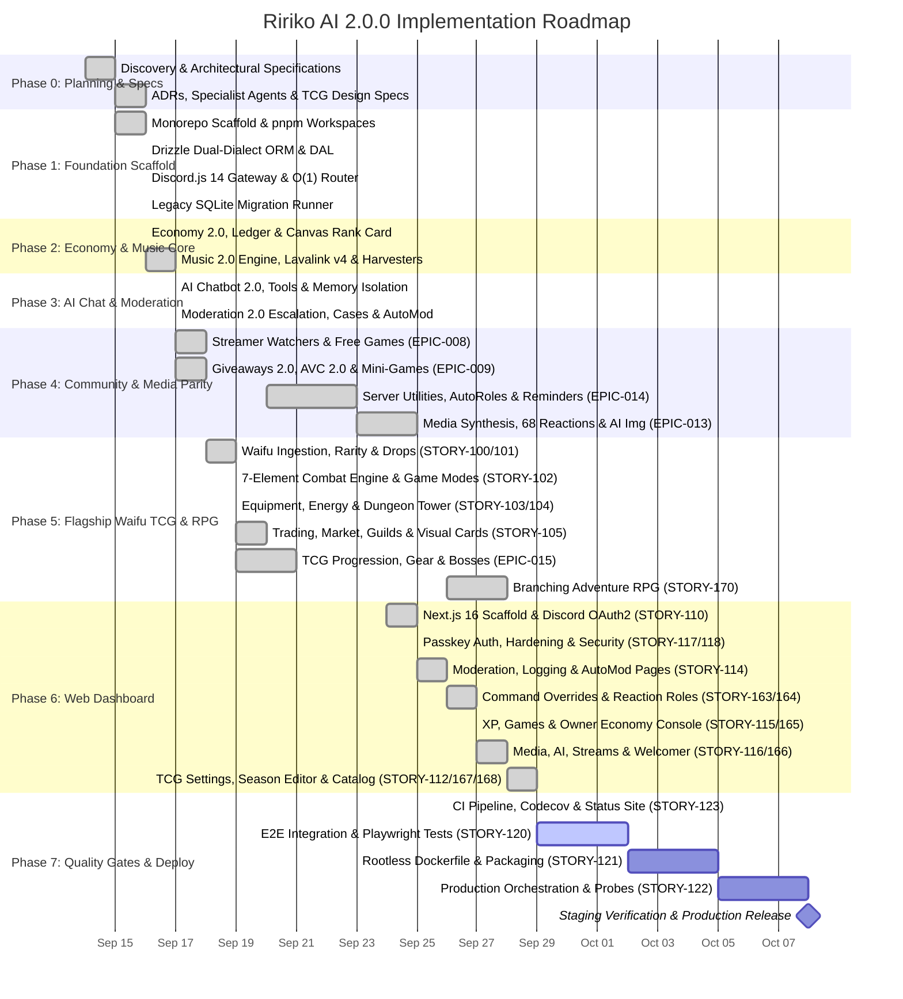

# Implementation Roadmap (Ririko AI 2.0.0)

> **Effective Date / Roadmap Start**: September 15, 2026 (`2026-09-15`)  
> **Current Date**: September 29, 2026 (`2026-09-29`)  
> **Target Release**: October / November 2026  
> **Main Development Branch**: `develop/2.0.0`  
> **Live Board Registry**: [docs/kanban/BOARD.md](file:///z:/Projects/ririko-v2-2026/docs/kanban/BOARD.md) · [docs/kanban/board.json](file:///z:/Projects/ririko-v2-2026/docs/kanban/board.json)

---

## Executive Progress Summary

| Metric | Target Baseline | Current State (2026-09-29) | Status |
|---|---|---|---|
| **Epics Completed** | 16 Epics | 15 of 16 Epics (`EPIC-000` through `EPIC-011`, `EPIC-013` through `EPIC-015`) | **93.8%** ✅ |
| **Stories Delivered** | ~40 Stories (Initial) | 80 Stories Completed (`STORY-001` .. `STORY-168`) + 1 in Review (`STORY-170`) | **95.2%** ✅ |
| **Tasks Completed** | ~80 Tasks (Initial) | 167 Tasks Completed, 1 in Review (`TASK-1705`) | **96.0%** ✅ |
| **Bugs Resolved** | Reactive triage | 28 Bugs Fixed (`BUG-0001` .. `BUG-0022`, `BUG-0026`), 3 To Do (`BUG-0023`..`0025`) | **90.3%** ✅ |
| **Active Focus** | `develop/2.0.0` | `EPIC-012`: Quality Gates, Playwright E2E, Docker Rootless & Probes | 🔄 **In Progress** |

---

## Phase Overview & Timeline


```mermaid
gantt
    title Ririko AI 2.0.0 Implementation Roadmap
    dateFormat  YYYY-MM-DD
    axisFormat  %b %d

    section Phase 0: Planning & Specs
    Discovery & Architectural Specifications   :done, 2026-09-14, 2026-09-15
    ADRs, Specialist Agents & TCG Design Specs :done, 2026-09-15, 2026-09-16

    section Phase 1: Foundation Scaffold
    Monorepo Scaffold & pnpm Workspaces        :done, 2026-09-15, 2026-09-16
    Drizzle Dual-Dialect ORM & DAL             :done, 2026-09-16, 2026-09-16
    Discord.js 14 Gateway & O(1) Router        :done, 2026-09-16, 2026-09-16
    Legacy SQLite Migration Runner             :done, 2026-09-16, 2026-09-16

    section Phase 2: Economy & Music Core
    Economy 2.0, Ledger & Canvas Rank Card     :done, 2026-09-16, 2026-09-16
    Music 2.0 Engine, Lavalink v4 & Harvesters :done, 2026-09-16, 2026-09-17

    section Phase 3: AI Chat & Moderation
    AI Chatbot 2.0, Tools & Memory Isolation   :done, 2026-09-17, 2026-09-17
    Moderation 2.0 Escalation, Cases & AutoMod :done, 2026-09-17, 2026-09-17

    section Phase 4: Community & Media Parity
    Streamer Watchers & Free Games (EPIC-008)  :done, 2026-09-17, 2026-09-18
    Giveaways 2.0, AVC 2.0 & Mini-Games (EPIC-009) :done, 2026-09-17, 2026-09-18
    Server Utilities, AutoRoles & Reminders (EPIC-014) :done, 2026-09-20, 2026-09-23
    Media Synthesis, 68 Reactions & AI Img (EPIC-013) :done, 2026-09-23, 2026-09-25

    section Phase 5: Flagship Waifu TCG & RPG
    Waifu Ingestion, Rarity & Drops (STORY-100/101) :done, 2026-09-18, 2026-09-19
    7-Element Combat Engine & Game Modes (STORY-102) :done, 2026-09-19, 2026-09-19
    Equipment, Energy & Dungeon Tower (STORY-103/104) :done, 2026-09-19, 2026-09-19
    Trading, Market, Guilds & Visual Cards (STORY-105) :done, 2026-09-19, 2026-09-20
    TCG Progression, Gear & Bosses (EPIC-015) :done, 2026-09-19, 2026-09-21
    Branching Adventure RPG (STORY-170)        :done, 2026-09-26, 2026-09-28

    section Phase 6: Web Dashboard
    Next.js 16 Scaffold & Discord OAuth2 (STORY-110) :done, 2026-09-24, 2026-09-25
    Passkey Auth, Hardening & Security (STORY-117/118) :done, 2026-09-25, 2026-09-25
    Moderation, Logging & AutoMod Pages (STORY-114) :done, 2026-09-25, 2026-09-26
    Command Overrides & Reaction Roles (STORY-163/164) :done, 2026-09-26, 2026-09-27
    XP, Games & Owner Economy Console (STORY-115/165) :done, 2026-09-27, 2026-09-27
    Media, AI, Streams & Welcomer (STORY-116/166) :done, 2026-09-27, 2026-09-28
    TCG Settings, Season Editor & Catalog (STORY-112/167/168) :done, 2026-09-28, 2026-09-29

    section Phase 7: Quality Gates & Deploy
    CI Pipeline, Codecov & Status Site (STORY-123) :done, 2026-09-26, 2026-09-26
    E2E Integration & Playwright Tests (STORY-120) :active, 2026-09-29, 3d
    Rootless Dockerfile & Packaging (STORY-121)    :2026-10-02, 3d
    Production Orchestration & Probes (STORY-122)  :2026-10-05, 3d
    Staging Verification & Production Release      :milestone, 2026-10-08, 0d
```

---

## Phase Breakdown & Acceptance Criteria

### Phase 0: Discovery, Architecture & Agent Definitions
- **Status**: ✅ **Complete** (`EPIC-000`, 13 pts base / 21 pts groomed)
- **Deliverables**:
  - [docs/legacy-feature-inventory.md](file:///z:/Projects/ririko-v2-2026/docs/legacy-feature-inventory.md) (141 commands & 17 entities audited from 1.4.0).
  - [docs/architecture.md](file:///z:/Projects/ririko-v2-2026/docs/architecture.md) (Clean architecture, monorepo topology, O(1) command router).
  - [docs/migrations.md](file:///z:/Projects/ririko-v2-2026/docs/migrations.md) and [docs/dependency-evaluation.md](file:///z:/Projects/ririko-v2-2026/docs/dependency-evaluation.md).
  - [docs/waifu-tcg.md](file:///z:/Projects/ririko-v2-2026/docs/waifu-tcg.md) (Comprehensive 15-subsystem flagship specification).
  - [docs/database.md](file:///z:/Projects/ririko-v2-2026/docs/database.md), [docs/commands.md](file:///z:/Projects/ririko-v2-2026/docs/commands.md), [docs/economy.md](file:///z:/Projects/ririko-v2-2026/docs/economy.md), [docs/dashboard.md](file:///z:/Projects/ririko-v2-2026/docs/dashboard.md), [docs/adapters.md](file:///z:/Projects/ririko-v2-2026/docs/adapters.md), [docs/ai.md](file:///z:/Projects/ririko-v2-2026/docs/ai.md), [docs/music.md](file:///z:/Projects/ririko-v2-2026/docs/music.md), [docs/moderation.md](file:///z:/Projects/ririko-v2-2026/docs/moderation.md), [docs/modules.md](file:///z:/Projects/ririko-v2-2026/docs/modules.md).
  - [docs/adr/](file:///z:/Projects/ririko-v2-2026/docs/adr/) (ADR-001 through ADR-012).
  - `GEMINI.md`, `AGENTS.md`, and 18 specialist agent definitions in `.gemini/agents/`.
  - Scrum Kanban Governance system ([docs/kanban/protocol.md](file:///z:/Projects/ririko-v2-2026/docs/kanban/protocol.md), [docs/kanban/BOARD.md](file:///z:/Projects/ririko-v2-2026/docs/kanban/BOARD.md), [docs/kanban/board.json](file:///z:/Projects/ririko-v2-2026/docs/kanban/board.json)).
- **Exit Gate**: All architectural decisions documented, approved, and registered in canonical board.

---

### Phase 1: Foundation Scaffold & Toolchain
- **Status**: ✅ **Complete** (`EPIC-001`, `EPIC-002`, `EPIC-003`, 55 pts base / 57 pts groomed)
- **Deliverables**:
  - `packages/core`: Zod config validation, typed asynchronous `EventBus`, standardized error codes hierarchy (`STORY-010`, `STORY-011`).
  - `packages/database`: Drizzle ORM dual-dialect abstraction (PostgreSQL & SQLite), 70+ normalized table schemas, ACID transaction helpers, and `ririko migrate legacy` CLI runner with `--dry-run` and data verification (`STORY-020`, `STORY-021`, `STORY-022`, `STORY-023`).
  - `packages/discord`: Discord.js 14 Gateway harness, dual-dispatch command router with O(1) hash map lookups, composable middleware pipeline (permissions, maintenance, cooldowns, rate limits), and interactive dynamic help center (`/help`) (`STORY-030`, `STORY-031`, `STORY-032`, `STORY-033`).
  - `apps/cli`: Scaffolding with `ririko doctor` comprehensive diagnostic harness (`STORY-012`).
  - `apps/bot`: Dev entrypoint and `/ping` diagnostic command (`CHORE-0301`).
- **Exit Gate**: `pnpm build`, `pnpm typecheck`, and `ririko doctor` run cleanly without errors.

---

### Phase 2: Centralized Economy & Music 2.0 Audio Core
- **Status**: ✅ **Complete** (`EPIC-004`, `EPIC-005`, 34 pts base / 43 pts groomed)
- **Deliverables**:
  - `packages/services/economy` (`STORY-040`, `STORY-041`, `STORY-042`, `STORY-043`, `STORY-044`, `STORY-161`):
    - Double-entry financial ledger (`economy_transactions`, `economy_balances`) with ACID constraints.
    - Anti-spam text heuristics and voice participation anti-AFK quorum state machine.
    - Daily streak multiplier engine (+5%/day up to 30 days, 36h reset grace period) and unified configurable reset boundary (`STORY-161`).
    - Transactional banking service (deposit, withdraw, level-scaled capacity, deadlock-free P2P transfers).
    - Leveling 2.0 progression formula ($5L^2 + 50L + 100$) and materialized leaderboard snapshots for $O(1)$ dense rank queries.
    - Shop catalog repository, inventory bags, and SSRF-validated custom profile backgrounds.
    - High-performance 1200x400 `@napi-rs/canvas` Profile Card 2.0 synthesizer.
    - Dual-dispatch economy command suite (/balance, /daily, /deposit, /withdraw, /pay, /leaderboard, /profile, /shop, /inventory, /use, /karma).
  - `packages/music` (`STORY-050`, `STORY-051`, `STORY-052`, `TASK-0530`, `BUG-0001`, `BUG-0002`, `BUG-0018`):
    - Multi-source extractors: YouTube, Spotify (Official Web API + LavaSrc precision matching), SoundCloud, Deezer.
    - Session cookie rotation, mobile client spoofing, and automated PO-Token background provider with Playwright Chrome/Chromium credential harvester.
    - Voice lifecycle state machine with 3-minute idle auto-disconnect and audio queue with loop modes and volume clamping (0%–150%).
    - Lavalink v4 backend integration (`TASK-0530`) with automated installer script.
    - Reactive embed controller and interactive button matrix updating without `setInterval` polling.
    - Persistent guild default volume across music sessions (`BUG-0018`).
    - 17 dual-dispatch music commands (/play, /pause, /skip, /back, /stop, /queue, /volume, /loop, /shuffle, /seek, /filter, /lyrics, /join, /leave, /playlist, etc.).
- **Exit Gate**: 100% verified against unit tests, Playwright audio streams, and Discord Gateway voice events.

---

### Phase 3: AI Chatbot 2.0 & Moderation 2.0
- **Status**: ✅ **Complete** (`EPIC-006`, `EPIC-007`, 26 pts base / 26 pts groomed)
- **Deliverables**:
  - `packages/ai` & `apps/bot/commands/ai` (`STORY-060`, `STORY-061`, `STORY-062`, `STORY-063`, `CHORE-0601`, `BUG-0003`..`0007`):
    - Multi-provider AI core supporting Google Gemini (`@google/genai`), OpenAI (`openai`), and local Ollama with automatic failover chain.
    - Per-user context isolation engine in `ai_conversations` and `ai_messages` preventing prompt/memory leakage across shared channels.
    - System safety prompts and customizable guild persona engine.
    - Safe function tool calling with bi-directional name sanitization and security mediation (verifying Discord permissions before tool execution).
    - Explicit time tool (`get_current_time`) with timezone resolution, anime search, coinflip, and reminder tool definitions.
    - Dedicated `#ririko-ai` gateway listener with debounced streaming message edits.
    - Dual-dispatch AI command suite (`/ai chat`, `/ai model`, `/ai channel`, `/ai persona`, `/ai clear`) and `ririko ai:configure` CLI setup wizard.
  - `packages/services/moderation` & `apps/bot/commands/moderation` (`STORY-070`, `STORY-071`, `STORY-072`, `STORY-073`):
    - 5-tier centralized permission and role hierarchy verification service (`PermissionService`).
    - Discord punitive actions core (kick, ban, softban, unban, timeout, nick, lock, unlock) with structured results and event bus emission.
    - Atomic sequential per-guild case numbering (Case #N) with mod log channel dispatches and persistent staff notes.
    - Dynamic warning escalation engine with threshold mappings and sliding-window expirations.
    - Disciplinary purge sanitizer supporting multi-filter bulk deletes (user, bots, links, invites) respecting Discord 14-day API limits.
    - Real-time AutoMod pipeline: invite filter with whitelist, scam/phishing URL shield with homoglyph normalization, mention spam detector, and burst spam limiter.
    - Anti-raid mass join monitor detecting coordinated account floods.
    - Dual-dispatch moderation commands suite (/warn, /timeout, /kick, /ban, /purge, /lock, etc.).
- **Exit Gate**: All moderation actions audited, AutoMod filters verified against malicious inputs, and AI chat tests passing.

---

### Phase 4: Core Parity & Community Media Systems
- **Status**: ✅ **Complete** (`EPIC-008`, `EPIC-009`, `EPIC-013`, `EPIC-014`, 63 pts base / 62 pts groomed)
- **Deliverables**:
  - **`EPIC-008`: Streamer Notifications & Free Games Announcer (8 pts)**:
    - `STORY-080`: Multi-platform live stream watcher (Twitch EventSub, YouTube Live PubSubHubbub, TikTok Live) with persistent idempotency keys and local thumbnail CDN re-uploader.
    - `STORY-081`: Free games announcer for Epic Games Store and Steam promotional specials feed with duplicate suppression.
  - **`EPIC-009`: Giveaways 2.0, Auto Voice 2.0 & Mini-Games Suite (13 pts)**:
    - `STORY-090`: Crash-resilient database-backed giveaways surviving bot restarts with button entry and role gates.
    - `STORY-091`: Dynamic "Join to Create" temporary voice channels (Auto Voice 2.0) with permission inheritance and orphan channel cleanup (`BUG-0021`).
    - `STORY-092`: Interactive Mini-Games Suite: unbeatable Minimax AI Tic-Tac-Toe, Rock Paper Scissors, HighLow card wagering, CoinFlip, and Dice wagers with escrow.
  - **`EPIC-013`: Media Synthesis, Anime Reactions & AI Image Generation (21 pts base / 18 pts groomed)**:
    - `STORY-130`: Unified `/react` command covering all 68 legacy anime reactions with autocomplete and legacy prefix aliases, backed by OtakuGIFs client and fallback GIF cache.
    - `STORY-131`: All 11 legacy meme template canvas synthesizers (`0days`, `allmyhomies`, `always-been`, `chad`, `undertaker`, etc.) using `@napi-rs/canvas`.
    - `STORY-132`: Multi-backend AI image generation service (`/imagine`) supporting Google Gemini Imagen, local ComfyUI/SD-WebUI, and Replicate with background job queue (`image_jobs`) and CLI config (`CHORE-1321`, `BUG-0019`).
    - `STORY-133`: Welcomer and Farewell dynamic canvas cards featuring user avatar, member count, and SSRF-validated background imagery.
  - **`EPIC-014`: Server Utilities, AutoRoles & Community Systems (21 pts base / 23 pts groomed)**:
    - `STORY-140`: Automatic Role System & Reaction Roles (Join roles, verification roles, button/select-menu component roles, tiered progression roles, temporary expiring roles).
    - `STORY-141`: Persistent natural language reminders engine (`/reminder`, `!remindme`) with chrono-node parsing and IANA timezone resolution surviving bot reboots (`BUG-0022`).
    - `STORY-142`: Anime & Manga search service (`/anime`, `/manga`, `/anime-character`) via Jikan API v4 and AniList with shared rate-limiting (`CHORE-1401`).
    - `STORY-143`: Server utility & identity commands parity (`/get-avatar`, `/guild-info`, `/member-info`, `/prefix`, `/timezone` with dynamic prefix help rendering).
    - `STORY-144`: Anime image commands parity (`/waifu`, `/wallpaper`) using WallHaven REST client and shared anime module.
- **Exit Gate**: 100% of all 141 legacy commands and all reaction/meme assets fully ported with verified dual-dispatch parity.

---

### Phase 5: Flagship Waifu TCG & RPG Subsystems
- **Status**: ✅ **Complete** (`EPIC-010`, `EPIC-015`, `STORY-170`, 109 pts base / 156 pts groomed)
- **Deliverables**:
  - **`EPIC-010`: Waifu TCG Core Gameplay, Ingestion, Trading & Marketplace (21 pts base / 24 pts groomed)**:
    - `STORY-100`: Ingestion pipeline harvesting `waifu.im`, AniList, and Jikan; magic bytes, dimension validation, SHA-256 deduplication, Section 24 attribution overlay, and silhouette fallback.
    - `STORY-101`: 8-tier rarity math (Common 50.0% to Mythic 0.05%), dynamic stats generation (HP, ATK, DEF, SPD, CRIT, MP), active skills, passive traits, automated guild drops with claim buttons and anti-sniping cooldowns.
    - `STORY-102`: 7-element affinity loop featuring Ice: Fire > Ice > Earth > Lightning > Water > Fire (1.5x damage); Light <> Shadow mutual catastrophe axis. Tactical status effects (Burn, Freeze/Chill, Fortify, Surge, Purify, Radiance, Decay).
    - `STORY-103`: 6-slot combat loadouts (3 Equipment, 3 Accessories) with tier-scaled Battle Perks, +0 to +10 enhancement with Crafting Dust, consumables catalog, and level-scaled daily energy recovery.
    - `STORY-104`: PvE Seasonal Dungeon Tower (Floors T1–T4 onboarding tutorial, 60–90 day seasonal framework with affixes, multi-layer wards, turn-10+ soft enrage, exponential scaling curve).
    - `STORY-105`: Concurrency-tested atomic P2P Trading (`/trade`), Player Marketplace (`/market` with 5% tax and 7-day expiration), WaifuGuilds (`/waifuguild`), Multi-Asset Achievement System (`/achievement`), Role-Guarded Administration (`/tcg-admin`), TCG Strategy Guidebook (`/tcg-info`), and 800×1200 px `@napi-rs/canvas` physical-style Card Synthesis Engine (`TASK-1061`).
  - **`EPIC-015`: Waifu TCG Progression, Equipment Economy & Seasonal Anime Bosses (21 pts base / 65 pts groomed)**:
    - `STORY-150` & `STORY-151`: Card EXP from dungeon victories, real combat skill MP costs, and DB-driven seasonal curve tables with floor boss definitions (`dungeon_bosses`).
    - `STORY-152`: Standalone Dungeon Balance Simulator CLI (`pnpm tcg:simulate`) verifying mathematical win-rate bands across all floor brackets.
    - `STORY-153` & `STORY-154`: `tcg:boss-builder` pipeline and Season 1 "Infernal Crucible" boss roster with high-resolution portraits and plain card artwork.
    - `STORY-155`: Real-time Boss artwork rendering in the interactive Dungeon Battle screen.
    - `STORY-156` & `STORY-157`: Equipment drop tables, boss signature drops, secondary stats, and interactive gear management menu (`/card gear`).
    - `STORY-158`: Town Shop revamp featuring categorized items, item comparison tool, Buy & Equip flow, and daily rotating deals.
    - `STORY-159`: Early-floor tuning, pity blessing mechanics, floor star ratings, and energy refunds on defeat.
    - `STORY-160`: Equipment crafting engine with Crafting Dust (`/item craft`) and recipe catalog.
    - Resolved critical gameplay bugs: starter blade auto-equip (`BUG-0010`), crafting dust persistence (`BUG-0011`), energy lifecycle wiring (`BUG-0012`), daily bonus energy cap (`BUG-0013`), gear transfer locks (`BUG-0014`), catalog seed upserts (`BUG-0015`), menu pagination (`BUG-0016`), card ID format (`BUG-0017`), and canonical item seed UUID pinning (`BUG-0026`).
  - **`STORY-170`: Interactive Branching Adventure RPG (67 pts total)**:
    - 30 illustrated branching quests with scene artwork, durable global adventure sessions, companion-scaled progression, and atomic reward settlement across credits, cards, and gear.
- **Exit Gate**: Concurrency-tested trading and marketplace (zero race conditions), full 7-element combat validated, floor 50+ scaling proven, balance simulator verified, and real card visual synthesis verified.

---

### Phase 6: Next.js 16 Web Dashboard & Management Portal
- **Status**: ✅ **Complete** (`EPIC-011`, 21 pts base / 120 pts groomed, completed 2026-09-29)
- **Deliverables**:
  - `STORY-110`: Next.js 16 App Router scaffold, React 19, Tailwind CSS, Discord OAuth2 authentication (`identify`, `guilds`), revocable server-side sessions, and `requireGuildAccess` authorization guard (`ManageGuild` / `Administrator`).
  - `CHORE-1101`: Cross-process guild configuration change feed (`guild_config_versions` table, bot watcher, and cache invalidation event emitter).
  - `STORY-111`: Shared Zod config schemas in `@ririko/core`, `GuildConfigService`, field-diff audit logger (`audit_logs`), dashboard shell with channel/role pickers, General tab, and `ririko guild:config` CLI parity.
  - `STORY-117` & `STORY-118`: WebAuthn Passkeys (`web_passkeys`), sign-in gate, `requireStepUp` re-verification, `BOT_OWNER_ID` owner guard, `ririko passkeys:reset` CLI recovery, active sessions manager, sign-in alerts, strict nonce CSP, React taint protection, and server-only secrets guards (`BUG-0020`).
  - `STORY-113`: Server analytics overview, command usage daily counters, bot status heartbeat, voice activity graphs, and moderation case log inspector with audit log viewer.
  - `STORY-114`: Typed settings form kit, logging configuration, dynamic warning escalation policy builder, and AutoMod rule manager with real bot action execution.
  - `STORY-163`: Command Overrides engine (`command_settings` table, channel overrides, allowed/blocked role lists) and management page.
  - `STORY-164`: Reaction Roles message builder (interactive button rows and select menus published via bot REST API), Auto Roles page, and Auto Voice management tab.
  - `STORY-115`: XP & Ranking configuration page with voice reward accrual, Mini-Games manager with maximum wager enforcement, and Giveaways manager (active list, manual end, reroll, history).
  - `STORY-165`: Owner Console with global economy controls (daily base reward, streak multipliers, bank capacity scaling formula), item shop catalog manager, and item seed code normalization.
  - `STORY-116`: Music settings page (default volume, DJ role guard, auto-leave on empty channel), AI Chatbot configuration (channel, persona, tool toggles, per-guild provider/model), Image Generation settings (provider, member daily limit, style preset), and Integrations status page (zero secret leakage).
  - `STORY-166`: Stream Alerts page (multi-platform subscriptions, custom notification templates, mention roles), Free Games announcement channel configuration, and Welcomer & Farewell dynamic card editor with live server-side preview.
  - `STORY-112`: Guild TCG drop settings (message spawn threshold, configurable channel, drop cooldown), guild-scoped TCG Manager Role, and owner-gated global TCG rules (market tax, listing expiry, energy limits).
  - `STORY-167`: Owner Dungeon Season Editor (season dates, theme, affixes, exponential scaling parameters, turn-10 enrage), interactive difficulty curve visualizer, and floor loot table editor.
  - `STORY-168`: Web Card Album viewer with cached `CardImageService` renders, override-safe TCG Shop Catalog editor, and Achievement Manager with guild completion telemetry.
- **Exit Gate**: Flawless Next.js 16 SSR, zero secret leakage, shared Zod validation with CLI and Bot, and real-time cross-process config synchronization.

---

### Phase 7: Quality Gates, Containerization & Production Deployment
- **Status**: 🔄 **In Progress** (`EPIC-012`, 13 pts base / 18 pts groomed, 5 pts done, 13 pts To Do)
- **Synchronized Stories**:
  - **`STORY-123`: CI Pipeline: CircleCI Quality Gates, Codecov Coverage & Vercel Status Site (5 pts)**: ✅ **Complete**
    - `TASK-1231`: One-time Prettier repository-wide baseline, CircleCI pipeline configuration (`lint`, `typecheck`, `test`, `web-build`, `gitleaks` secret scan).
    - `TASK-1232`: Vitest v8 coverage tracking with strict ratchet thresholds (lines ≥ 67%, functions ≥ 69%, statements ≥ 65%, branches ≥ 54%), JUnit test reporting, and Codecov integration.
    - `TASK-1233`: Automated Vercel project status site generated directly from the kanban board registry.
  - **`STORY-120`: E2E Integration Tests & Quality Gates Setup (5 pts)**: 🎯 **To Do**
    - `TASK-1201`: Setup Playwright for Web Dashboard E2E Tests (OAuth2 mock, navigation, settings mutations).
    - `TASK-1202`: Setup Discord API Mock Harness & Integration Test Suite for bot interactions and audio playback.
  - **`STORY-121`: Rootless Dockerfile & Containerization (5 pts)**: 🎯 **To Do**
    - `TASK-1211`: Multi-stage Rootless Dockerfile for Next.js Web Dashboard (`nodejs` unprivileged user, standalone output).
    - `TASK-1212`: Multi-stage Rootless Dockerfile for Discord Bot (`apps/bot`).
  - **`STORY-122`: Production Orchestration & Health Probes (3 pts)**: 🎯 **To Do**
    - `TASK-1221`: Implement `/health` and `/ready` probes for Bot and Web Dashboard.
    - `TASK-1222`: `docker-compose.production.yml` with Redis, PostgreSQL, Lavalink, and Bot/Web application services.
- **Exit Gate**: Production Docker container boots in under 3 seconds, all automated tests and coverage thresholds pass, and all health probes report healthy.

---

## Story Points & Velocity Tracking

```
Phase 0:  [====================] 100% (21/21 pts)   Planning & Specifications
Phase 1:  [====================] 100% (57/57 pts)   Scaffold, Dual DB & Discord Core
Phase 2:  [====================] 100% (43/43 pts)   Centralized Economy & Music 2.0
Phase 3:  [====================] 100% (26/26 pts)   AI Chatbot & Moderation 2.0
Phase 4:  [====================] 100% (62/62 pts)   Parity, Media & Community
Phase 5:  [====================] 100% (156/156 pts) Flagship Waifu TCG & Adventure RPG
Phase 6:  [====================] 100% (120/120 pts) Next.js 16 Web Dashboard
Phase 7:  [======..............]  27% (5/18 pts)    Quality Gates & Production Deploy
-------------------------------------------------------------------------------
TOTAL:    [===================.]  97% (485/498 pts) Overall Project Completion
```

---

## References & Key Documentation
- Master Platform Specification: [BLUEPRINT.md](file:///z:/Projects/ririko-v2-2026/BLUEPRINT.md)
- Scrum Kanban Governance Protocol: [docs/kanban/protocol.md](file:///z:/Projects/ririko-v2-2026/docs/kanban/protocol.md)
- Canonical Kanban Database: [docs/kanban/board.json](file:///z:/Projects/ririko-v2-2026/docs/kanban/board.json)
- Live Scrum Kanban Board: [docs/kanban/BOARD.md](file:///z:/Projects/ririko-v2-2026/docs/kanban/BOARD.md)
- Testing & Quality Gates: [docs/testing.md](file:///z:/Projects/ririko-v2-2026/docs/testing.md)
- Deployment & Infrastructure: [docs/deployment.md](file:///z:/Projects/ririko-v2-2026/docs/deployment.md)
