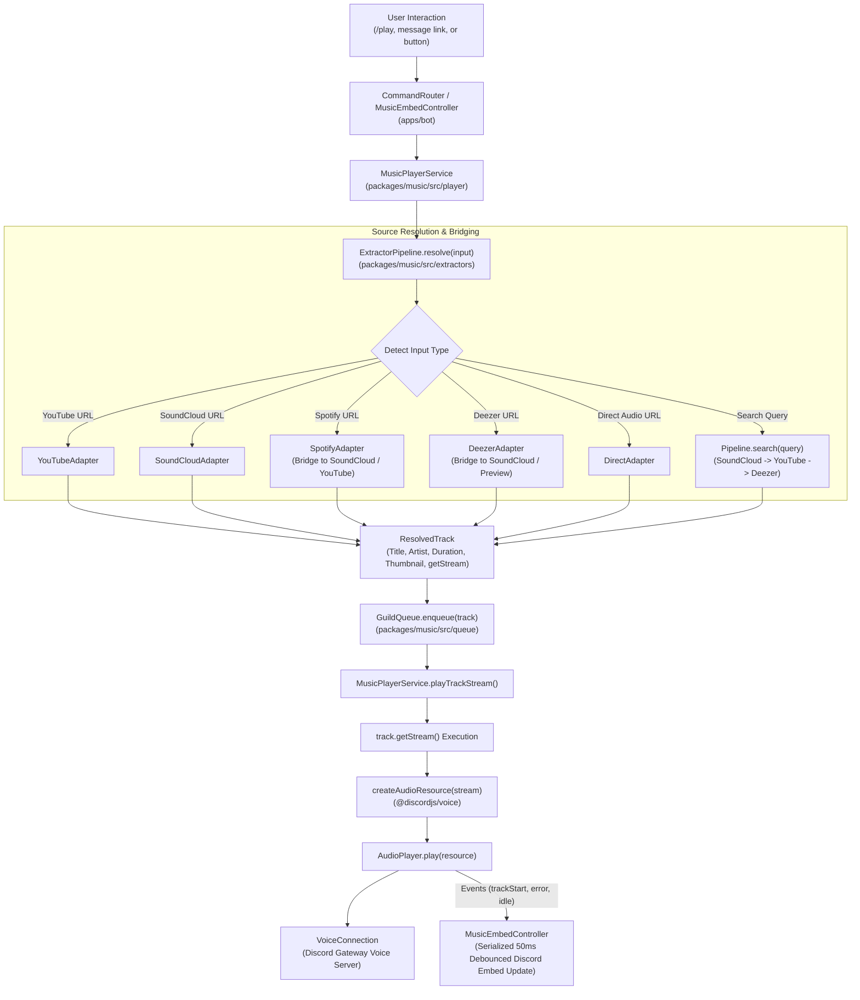
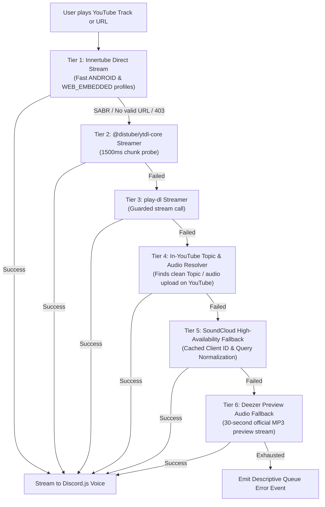

# Music 2.0 Audio Subsystem Specification & Architecture

## 1. Overview & Architectural Goals
**Music 2.0** is the production-grade audio subsystem for Ririko AI 2.0.0. It replaces the legacy monolithic, error-prone audio pipeline from version 1.4.0 with a modern, decoupled architecture:
- **Zero Polling Loops**: Completely eliminates the aggressive 10-second `setInterval` message-editing loops from 1.4.0 that routinely triggered Discord HTTP 429 rate limits.
- **Multi-Source Extractor Pipeline**: Native, decoupled audio extractors supporting YouTube, Spotify, SoundCloud, Deezer, and direct audio streams.
- **Multi-Tier Audio Resiliency**: Built-in, self-healing streaming cascade designed to withstand YouTube's modern anti-bot measures (SABR, BotGuard Proof-of-Origin tokens, and geoblocks).
- **Reactive Discord Embeds**: Real-time interactive player embed controller (`#music` channel) with serialized per-guild mutexes and coalescing debouncing.
- **Full Type Safety**: Monorepo package `@ririko/music` written in strict TypeScript 5.8+ with 100% test coverage.

---

## 2. Monorepo Package Topology (`@ririko/music`)

The audio subsystem is partitioned into four decoupled modules within [`packages/music`](file:///Z:/Projects/ririko-v2-2026/packages/music):

```
packages/music/
├── src/
│   ├── extractors/                 # Audio source adapters & metadata resolvers
│   │   ├── client-spoofing.ts      # User-Agent & header emulation (Android/iOS/Web)
│   │   ├── cookie-rotator.ts       # Round-robin session cookie rotation & health
│   │   ├── deezer.adapter.ts       # Native Deezer REST API extractor
│   │   ├── direct.adapter.ts       # Raw HTTP audio stream extractor (.mp3, .ogg, .wav)
│   │   ├── pipeline.ts             # Orchestrator & multi-provider stream fallback
│   │   ├── soundcloud.adapter.ts   # High-availability SoundCloud audio extractor
│   │   ├── spotify.adapter.ts      # Spotify metadata scraper & stream bridging
│   │   └── youtube.adapter.ts      # Resilient multi-tier YouTube streaming adapter
│   ├── player/                     # Audio playback orchestration
│   │   ├── music-player.service.ts # Core service wrapping @discordjs/voice AudioPlayer
│   │   └── types.ts                # Play options, player events, and result interfaces
│   ├── queue/                      # Queue & track lifecycle management
│   │   ├── autoplay.ts             # Smart recommendation engine for ended queues
│   │   ├── guild-queue.ts          # State machine, history, volume clamping & loops
│   │   ├── queue-manager.ts        # In-memory per-guild queue registry
│   │   └── types.ts                # QueuedTrack, LoopMode (OFF/TRACK/QUEUE), AudioFilter
│   ├── voice/                      # Discord Voice connection lifecycle
│   │   └── voice-lifecycle-manager.ts # Gateway join, leave, and reconnect management
│   ├── index.ts                    # Public package exports
│   └── types.ts                    # Core contracts (MusicSourceAdapter, ResolvedTrack)
```

---

## 3. End-to-End Audio Pipeline Architecture

The lifecycle of an audio request flows through a strict, unidirectional pipeline:



---

## 4. Multi-Tier YouTube Resiliency Architecture

In modern environments, YouTube deploys **Server-Side Adaptive Bitrate (SABR / Protobuf UMP)** and **BotGuard Proof-of-Origin (PO-Token)** verification. Unauthenticated requests to major-label official music videos receive `server_abr_streaming_url` without raw format URLs, causing traditional scrapers to crash with:
`PlayerError: No valid URL to decipher` or `HTTP 403 Forbidden`.

To ensure near 100% playback reliability while preserving our fallback pipeline, [`YouTubeAdapter`](file:///Z:/Projects/ririko-v2-2026/packages/music/src/extractors/youtube.adapter.ts) implements an in-adapter 6-tier cascade:



### Cascade Details:
1. **Tier 1 (Direct Innertube Streaming)**:
   - Uses `youtubei.js` (`Innertube`).
   - If `YOUTUBE_COOKIE`, `YOUTUBE_PO_TOKEN`, or `YOUTUBE_VISITOR_DATA` are configured, they are injected into `Innertube.create()`.
   - Probes client profiles `['ANDROID', 'WEB_EMBEDDED']` and peeks the first chunk to ensure GoogleVideo CDN returns HTTP 200 OK.
2. **Tier 2 (`@distube/ytdl-core` Secondary Streamer)**:
   - If Innertube encounters a cipher issue, attempts streaming via `@distube/ytdl-core` with `highWaterMark: 1 << 25`.
3. **Tier 3 (`play-dl` Secondary Streamer)**:
   - Probes `play-dl` with a fast 1500ms timeout guard.
4. **Tier 4 (In-YouTube Topic & Audio Upload Discovery)**:
   - Official VEVO music videos have the strictest SABR locks. The exact same song almost always exists on YouTube as an official auto-generated YouTube Music track (`- Topic`) or high-fidelity studio upload.
   - Searches YouTube for `"${artist} - ${title} audio"` or `"${artist} - ${title} Topic"`, resolves the alternative video ID, and streams it directly. **The user stays on YouTube with studio audio fidelity.**
5. **Tier 5 (SoundCloud High-Availability Fallback)**:
   - If all YouTube attempts fail, seamlessly falls back to SoundCloud.
   - **SoundCloud Client ID Caching**: Client ID is cached in memory with automatic re-acquisition on failure, completely eliminating transient client ID fetch errors.
6. **Tier 6 (Deezer Audio Fallback)**:
   - Final safety net querying Deezer REST API for preview audio.

---

## 5. Guide: Obtaining YouTube Cookies, PO-Token & Visitor Data

While Ririko's automated Tier 4 & Tier 5 fallbacks ensure music plays even without credentials, supplying YouTube session tokens guarantees **100% direct native YouTube playback** without throttling or SABR blocks.

### 5.1. Extracting `YOUTUBE_COOKIE`

A YouTube cookie authenticates your bot session, bypassing datacenter IP reputation penalties.

#### Method A: Browser DevTools (Recommended)
1. Open your browser (Chrome, Edge, Firefox, or Brave) and navigate to [youtube.com](https://www.youtube.com).
2. Make sure you are signed in (a throwaway Google account is recommended).
3. Press **F12** (or `Ctrl+Shift+I` / `Cmd+Option+I`) to open **Developer Tools**.
4. Go to the **Network** tab.
5. In the filter box, type `browse` or `v1/player`.
6. Refresh the page or click on any video.
7. Click on any request to `youtube.com` (e.g. `browse` or `player`).
8. In the **Headers** panel, scroll down to **Request Headers**.
9. Locate the `cookie:` header. Right-click its value and select **Copy value**.
10. Paste this string into your `.env` file:
    ```env
    YOUTUBE_COOKIE="VISITOR_INFO1_LIVE=...; LOGIN_INFO=...; __Secure-3PSID=...; ..."
    ```

#### Method B: Browser Extension (Netscape / Cookie Format)
1. Install an extension like **Cookie-Editor** or **Get cookies.txt LOCALLY**.
2. Visit [youtube.com](https://www.youtube.com).
3. Open the extension and export the cookies as **Header String** or **Netscape format**.
4. Copy the cookie string into `YOUTUBE_COOKIE` in your `.env`.

> [!TIP]
> Essential cookies include `VISITOR_INFO1_LIVE`, `__Secure-3PSID`, and `LOGIN_INFO`. Never share your `.env` file or commit it to GitHub.

---

### 5.2. YouTube PO-Token & Visitor Data Automation

The **PO-Token (Proof of Origin Token)** is generated by Google's **BotGuard** client integrity engine. It proves to GoogleVideo CDN that stream requests originate from a legitimate browser context, bypassing throttling and deciphering blocks on age-restricted or official VEVO tracks.

Ririko 2.0.0 provides **automated generation and rotation** both via CLI and in-process:

#### Method A: Developer CLI Command (Instant JSDOM Mode)
Generate fresh YouTube credentials on your host machine in ~1.2s and save directly into `.env`:
```bash
# Preview generated tokens
pnpm ririko generate:po-token

# Generate and automatically save to .env
pnpm ririko generate:po-token --save
```
*(Alias `ririko youtube:token --save` is also supported)*

#### Method B: Playwright Chrome Harvester (Cookies + PO-Token + VisitorData)
Uses real Microsoft Playwright with Google Chrome / Chromium (with anti-automation evasion) to harvest the full credential trifecta:
```bash
# 1. Automated Headless Chrome Mode (Extracts full session cookies + tokens)
pnpm ririko generate:po-token --chrome --save

# 2. Interactive Login Mode (Opens visible Chrome window to log in to YouTube/Google)
pnpm ririko generate:po-token --login --save

# 3. Custom engine selection (chrome, chromium, firefox)
pnpm ririko generate:po-token -b chrome --save
```

Output:
```text
🌸 Ririko AI 2.0.0 — YouTube Browser Credential Harvester

  Launching Google Chrome (headless)...
  Navigating to YouTube to establish session...
  Extracting browser cookies and client profile...
  Generating BotGuard Proof of Origin (poToken) matched to Google Chrome fingerprint...

✔ Successfully harvested YouTube credentials in 6786ms!

  Engine:        Google Chrome
  Mode:          Guest Browser Session
  Cookies:       7 cookies extracted
  User-Agent:    Mozilla/5.0 (Windows NT 10.0; Win64; x64) AppleWebKit/537.36 (KHTML, like Gecko) HeadlessChrome/152.0.0.0 Safari/537.36

Visitor Data:
  CgtGYjRGajhqS1BHMCjUyqrVBjIKCgJNWRIEGgAgD2KzAgqw...

Proof of Origin (PO Token):
  MtUEUtVTaFxAt2BSlONvYMq_TJXvhgln5qOmMhMs2u_zfFL...

YouTube Cookie Header (Preview):
  GPS=1; YSC=_-0E4uczQC4; VISITOR_INFO1_LIVE=Fb4Fj8jKPG0; ...

💾 Saved YOUTUBE_COOKIE, YOUTUBE_PO_TOKEN, and YOUTUBE_VISITOR_DATA to:
  Z:\Projects\ririko-v2-2026\.env
```

#### Method C: Automated In-Process Background Provider
If `YOUTUBE_PO_TOKEN` and `YOUTUBE_VISITOR_DATA` are omitted from `.env`:
1. When `YouTubeAdapter` is initialized, it launches a non-blocking background BotGuard challenge in JSDOM via `PoTokenService`.
2. Bot boot and command execution are **never blocked**.
3. Tokens are cached in memory and automatically refreshed every **18 hours** via background rotation timer, keeping credentials perpetually fresh without manual intervention.

#### Method D: Manual DevTools Extraction (Optional)
If you prefer extracting credentials from a specific logged-in browser session:
1. Open a **New Incognito / Private Window** in your browser.
2. Press **F12** to open **Developer Tools** and select the **Network** tab.
3. In the filter/search box at the top of the Network tab, type:
   ```
   v1/player
   ```
4. Navigate to [youtube.com](https://www.youtube.com) and click on any music video.
5. In the Network requests list, click on the **`v1/player`** request.
6. In the right pane, click on the **Payload** (or **Request**) tab.
7. Expand the JSON payload:
   - **PO-Token**: Look under `serviceIntegrityDimensions` -> find `poToken`.
     Copy this entire string (starts with `Mn...` or `Mt...`).
   - **Visitor Data**: Look under `context` -> `client` -> find `visitorData`.
     Copy this string (looks like `Cgt...%3D%3D`).

```json
{
  "context": {
    "client": {
      "clientName": "WEB",
      "clientVersion": "2.2026...",
      "visitorData": "Cgt4UVQ3VnRvcHBpUSjuxKnVBg%3D%3D"  <-- YOUTUBE_VISITOR_DATA
    }
  },
  "serviceIntegrityDimensions": {
    "poToken": "MnlY..."                               <-- YOUTUBE_PO_TOKEN
  }
}
```

8. Add them to your `.env` file:
   ```env
   YOUTUBE_PO_TOKEN="MnlY..."
   YOUTUBE_VISITOR_DATA="Cgt4UVQ3VnRvcHBpUSjuxKnVBg%3D%3D"
   ```

---

## 6. Guide: Obtaining Spotify Session Credentials

Spotify audio streams are DRM-protected. Ririko resolves full-fidelity track, album, and playlist metadata via Spotify and automatically bridges audio to SoundCloud or YouTube.

To extract album art, tracklists, and playlists from Spotify without registering a Spotify Developer App:

1. Open your browser and navigate to [open.spotify.com](https://open.spotify.com).
2. Log in to your Spotify account (free or premium).
3. Press **F12** to open Developer Tools -> Go to the **Application** tab (Chrome/Edge) or **Storage** tab (Firefox).
4. In the left sidebar, expand **Cookies** and select `https://open.spotify.com`.
5. Find the following cookie keys:
   - **`sp_dc`**: Double-click its value, copy, and set as `SPOTIFY_DC` in `.env`.
   - **`sp_key`**: (Optional) Copy and set as `SPOTIFY_KEY` in `.env`.
6. Add them to your `.env`:
   ```env
   SPOTIFY_DC="AQD...your_sp_dc_value_here..."
   SPOTIFY_KEY="...your_sp_key_value_here..."
   ```

---

## 7. Environment Configuration Reference

The following environment variables in `.env` govern the audio subsystem:

| Variable | Required? | Default | Description |
|---|---|---|---|
| `DEFAULT_PREFIX` | Optional | `$` | Default command prefix for text commands (e.g. `$play`). |
| `YOUTUBE_COOKIE` | Optional | None | Session cookie string to bypass YouTube datacenter IP blocking. |
| `YOUTUBE_PO_TOKEN` | Optional | None | Proof of Origin token from YouTube Web player payload. |
| `YOUTUBE_VISITOR_DATA` | Optional | None | Visitor context string paired with `YOUTUBE_PO_TOKEN`. |
| `SPOTIFY_DC` | Optional | None | `sp_dc` cookie from `open.spotify.com` for anonymous metadata scraping. |
| `SPOTIFY_KEY` | Optional | None | `sp_key` cookie from `open.spotify.com`. |
| `SPOTIFY_CLIENT_ID` | Optional | None | Official Spotify Developer App Client ID (for official Web API search). |
| `SPOTIFY_CLIENT_SECRET` | Optional | None | Official Spotify Developer App Client Secret. |

Example `.env` configuration:
```env
# Discord Bot Credentials
DISCORD_TOKEN=your_token_here
DISCORD_CLIENT_ID=your_client_id_here
DEFAULT_PREFIX=$

# YouTube Audio Credentials (Optional, maximizes reliability)
YOUTUBE_COOKIE=
YOUTUBE_PO_TOKEN=
YOUTUBE_VISITOR_DATA=

# Spotify Session (Optional, for playlist & track resolution)
SPOTIFY_DC=
SPOTIFY_KEY=
```

---

## 8. Reactive UI & Discord Embed Synchronization

Legacy bots use continuous `setInterval` polling to update embeds. Music 2.0 uses **event-driven synchronization** implemented in [`MusicEmbedController`](file:///Z:/Projects/ririko-v2-2026/apps/bot/src/controllers/music-embed.controller.ts):

### Key Invariants:
1. **Serialized Per-Guild Mutex**:
   - Updates to Discord messages for a given guild are serialized using `guildUpdating` and `guildUpdateQueued` state sets.
   - Rapid bursts of events (e.g. adding 10 songs from a playlist in 50ms) are coalesced into a **single Discord REST edit** via a 50ms trailing debounce.
2. **Orphan Message Prevention**:
   - The controller caches `messageId` and `channelId`.
   - On error, it only falls back to sending a new message if the Discord REST API returns `10008` (`Unknown Message`). Rate limits or network hiccups will never leave duplicate abandoned player cards.
3. **Double-Skip & Failure Guard**:
   - When a track fails to stream, `GuildQueue.skip(isError = true)` permanently discards the failed track (never saves to history and never loops it).
   - A `skipInitiated` mutex on [`MusicPlayerService`](file:///Z:/Projects/ririko-v2-2026/packages/music/src/player/music-player.service.ts) prevents `AudioPlayerStatus.Idle` from triggering a duplicate skip on failure recovery.
4. **Queue & Playing Status**:
   - The player card displays the current track and queue length. If 1 song is playing with 0 songs waiting, the display accurately indicates `Now Playing (1 track active)`.

---

## 9. Command & Component Control Catalog

All commands support dual-dispatch: full Slash Command (`/play`) and Message Prefix (`$play`) parity.

| Command | Aliases | Parameters | Description |
|---|---|---|---|
| `/play` | `$p` | `<query \| url>` | Resolves track/playlist and enqueues it. |
| `/pause` | `$pause` | None | Pauses active playback. |
| `/resume` | `$resume`, `$unpause` | None | Resumes paused playback. |
| `/skip` | `$s`, `$next` | None | Skips current track. |
| `/back` | `$prev`, `$previous` | None | Plays the previous track from history. |
| `/stop` | `$leave`, `$dc` | None | Clears the queue, stops audio, and leaves voice channel. |
| `/queue` | `$q` | `[page]` | Displays interactive paginated track queue. |
| `/nowplaying` | `$np` | None | Renders detailed progress card for active song. |
| `/volume` | `$vol`, `$v` | `<1-150>` | Adjusts guild player volume (clamped 0% to 150%). |
| `/loop` | `$repeat` | `<off \| track \| queue>` | Sets loop mode. |
| `/shuffle` | `$mix` | None | Randomizes waiting tracks in the queue. |
| `/seek` | `$jump` | `<seconds>` | Seeks to a specific timestamp in the track. |
| `/filter` | `$fx` | `<bassboost \| nightcore \| 8d \| ...>` | Applies audio filter preset. |
| `/lyrics` | `$ly` | `[song]` | Fetches synced or plain lyrics. |
| `/join` | `$connect` | None | Summons bot to user's voice channel. |
| `/setup-music` | None | None | Generates the dedicated `#music` interactive channel. |

### Interactive Embed Buttons:
- `music_pause_resume`: Toggles pause/play state.
- `music_skip`: Advances to next track in queue.
- `music_stop`: Terminates session and disconnects voice.
- `music_loop`: Cycles through `OFF` -> `TRACK` -> `QUEUE` modes.
- `music_queue`: Renders the active queue list with requester info.

---

## 10. AI Invocation & Safety Guardrails

In strict adherence to `BLUEPRINT.md` Sections 10 and 75:
1. **Safe Tool Calling Contract**:
   When a user interacts with the AI in `#ririko-ai` (e.g. *"Ririko, play Lemon by Kenshi Yonezu"*), the LLM executes structured function calling:
   ```json
   {
     "tool": "music.play",
     "arguments": {
       "query": "Kenshi Yonezu - Lemon"
     }
   }
   ```
2. **Deterministic Safety Barriers**:
   - **Volume Clamping**: Volume requests above 150% are automatically clamped to 150% to prevent hearing damage.
   - **Zero Process Manipulation**: No arbitrary shell execution or process spawns are ever accepted from LLM tool outputs.
   - **Permission Boundary**: The bot framework enforces voice channel permissions before executing any tool call dispatched by the AI.
