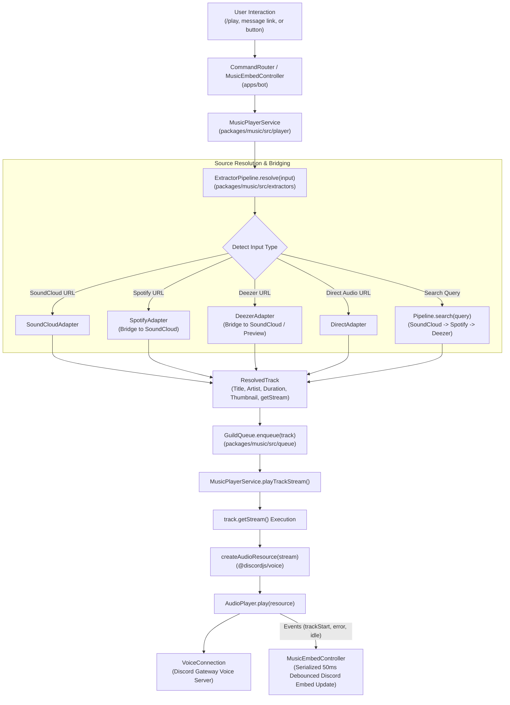

# Music 2.0 Audio Subsystem Specification & Architecture

## 1. Overview & Architectural Goals
**Music 2.0** is the production-grade audio subsystem for Ririko AI 2.0.0. It replaces the legacy monolithic, error-prone audio pipeline from version 1.4.0 with a modern, decoupled architecture:
- **Zero Polling Loops**: Completely eliminates the aggressive 10-second `setInterval` message-editing loops from 1.4.0 that routinely triggered Discord HTTP 429 rate limits.
- **Lavalink-First Playback**: Lavalink plugins resolve and stream every source in production (see section 4).
- **Multi-Source Extractor Pipeline**: A built-in fallback player with decoupled extractors for Spotify, SoundCloud, Deezer, and direct audio streams.
- **Reactive Discord Embeds**: Real-time interactive player embed controller (`#music` channel) with serialized per-guild mutexes and coalescing debouncing.
- **Full Type Safety**: Monorepo package `@ririko/music` written in strict TypeScript 5.8+ with 100% test coverage.

---

## 2. Monorepo Package Topology (`@ririko/music`)

The audio subsystem is partitioned into four decoupled modules within [`packages/music`](file:///Z:/Projects/ririko-v2-2026/packages/music):

```
packages/music/
├── src/
│   ├── extractors/                 # Audio source adapters & metadata resolvers
│   │   ├── deezer.adapter.ts       # Native Deezer REST API extractor
│   │   ├── direct.adapter.ts       # Raw HTTP audio stream extractor (.mp3, .ogg, .wav)
│   │   ├── librespot.client.ts     # go-librespot daemon supervisor, REST client & audio pipe
│   │   ├── librespot.installer.ts  # Platform-aware go-librespot downloader (bot-local, no PATH)
│   │   ├── pipeline.ts             # Orchestrator & multi-provider stream fallback
│   │   ├── soundcloud.adapter.ts   # High-availability SoundCloud audio extractor
│   │   ├── spotify-native.service.ts # Native Spotify playback & single-stream lease
│   │   ├── spotify.adapter.ts      # Spotify metadata scraper, native audio & stream bridging
│   │   └── track-matcher.ts        # Precision candidate matching for stream bridging
│   ├── player/                     # Audio playback orchestration
│   │   ├── music-player.service.ts # Core service wrapping @discordjs/voice AudioPlayer
│   │   └── types.ts                # Play options, player events, and result interfaces
│   ├── queue/                      # Queue & track lifecycle management
│   │   ├── autoplay.ts             # Smart recommendation engine for ended queues
│   │   ├── guild-queue.ts          # State machine, history, volume clamping & loops
│   │   ├── queue-manager.ts        # In-memory per-guild queue registry
│   │   └── types.ts                # QueuedTrack, LoopMode (OFF/TRACK/QUEUE), AudioFilter
│   ├── voice/                      # Discord Voice connection lifecycle
│   │   └── voice-lifecycle-manager.ts # Gateway join, leave, and reconnect management
│   ├── index.ts                    # Public package exports
│   └── types.ts                    # Core contracts (MusicSourceAdapter, ResolvedTrack)
```

---

## 3. End-to-End Audio Pipeline Architecture

The lifecycle of an audio request flows through a strict, unidirectional pipeline:


```mermaid
flowchart TD
    User["User Interaction<br/>(/play, message link, or button)"] --> Router["CommandRouter / MusicEmbedController<br/>(apps/bot)"]
    Router --> MPS["MusicPlayerService<br/>(packages/music/src/player)"]
    MPS --> Pipe["ExtractorPipeline.resolve(input)<br/>(packages/music/src/extractors)"]
    
    subgraph Extractors ["Source Resolution & Bridging"]
        Pipe --> Detect{"Detect Input Type"}
        Detect -- "Spotify URL" --> SP["SpotifyAdapter<br/>(Bridge to SoundCloud)"]
        Detect -- "SoundCloud URL" --> SC["SoundCloudAdapter"]
        Detect -- "Deezer URL" --> DZ["DeezerAdapter<br/>(Bridge to SoundCloud / Preview)"]
        Detect -- "Direct Audio URL" --> DIR["DirectAdapter"]
        Detect -- "Search Query" --> Search["Pipeline.search(query)<br/>(SoundCloud -> Spotify -> Deezer)"]
    end

    SC & SP & DZ & DIR & Search --> Resolved["ResolvedTrack<br/>(Title, Artist, Duration, Thumbnail, getStream)"]
    Resolved --> Queue["GuildQueue.enqueue(track)<br/>(packages/music/src/queue)"]
    Queue --> Player["MusicPlayerService.playTrackStream()"]
    Player --> Stream["track.getStream() Execution"]
    Stream --> Resource["createAudioResource(stream)<br/>(@discordjs/voice)"]
    Resource --> AudioPlayer["AudioPlayer.play(resource)"]
    AudioPlayer --> VoiceConn["VoiceConnection<br/>(Discord Gateway Voice Server)"]
    AudioPlayer -- "Events (trackStart, error, idle)" --> Controller["MusicEmbedController<br/>(Serialized 50ms Debounced Discord Embed Update)"]
```

---

## 4. Playback Paths

Ririko plays music through one of two paths:

1. **Lavalink (recommended for production)**. When a Lavalink node is connected, `MusicPlayerService.play()` hands the query to [`LavalinkService`](file:///Z:/Projects/ririko-v2-2026/packages/music/src/lavalink/lavalink-service.ts). The Lavalink plugins resolve and stream every source, including YouTube and Spotify (LavaSrc). `pnpm lavalink:install` generates `lavalink/application.yml` from `.env`:
   - `LAVALINK_YOUTUBE_CIPHER_URL` (optional) points the YouTube plugin at a yt-cipher server. Without it the plugin uses its built-in signature cipher.
2. **Built-in player (fallback)**. When Lavalink is not configured or not reachable, the bot plays in-process through `ExtractorPipeline`. The standard adapters from `createStandardAdapters()` cover SoundCloud, Spotify and Deezer (both bridged to full-length SoundCloud audio) and direct audio URLs. Searches use SoundCloud. YouTube links are not supported in this mode.

---

## 5. Optional Private Music Package

Maintainers with access to the private music package can add sources to the built-in player:

1. Clone the private repository into `packages/music-private` (ignored by git, the pnpm workspace, ESLint, Prettier and the public test run).
2. Install and build it on its own, after the public `pnpm install` and `pnpm build`:
   ```bash
   pnpm --dir packages/music-private install --ignore-workspace
   pnpm --dir packages/music-private build
   ```
3. Set `USE_PRIVATE_MUSIC_PACKAGE=true` in `.env`.

[`apps/bot/src/music-sources.ts`](file:///Z:/Projects/ririko-v2-2026/apps/bot/src/music-sources.ts) imports the package only when the flag is `true`. If the package is missing or fails to load, the bot logs a warning and continues with the standard adapters. The package documents its own environment variables and tools.

---

## 6. Guide: Spotify Credentials & Web API Integration

Spotify integration in Ririko powers full-fidelity track, album, and playlist metadata resolution and canonical song identification. You can configure either or both methods:

| Method | What it gives you | Setup |
|---|---|---|
| **6.1 Official Spotify Web API** | Direct API querying for search, track, album, and playlist resolution with official rate limits | Free Spotify Developer App (`SPOTIFY_CLIENT_ID` + `SPOTIFY_CLIENT_SECRET`) |
| **6.2 Session Cookies** | Direct scraping of track, album, and playlist metadata without developer registration | `sp_dc` (and optional `sp_key`) from `open.spotify.com` |

When a user plays a Spotify track or playlist (`/play <spotify-url>`), Ririko resolves the canonical metadata via Spotify Web API / session cookies and automatically bridges the audio to a matching full-length SoundCloud stream.

---

### 6.1. Official Spotify Web API (Recommended)

To obtain official Spotify Web API credentials:
1. Navigate to the [Spotify Developer Dashboard](https://developer.spotify.com/dashboard) and sign in.
2. Click **Create an App**.
3. Fill in the App details:
   - **App Name**: `Ririko Bot` (or your preferred name)
   - **App Description**: `Discord Music Bot Integration`
   - **Redirect URI**: `http://localhost:8888/callback` (not required for Client Credentials, but required by Spotify dashboard form)
   - Select **Web API**.
4. Once created, click on your app -> Go to **Settings**.
5. Copy your **Client ID** and click **View client secret** to copy your **Client Secret**.
6. Add them to your `.env`:
   ```env
   SPOTIFY_CLIENT_ID="your_spotify_client_id_here"
   SPOTIFY_CLIENT_SECRET="your_spotify_client_secret_here"
   ```

---

### 6.2. Session Cookies (`sp_dc` / `sp_key`)

If you do not wish to create a Spotify Developer application, Ririko can scrape metadata using your personal browser session:

1. Open your browser and navigate to [open.spotify.com](https://open.spotify.com).
2. Log in to your Spotify account (free or premium).
3. Press **F12** to open Developer Tools -> Go to the **Application** tab (Chrome/Edge) or **Storage** tab (Firefox).
4. In the left sidebar, expand **Cookies** and select `https://open.spotify.com`.
5. Find the following cookie keys:
   - **`sp_dc`**: Double-click its value, copy, and set as `SPOTIFY_DC` in `.env`.
   - **`sp_key`**: (Optional) Copy and set as `SPOTIFY_KEY` in `.env`.
6. Add them to your `.env`:
   ```env
   SPOTIFY_DC="AQD...your_sp_dc_value_here..."
   SPOTIFY_KEY="...your_sp_key_value_here..."
   ```

---

## 7. Environment Configuration Reference

The following environment variables in `.env` govern the audio subsystem:

| Variable | Required? | Default | Description |
|---|---|---|---|
| `DEFAULT_PREFIX` | Optional | `!` | Default command prefix for text commands (e.g. `!play`). |
| `USE_PRIVATE_MUSIC_PACKAGE` | Optional | `false` | `true` loads the private music package into the built-in player (section 5). |
| `LAVALINK_YOUTUBE_CIPHER_URL` | Optional | None | yt-cipher server for the Lavalink YouTube plugin; empty uses the built-in cipher. |
| `SPOTIFY_CLIENT_ID` | Optional | None | Official Spotify Developer App Client ID (for official Web API). |
| `SPOTIFY_CLIENT_SECRET` | Optional | None | Official Spotify Developer App Client Secret. |
| `SPOTIFY_DC` | Optional | None | `sp_dc` cookie from `open.spotify.com` for session cookie scraping. |
| `SPOTIFY_KEY` | Optional | None | `sp_key` cookie from `open.spotify.com`. |
| `FFMPEG_PATH` | Optional | `ffmpeg` | Path to the FFmpeg binary in system PATH. |

Example `.env` configuration:
```env
# Discord Bot Credentials
DISCORD_TOKEN=your_token_here
DISCORD_CLIENT_ID=your_client_id_here
DEFAULT_PREFIX=!

# Spotify Web API & Session (Optional, for playlist & track resolution)
SPOTIFY_CLIENT_ID=
SPOTIFY_CLIENT_SECRET=
SPOTIFY_DC=
SPOTIFY_KEY=
```

---

## 8. Reactive UI & Discord Embed Synchronization

Legacy bots use continuous `setInterval` polling to update embeds. Music 2.0 uses **event-driven synchronization** implemented in [`MusicEmbedController`](file:///Z:/Projects/ririko-v2-2026/apps/bot/src/controllers/music-embed.controller.ts):

### Key Invariants:
1. **Serialized Per-Guild Mutex**:
   - Updates to Discord messages for a given guild are serialized using `guildUpdating` and `guildUpdateQueued` state sets.
   - Rapid bursts of events (e.g. adding 10 songs from a playlist in 50ms) are coalesced into a **single Discord REST edit** via a 50ms trailing debounce.
2. **Orphan Message Prevention**:
   - The controller caches `messageId` and `channelId`.
   - On error, it only falls back to sending a new message if the Discord REST API returns `10008` (`Unknown Message`). Rate limits or network hiccups will never leave duplicate abandoned player cards.
3. **Double-Skip & Failure Guard**:
   - When a track fails to stream, `GuildQueue.skip(isError = true)` permanently discards the failed track (never saves to history and never loops it).
   - A `skipInitiated` mutex on [`MusicPlayerService`](file:///Z:/Projects/ririko-v2-2026/packages/music/src/player/music-player.service.ts) prevents `AudioPlayerStatus.Idle` from triggering a duplicate skip on failure recovery.
4. **Queue & Playing Status**:
   - The player card displays the current track and queue length. If 1 song is playing with 0 songs waiting, the display accurately indicates `Now Playing (1 track active)`.

---

## 9. Command & Component Control Catalog

All commands support dual-dispatch: full Slash Command (`/play`) and Message Prefix (`!play`) parity.

| Command | Aliases | Parameters | Description |
|---|---|---|---|
| `/play` | `!p` | `<query \| url>` | Resolves track/playlist and enqueues it. |
| `/pause` | `!pause` | None | Pauses active playback. |
| `/resume` | `!resume`, `!unpause` | None | Resumes paused playback. |
| `/skip` | `!s`, `!next` | None | Skips current track. |
| `/back` | `!prev`, `!previous` | None | Plays the previous track from history. |
| `/stop` | `!leave`, `!dc` | None | Clears the queue, stops audio, and leaves voice channel. |
| `/queue` | `!q` | `[page]` | Displays interactive paginated track queue. |
| `/nowplaying` | `!np` | None | Renders detailed progress card for active song. |
| `/volume` | `!vol`, `!v` | `<1-150>` | Adjusts guild player volume (clamped 0% to 150%). |
| `/loop` | `!repeat` | `<off \| track \| queue>` | Sets loop mode. |
| `/shuffle` | `!mix` | None | Randomizes waiting tracks in the queue. |
| `/seek` | `!jump` | `<seconds>` | Seeks to a specific timestamp in the track. |
| `/filter` | `!fx` | `<bassboost \| nightcore \| 8d \| ...>` | Applies audio filter preset. |
| `/lyrics` | `!ly` | `[song]` | Shows the lyrics of the current track, or of `song`, from LRCLIB. See section 9.2. |
| `/join` | `!connect` | None | Summons bot to user's voice channel. |
| `/setup-music` | None | None | Generates the dedicated `#music` interactive channel. Needs Manage Server. |

### 9.1. Server Settings (STORY-116)
The dashboard Music page, and `ririko guild:config <guild> music.<key>`, edit these settings:
- **Default volume** (`music_guild_settings.default_volume`, 0 to 150, default 80): the volume a new session starts at. `/volume <level>` also saves it, as since BUG-0018. A dashboard change evicts the player's cached value.
- **Music channel** (`music_channels`): when the channel changes, the row's message ID is cleared, and on the `guild:configChanged` event the bot posts a new controller there. The previous controller message is not deleted.
- **DJ role** (`music_guild_settings.dj_role_id`): when set, only members with the role or Manage Server (or Administrator) can change playback:
  - Commands: `/pause`, `/resume`, `/skip`, `/back`, `/stop`, `/volume <level>`, `/loop`, `/shuffle`, `/seek`, `/filter` and `/leave`.
  - Controller buttons: previous, play/pause, skip, stop, mute, loop and shuffle.

  Everyone can still add songs (`/play`, the music channel, `/playlist`) and use `/queue`, `/nowplaying`, `/lyrics` and `/join`. The check runs as command middleware (`commands/music/dj-role.ts`).
- **Leave empty voice channels** (`music_guild_settings.auto_leave_empty`, default on): a `voiceStateUpdate` listener counts the members who are not bots in Ririko's voice channel. With nobody left, `MusicPlayerService.handleChannelOccupancy` stops the player and leaves after the idle timeout (3 minutes); anyone joining cancels it. This works for the built-in player and Lavalink. Before STORY-116, Ririko never left an empty channel.

`restrict_voice_channel_id` and `lyrics_provider` are not read by the bot, so they are not on the page. `/lyrics` always uses LRCLIB (section 9.2), whatever `lyrics_provider` holds. Audio filters are per session and are not saved.

### 9.2. Lyrics (BUG-0040)
`/lyrics` (`!ly`) and the Lyrics button of the music controller fetch lyrics from [LRCLIB](https://lrclib.net). The API is free and needs **no API key and no environment variable**. `LrclibClient` (`packages/services/src/lyrics/lrclib.client.ts`) sends the `RirikoBot/2.0` User-Agent that LRCLIB asks clients to send, goes through `fetchWithRetry` with its own rate limiter and a 5 second timeout, and is built once in `createBotServices` as `lrclibClient`.

- **Current track** (`/lyrics` with no argument, and the button): the title is cleaned with `PrecisionTrackMatcher.cleanTitle` and a trailing ` - Topic` is removed from the artist. The client calls `GET /api/get` with the track name, artist and duration. A 404 means no exact match, so it then calls `GET /api/search` and takes the first result whose length is within 3 seconds of the track (the first result when the length is unknown).
- **Free text** (`/lyrics song:<text>`, `!ly <text>`): `GET /api/search?q=<text>`, first result.
- **Reply**: the plain lyrics, or the synced lyrics with their `[mm:ss.xx]` timestamps removed, with the matched track and artist in the title and a `Lyrics from LRCLIB` footer. The button reply is ephemeral. Anyone in voice can use the button; the DJ role does not apply.
- **Long lyrics** are split on line breaks across up to 10 embeds in one message (4096 characters per embed, 6000 in total). Anything beyond that is cut with a note.
- **Failures** each get a clear reply: nothing playing and no argument, no lyrics found, an instrumental track, and LRCLIB unreachable. Errors are logged and never reach the gateway as unhandled rejections. `/lyrics` defers its reply before the lookup.

Lavalink's lyrics plugins, synced karaoke display and providers that need a key are out of scope.

### Interactive Embed Buttons:
- `music_pause_resume`: Toggles pause/play state.
- `music_skip`: Advances to next track in queue.
- `music_stop`: Terminates session and disconnects voice.
- `music_loop`: Cycles through `OFF` -> `TRACK` -> `QUEUE` modes.
- `music_queue`: Renders the active queue list with requester info.

---

## 10. AI Invocation & Safety Guardrails

In strict adherence to `BLUEPRINT.md` Sections 10 and 75:
1. **Safe Tool Calling Contract**:
   When a user interacts with the AI in `#ririko-ai` (e.g. *"Ririko, play Lemon by Kenshi Yonezu"*), the LLM executes structured function calling:
   ```json
   {
     "tool": "music.play",
     "arguments": {
       "query": "Kenshi Yonezu - Lemon"
     }
   }
   ```
2. **Deterministic Safety Barriers**:
   - **Volume Clamping**: Volume requests above 150% are automatically clamped to 150% to prevent hearing damage.
   - **Zero Process Manipulation**: No arbitrary shell execution or process spawns are ever accepted from LLM tool outputs.
   - **Permission Boundary**: The bot framework enforces voice channel permissions before executing any tool call dispatched by the AI.
