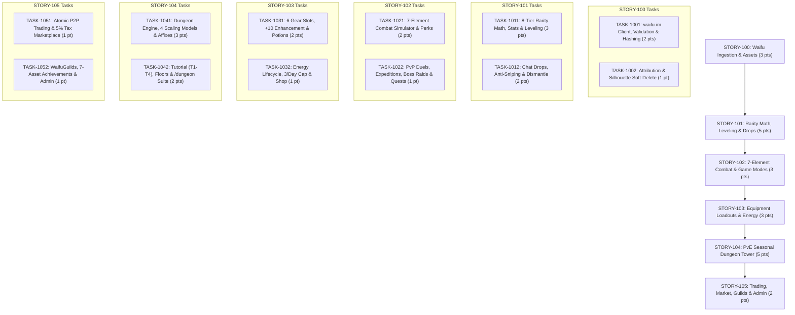

# Reinforced Implementation Plan — EPIC-010: Waifu TCG Gameplay, Ingestion, Trading & Marketplace

## Complete Line-by-Line Traceability Matrix (`docs/waifu-tcg.md`)

This plan provides **100% coverage** of [docs/waifu-tcg.md](file:///Z:/Projects/ririko-v2-2026/docs/waifu-tcg.md). Every requirement, formula, mechanic, and rule is cited with its exact line range and mapped to a specific implementation task.

| Section in `docs/waifu-tcg.md` | Line Range | Core Requirements & Architecture | Target Task |
|---|---|---|---|
| **1. System Overview** | [L1–L11](file:///Z:/Projects/ririko-v2-2026/docs/waifu-tcg.md#L1-L11) | High-level gamification overview: ingestion, 8-tier cards, 7-element combat, trading, market, WaifuGuilds, loadouts, potions, energy, shop, achievements, seasonal dungeon. | Epic Architecture |
| **2.1. Ingestion Architecture** | [L15–L38](file:///Z:/Projects/ririko-v2-2026/docs/waifu-tcg.md#L15-L38) | Background worker, magic bytes/aspect ratio/dimension validation, binary download, SHA-256 content hashing, metadata extraction, `waifu_assets` table, `/assets/waifu-cards/` storage. | `TASK-1001` |
| **2.2. Copyright, Attribution & Removal** | [L39–L53](file:///Z:/Projects/ririko-v2-2026/docs/waifu-tcg.md#L39-L53) | Mandatory footer `Image source: waifu.im`. Soft-deletion `is_deleted_by_request = true`, standardized silhouette frame fallback, 100% preservation of user stats & ownership. | `TASK-1002` |
| **3.1. 8-Tier Rarity Curve** | [L57–L71](file:///Z:/Projects/ririko-v2-2026/docs/waifu-tcg.md#L57-L71) | Rarity distribution: Common (60%), Uncommon (20%), Rare (10%), SR (6%), UR (3%), SEC (0.9%), SIR (0.09%), Mythic (0.01%). Stat multipliers (1.0x to 5.0x) & Max Levels (20 to 100). | `TASK-1011` |
| **3.2. Dynamic Attributes & Roles** | [L72–L89](file:///Z:/Projects/ririko-v2-2026/docs/waifu-tcg.md#L72-L89) | Serial numbers (`#0042/1000`), HP (500–15,000), ATK (50–2,500), DEF (30–1,800), SPD (10–300), CRIT (5%–50%), MP (100). Active Skills, Passives, Collection numbers, Card Leveling. | `TASK-1011` |
| **4. Elemental Interaction Matrix** | [L91–L110](file:///Z:/Projects/ririko-v2-2026/docs/waifu-tcg.md#L91-L110) | 7-Element matrix diagram: Fire > Ice > Earth > Lightning > Water > Fire (1.5x DMG). Light <> Shadow mutual high-risk advantage (1.5x DMG to each other). | `TASK-1021` |
| **4.1. Elemental Advantage Loop** | [L111–L119](file:///Z:/Projects/ririko-v2-2026/docs/waifu-tcg.md#L111-L119) | Fire melts Ice, Ice freezes Earth, Earth grounds Lightning, Lightning shocks Water, Water extinguishes Fire, Light/Shadow mutual bonus. | `TASK-1021` |
| **4.2. Status Effects & Traits** | [L120–L131](file:///Z:/Projects/ririko-v2-2026/docs/waifu-tcg.md#L120-L131) | 7 Status Effects: Fire (Burn DoT 10% ATK), Ice (Freeze 15% skip & Chill -25% SPD), Earth (Fortify shield), Lightning (Surge crit), Water (Purify regen/cleanse), Light (Radiance buff), Shadow (Decay lifesteal). | `TASK-1021` |
| **5. Waifu Drop System** | [L133–L144](file:///Z:/Projects/ririko-v2-2026/docs/waifu-tcg.md#L133-L144) | Dedicated drop channel, 50–100 active unique member message trigger, 60s interactive `[Claim Card]` button, active hours (08:00–23:00), 5-min claimant anti-sniping cooldown. | `TASK-1012` |
| **6.1. Game Modes** | [L148–L158](file:///Z:/Projects/ririko-v2-2026/docs/waifu-tcg.md#L148-L158) | Explore (`/game explore` 1h/4h/8h), Seasonal Dungeons (`/dungeon`), PvP Duels (`/game pvp` with wagers), Boss Raids (`/game boss`), Daily & Weekly Missions (`quests` table). | `TASK-1022` |
| **6.2. Card Collection Commands** | [L159–L168](file:///Z:/Projects/ririko-v2-2026/docs/waifu-tcg.md#L159-L168) | `/card collection [filter] [sort]`, `/card inspect <id>`, `/card equip <id>`, `/card favorite <id>`, `/card dismantle <id>` (yields Crafting Dust). | `TASK-1012` |
| **7. PvE Dungeon Architecture** | [L170–L190](file:///Z:/Projects/ririko-v2-2026/docs/waifu-tcg.md#L170-L190) | Three-tier progression model: Phase 1 (Tutorial T1–T4) -> Phase 2 (Seasons S1, S2, S3...) -> Phase 3 (Floors F1–F50+). | `TASK-1041` |
| **7.1. Tutorial Dungeon (Prologue)** | [L191–L199](file:///Z:/Projects/ririko-v2-2026/docs/waifu-tcg.md#L191-L199) | Floors T1 (Elements), T2 (Mana/Skills), T3 (Consumables/Survival), T4 (Boss Break Shields). 0 Energy, starter waifu card, Novice Blade, 3x Minor HP Potions, unlocks `TUTORIAL_COMPLETE`. | `TASK-1042` |
| **7.2. Seasonal Framework & Affixes** | [L200–L213](file:///Z:/Projects/ririko-v2-2026/docs/waifu-tcg.md#L200-L213) | 60–90 day cycles. S1 (*Infernal Crucible*): Scorched Earth & Heat Haze. S2 (*Abyssal Maelstrom*): Torrential Deluge & Tidal Barrier. S3 (*Celestial Twilight*): Radiant Flare & Void Drain. | `TASK-1041` |
| **7.3. Anti-Powercreep Architecture** | [L214–L223](file:///Z:/Projects/ririko-v2-2026/docs/waifu-tcg.md#L214-L223) | Multi-layer elemental wards (Fire -> Lightning -> Ice), seasonal affix penalties, turn limits & soft enrage on turn 10+ (+100% ATK/turn + true damage). | `TASK-1041` |
| **7.4. Floor Progression & Energy** | [L224–L233](file:///Z:/Projects/ririko-v2-2026/docs/waifu-tcg.md#L224-L233) | Floor unlocking (F -> F+1). Mini-Boss every 5th floor ($1.75\times$), Major Boss every 10th floor ($3.2\times$). Energy brackets: F1–10 (10), F11–25 (15), F26–40 (20), F41–50+ (25). | `TASK-1042` |
| **7.5. Difficulty Scaling Engine** | [L234–L268](file:///Z:/Projects/ririko-v2-2026/docs/waifu-tcg.md#L234-L268) | 4 Scaling Models: Linear, Polynomial, Exponential ($\text{Base} \times (1+r)^{F-1} \times \text{BossMultiplier}$, $r=0.085$), Hybrid. Baseline table F1, F5, F10, F20, F30, F40, F50. | `TASK-1041` |
| **7.6. Admin Configurability** | [L269–L280](file:///Z:/Projects/ririko-v2-2026/docs/waifu-tcg.md#L269-L280) | Dashboard visualizer & Discord slash command: `/tcg-admin config dungeon scaling_model`, `growth_rate`, `season_affix <id> <json>`. | `TASK-1052` |
| **8.1. P2P Card Trading** | [L284–L292](file:///Z:/Projects/ririko-v2-2026/docs/waifu-tcg.md#L284-L292) | `/game trade <@user>`: Two-party select menu session, State Locking `IN_TRADE`, dual inspection, atomic ACID database transfer. | `TASK-1051` |
| **8.2. Player Marketplace** | [L293–L301](file:///Z:/Projects/ririko-v2-2026/docs/waifu-tcg.md#L293-L301) | `/game market`: State Locking `IN_MARKET`, 5% market tax deducted on sale, 7-day automatic expiration returning asset to inventory. | `TASK-1051` |
| **9. Waifu Guilds Subsystem** | [L303–L314](file:///Z:/Projects/ririko-v2-2026/docs/waifu-tcg.md#L303-L314) | `WaifuGuild` vs `DiscordGuild` decoupling. Faction creation, member XP contribution leveling, shared guild bank, cooperative raid bosses. | `TASK-1052` |
| **10. Gear Subsystem & Loadout** | [L316–L335](file:///Z:/Projects/ririko-v2-2026/docs/waifu-tcg.md#L316-L335) | 6-Slot Loadout diagram: 3 Equipments (Weapon, Armor, Relic) + 3 Accessories (Ring, Amulet, Talisman). | `TASK-1031` |
| **10.1. Equipments & Battle Perks** | [L336–L354](file:///Z:/Projects/ririko-v2-2026/docs/waifu-tcg.md#L336-L354) | Weapon (ATK/CRIT), Armor (HP/DEF/Mitigation), Relic (SPD/Mastery/Shield). Perks: Rare (*Sharpened Edge*), SR (*Vampiric Touch*), UR (*Glacial Counter*), SEC (*Mana Conduit*), SIR (*Phoenix Ward*), Mythic (*Cosmic Cataclysm*). | `TASK-1031` |
| **10.2. Accessories Multipliers** | [L355–L364](file:///Z:/Projects/ririko-v2-2026/docs/waifu-tcg.md#L355-L364) | Ring (ATK %, CRIT Rate %, Piercing %), Amulet (HP %, DEF %, Resistance %), Talisman (SPD %, Mana Max %, Mana Regen %). | `TASK-1031` |
| **10.3. Equipment Enhancement** | [L365–L371](file:///Z:/Projects/ririko-v2-2026/docs/waifu-tcg.md#L365-L371) | +0 to +10 enhancement using Crafting Dust and Credits. +5% to +10% base stats per level. Perk trigger scaling at +5 and +10. | `TASK-1031` |
| **11.1. HP Potions** | [L386–L390](file:///Z:/Projects/ririko-v2-2026/docs/waifu-tcg.md#L386-L390) | Minor HP Potion (300 HP / 25%), Major HP Potion (1,200 HP / 50%), Elixir of Full Vitality (100% HP + debuff cleanse). | `TASK-1031` |
| **11.2. Mana Potions** | [L391–L396](file:///Z:/Projects/ririko-v2-2026/docs/waifu-tcg.md#L391-L396) | Mana Draught (30 MP), Greater Mana Potion (70 MP), Cosmic Ether (100% MP + 0 cooldown free skill cast). | `TASK-1031` |
| **11.3. Energy Restores & Anti-Abuse** | [L397–L407](file:///Z:/Projects/ririko-v2-2026/docs/waifu-tcg.md#L397-L407) | Stamina Candy (+15), Grand Stamina Flask (+30), Celestial Ambrosia (Full Energy). Anti-abuse cap: max 3 energy potions/day. Zero infinite stock in shop. | `TASK-1032` |
| **12.1. Daily Replenishment** | [L413–L416](file:///Z:/Projects/ririko-v2-2026/docs/waifu-tcg.md#L413-L416) | 00:00 UTC daily replenishment: $\text{Energy}_{\text{current}} = \max(\text{current}, \text{MaxEnergy}(\text{Level}))$. | `TASK-1032` |
| **12.2. Level-Based Energy Formula** | [L417–L444](file:///Z:/Projects/ririko-v2-2026/docs/waifu-tcg.md#L417-L444) | $\text{MaxEnergy}(\text{Level}) = \min(\text{GlobalCap}, 100 + \lfloor (L - 1) \times 2 \rfloor + \text{MilestoneBonus}(L))$. Milestone bonus table L1 to L100. | `TASK-1032` |
| **12.3. Global Energy Cap** | [L445–L453](file:///Z:/Projects/ririko-v2-2026/docs/waifu-tcg.md#L445-L453) | Default 300 (range 100–1,000). Temporary overflow allowed from consumables/level-up. | `TASK-1032` |
| **12.4. Energy Expenditure Table** | [L454–L467](file:///Z:/Projects/ririko-v2-2026/docs/waifu-tcg.md#L454-L467) | Expeditions: 1h (10), 4h (25), 8h (45). Dungeons: F1–10 (10), F11–25 (15), F26–40 (20), F41–50+ (25). World Boss (30). PvP (5). | `TASK-1022` & `TASK-1042` |
| **13.1. Basic Town Shop (/shop)** | [L489–L495](file:///Z:/Projects/ririko-v2-2026/docs/waifu-tcg.md#L489-L495) | `/shop`: Common/Uncommon gear, basic accessories, minor potions, max 1 Stamina Candy/day. Audited via double-entry ledger (`SHOP_BUY`). | `TASK-1032` |
| **13.2. Combat Loot Progression** | [L496–L503](file:///Z:/Projects/ririko-v2-2026/docs/waifu-tcg.md#L496-L503) | Dungeon loot: F1–25 (Rare), F26–50 (SR), F51–100 (UR & SEC), Server Raid Bosses (SIR & Mythic sets with dual perks). | `TASK-1042` |
| **14.1. Achievement Tracks** | [L509–L523](file:///Z:/Projects/ririko-v2-2026/docs/waifu-tcg.md#L509-L523) | 6 Core Tracks: Collector, Combatant, Tycoon, Blacksmith, Devotion, Guild Hero across 5 Tiers (Bronze, Silver, Gold, Platinum, Mythic). | `TASK-1052` |
| **14.2. Multi-Asset Reward Dispatch** | [L524–L547](file:///Z:/Projects/ririko-v2-2026/docs/waifu-tcg.md#L524-L547) | 7 Asset Categories: Account EXP, Credits/Gems, Collectible Cards, Equipments, Accessories, Consumables, Badges/Titles. Sample matrix (`COLL_INITIATE`, `COLL_ELEMENTAL`, `COLL_MYTHIC_LEGEND`, `BATTLE_FIRST_BLOOD`, `BATTLE_DUNGEON_50`, `BATTLE_BOSS_SLAYER`, `CRAFT_MASTER_FORGE`, `DEVOTION_STREAK_30`). | `TASK-1052` |
| **14.3. Event Listener & Atomic Claim** | [L548–L554](file:///Z:/Projects/ririko-v2-2026/docs/waifu-tcg.md#L548-L554) | Event listener on `EconomyEvent` and `GameEvent`. Ephemeral ping. Atomic claim command `/achievement claim <id | all>`. | `TASK-1052` |
| **15.1. Governance Parameters** | [L579–L588](file:///Z:/Projects/ririko-v2-2026/docs/waifu-tcg.md#L579-L588) | `global_max_energy_cap`, `base_energy_capacity`, `energy_scaling_per_level`, `daily_energy_restore_pot_limit`, `daily_replenish_cron`, `dungeon_scaling_model`, `dungeon_growth_rate`, `tcg_manager_role_id`. | `TASK-1052` |
| **15.2. Dual-Interface Access** | [L589–L599](file:///Z:/Projects/ririko-v2-2026/docs/waifu-tcg.md#L589-L599) | `/tcg-admin config ...` and Web Dashboard portal `/dashboard/[guildId]/waifu-tcg`. | `TASK-1052` |

---

## 2. Checkpointable Delivery Plan (6 Stories, 12 Tasks)

Each Story is executed on its dedicated feature branch with **Strict WIP Limit = 1**, Fibonacci task point estimation, and continuous quality gates.



---

### Milestone 1: STORY-100 — Ingestion Pipeline, Asset Validation, Deduplication & Attribution (3 pts)
*Target Feature Branch: `feat/STORY-100-waifu-ingestion`*
*Citations: [docs/waifu-tcg.md:L13-L53](file:///Z:/Projects/ririko-v2-2026/docs/waifu-tcg.md#L13-L53)*

#### `TASK-1001` (2 pts): *waifu.im Ingestion Client, Image Validation, SHA-256 Deduplication & Asset Repository*
- **Source Lines**: [docs/waifu-tcg.md:L15–L38](file:///Z:/Projects/ririko-v2-2026/docs/waifu-tcg.md#L15-L38)
- **Deliverables**:
  - `WaifuImClient` (`packages/services/src/waifu-tcg/ingestion/waifu-im.client.ts`): Async client querying `api.waifu.im/search` with retry backoff, tag parsing, and timeout controls.
  - `ImageValidator` (`packages/services/src/waifu-tcg/ingestion/image-validator.ts`): Inspects magic bytes (PNG: `89 50 4E 47`, JPEG: `FF D8 FF`, WebP: `52 49 46 46 ... 57 45 42 50`), validates aspect ratio (2:3 or 3:4) and min dimensions (400x600).
  - `Sha256Hasher`: Computes hex digest of image binary for deduplication against `waifu_assets.image_hash`.
  - Storage: Persists valid images under `assets/waifu-cards/`.
  - `WaifuAssetRepository` (`packages/database/src/repositories/waifu-asset.repository.ts`): Dual-dialect implementation for `waifu_sources` and `waifu_assets`.
  - Starter Seed Dataset: 25 pre-validated canonical anime card assets across all 7 elements for rapid offline/unit testing.

#### `TASK-1002` (1 pt): *Section 24 Attribution Footer, Soft-Delete Silhouette Fallback & Ingestion Unit Tests*
- **Source Lines**: [docs/waifu-tcg.md:L39–L53](file:///Z:/Projects/ririko-v2-2026/docs/waifu-tcg.md#L39-L53)
- **Deliverables**:
  - `AttributionFormatter`: Injects mandatory embed footer `Image source: waifu.im` in all card responses.
  - Takedown / Soft-Delete Engine: When `is_deleted_by_request = true`, card graphic falls back to a standardized silhouette placeholder frame. Character name, stats, serial number, and user inventory ownership remain 100% intact.
  - Test Harness: `packages/services/src/waifu-tcg/__tests__/ingestion.test.ts` verifying magic byte rejection, SHA-256 collision handling, and soft-delete rendering.

---

### Milestone 2: STORY-101 — 8-Tier Rarity Math, Card Attributes, Leveling & Automated Drops (5 pts)
*Target Feature Branch: `feat/STORY-101-cards-drops`*
*Citations: [docs/waifu-tcg.md:L55-L89](file:///Z:/Projects/ririko-v2-2026/docs/waifu-tcg.md#L55-L89), [docs/waifu-tcg.md:L133-L144](file:///Z:/Projects/ririko-v2-2026/docs/waifu-tcg.md#L133-L144), [docs/waifu-tcg.md:L159-L168](file:///Z:/Projects/ririko-v2-2026/docs/waifu-tcg.md#L159-L168)*

#### `TASK-1011` (3 pts): *8-Tier Rarity Math Engine, Dynamic Stats Generation, Skills/Passives & Card Leveling*
- **Source Lines**: [docs/waifu-tcg.md:L57–L89](file:///Z:/Projects/ririko-v2-2026/docs/waifu-tcg.md#L57-L89)
- **Deliverables**:
  - `RarityEngine`: Exact 8-tier cumulative probability distribution:
    - Common: 60.0% weight, 1.0x multiplier, Max Lv 20
    - Uncommon: 20.0% weight, 1.2x multiplier, Max Lv 30
    - Rare: 10.0% weight, 1.5x multiplier, Max Lv 40
    - Super Rare (SR): 6.0% weight, 1.9x multiplier, Max Lv 50
    - Ultra Rare (UR): 3.0% weight, 2.5x multiplier, Max Lv 60
    - Secret Rare (SEC): 0.9% weight, 3.2x multiplier, Max Lv 70
    - Special Illustration Rare (SIR): 0.09% weight, 4.0x multiplier, Max Lv 85
    - Mythic: 0.01% weight, 5.0x multiplier, Max Lv 100
  - `CardGenerator`: Generates HP (500–15,000), ATK (50–2,500), DEF (30–1,800), SPD (10–300), CRIT (5%–50%), MP (100).
  - Skills & Passives: Generates unique active skill (MP cost, elemental effect) and ambient passive ability.
  - Leveling & EXP Engine: Card EXP accumulation from combat/expeditions, level up checks, and max level cap enforcement per rarity.
  - Serial Number Generator: Assigns formatted serials (e.g. `#0042/1000`).
  - `WaifuCardRepository` and `UserCardRepository` (`packages/database/src/repositories/waifu-card.repository.ts`).

#### `TASK-1012` (2 pts): *Chat Drops Engine, Anti-Sniping Cooldown, Card Dismantling & Collection Commands Suite*
- **Source Lines**: [docs/waifu-tcg.md:L133–L144](file:///Z:/Projects/ririko-v2-2026/docs/waifu-tcg.md#L133-L144), [docs/waifu-tcg.md:L159–L168](file:///Z:/Projects/ririko-v2-2026/docs/waifu-tcg.md#L159-L168)
- **Deliverables**:
  - `WaifuDropEngine`: Tracks chat message thresholds (50–100 messages from unique users) in configured channel during active hours (08:00–23:00).
  - Discord Interactive Button: Spawns `[Claim Card]` component with 60-second claim window.
  - Anti-Sniping Cooldown: 5-minute cooldown for the claimant of the previous drop.
  - Card Dismantle Engine: `/card dismantle <card_id>` converts duplicate cards into **Crafting Dust** scaled by rarity tier.
  - Dual-Dispatch Commands (`apps/bot/src/commands/tcg/card.command.ts`):
    - `/card claim` (or interactive button click)
    - `/card inspect <card_id>` (embed with foil art, stats, skill, equipped gear, history)
    - `/card collection [filter: element/rarity] [sort: level/rarity/name]` (paginated album)
    - `/card favorite <card_id>` (protects from accidental dismantle/sale)
    - `/card equip <card_id>` (assigns to active deck; locks from trade/market)
    - Prefix parity: `!card claim`, `!card inspect`, `!card collection`, `!card favorite`, `!card dismantle`.

---

### Milestone 3: STORY-102 — 7-Element Combat Engine, Tactical Status Effects & Game Modes Suite (3 pts)
*Target Feature Branch: `feat/STORY-102-combat-game-modes`*
*Citations: [docs/waifu-tcg.md:L91-L131](file:///Z:/Projects/ririko-v2-2026/docs/waifu-tcg.md#L91-L131), [docs/waifu-tcg.md:L148-L158](file:///Z:/Projects/ririko-v2-2026/docs/waifu-tcg.md#L148-L158), [docs/waifu-tcg.md:L454-L467](file:///Z:/Projects/ririko-v2-2026/docs/waifu-tcg.md#L454-L467)*

#### `TASK-1021` (2 pts): *7-Element Affinity Matrix (Including Ice), Tactical Status Effects, Dynamic Battle Perks & Combat Simulator*
- **Source Lines**: [docs/waifu-tcg.md:L91–L131](file:///Z:/Projects/ririko-v2-2026/docs/waifu-tcg.md#L91-L131)
- **Deliverables**:
  - `ElementalMatrix`: Fire > Ice > Earth > Lightning > Water > Fire (1.5x DMG multiplier). Light <> Shadow mutual catastrophe advantage (1.5x DMG to each other).
  - `StatusEffectsEngine`:
    - Fire: *Burn* (10% ATK damage over time).
    - Ice: *Freeze* (15% chance to skip turn) & *Chill* (-25% SPD).
    - Earth: *Fortify* (Shielding & damage mitigation).
    - Lightning: *Surge* (+15% CRIT & micro-stuns).
    - Water: *Purify & Flow* (8% max HP regen/turn & debuff cleanse).
    - Light: *Radiance* (Team ATK buff & barrier pierce).
    - Shadow: *Decay & Leech* (20% lifesteal).
  - Combat Simulator (`CombatSimulator`): Turn queue sorted strictly by Speed; MP skill casts; gear Battle Perks execution (Vampiric Touch, Glacial Counter, Mana Conduit, Phoenix Ward, Cosmic Cataclysm); in-combat potion consumption; turn 10+ soft enrage (+100% ATK/turn, true damage). Accepts injectable deterministic `() => number` RNG.

#### `TASK-1022` (1 pt): *PvP Duels (`/game pvp`), Timed Expeditions (`/game explore`), Boss Raids (`/game boss`) & Quests*
- **Source Lines**: [docs/waifu-tcg.md:L148–L158](file:///Z:/Projects/ririko-v2-2026/docs/waifu-tcg.md#L148-L158), [docs/waifu-tcg.md:L454–L467](file:///Z:/Projects/ririko-v2-2026/docs/waifu-tcg.md#L454-L467)
- **Deliverables**:
  - PvP Duel Controller: 3v3 duel with interactive buttons and optional credit wagers escrowed in `EconomyRepository` transactions. Consumes 5 Energy.
  - Timed Expeditions Engine (`ExpeditionService`): 1h (10 energy), 4h (25 energy), 8h (45 energy) returning credits, leveling materials, crafting dust, and card shards upon completion.
  - Cooperative Boss Raids (`BossRaidService`): Massive server-wide/guild-wide HP bosses using `bosses` and `boss_runs`, consuming 30 Energy, rewarding exclusive frames/mythic gear.
  - Daily & Weekly Missions (`QuestService`): Tracks battle and claim milestones in `quests` table, awarding free summons, consumables, and gems.
  - Dual-Dispatch Commands: `/game pvp`, `/game explore`, `/game boss`, `/game quests` with full prefix parity.

---

### Milestone 4: STORY-103 — Equipment, Accessories, Consumables & Daily Energy Lifecycle Engine (3 pts)
*Target Feature Branch: `feat/STORY-103-equipment-energy`*
*Citations: [docs/waifu-tcg.md:L316-L371](file:///Z:/Projects/ririko-v2-2026/docs/waifu-tcg.md#L316-L371), [docs/waifu-tcg.md:L373-L453](file:///Z:/Projects/ririko-v2-2026/docs/waifu-tcg.md#L373-L453), [docs/waifu-tcg.md:L489-L495](file:///Z:/Projects/ririko-v2-2026/docs/waifu-tcg.md#L489-L495)*

#### `TASK-1031` (2 pts): *6-Slot Combat Loadouts, Tier-Scaled Battle Perks, +0 to +10 Enhancement & Consumables Catalog*
- **Source Lines**: [docs/waifu-tcg.md:L316–L371](file:///Z:/Projects/ririko-v2-2026/docs/waifu-tcg.md#L316-L371), [docs/waifu-tcg.md:L373–L396](file:///Z:/Projects/ririko-v2-2026/docs/waifu-tcg.md#L373-L396)
- **Deliverables**:
  - 6 Gear Slots:
    - 3 Equipments: Weapon (ATK, CRIT Rate, CRIT DMG), Armor (HP, DEF, Mitigation %), Relic (SPD, Elemental Mastery %, Mana Shield).
    - 3 Accessories: Ring (ATK %, CRIT Rate %, Piercing %), Amulet (HP %, DEF %, Resistance %), Talisman (SPD %, Mana Max %, Mana Regen %).
  - Battle Perks by Rarity: Rare (*Sharpened Edge*), SR (*Vampiric Touch*), UR (*Glacial Counter*), SEC (*Mana Conduit*), SIR (*Phoenix Ward*), Mythic (*Cosmic Cataclysm*).
  - Enhancement Engine: +0 to +10 using Crafting Dust and credits. Base stats increase +5% to +10% per level. Perks scale in potency/chance at +5 and +10.
  - Consumables Catalog:
    - HP Potions: Minor (300 HP / 25%), Major (1,200 HP / 50%), Elixir of Full Vitality (100% HP + cleanse).
    - Mana Potions: Mana Draught (30 MP), Greater Mana Potion (70 MP), Cosmic Ether (100% MP + 0 cooldown free cast).
    - Energy Restores: Stamina Candy (+15), Grand Stamina Flask (+30), Celestial Ambrosia (Full energy to cap).
  - Dual-Dialect Repositories: `GameItemRepository` and `UserInventoryItemRepository` (`packages/database/src/repositories/tcg-item.repository.ts`).

#### `TASK-1032` (1 pt): *Level-Based Energy Lifecycle, Anti-Abuse 3/Day Potion Ceiling, Town Shop & Dual-Dispatch Commands*
- **Source Lines**: [docs/waifu-tcg.md:L397–L453](file:///Z:/Projects/ririko-v2-2026/docs/waifu-tcg.md#L397-L453), [docs/waifu-tcg.md:L489–L495](file:///Z:/Projects/ririko-v2-2026/docs/waifu-tcg.md#L489-L495)
- **Deliverables**:
  - Level-Based Energy Formula:
    $$\text{MaxEnergy}(\text{Level}) = \min\left(\text{GlobalCap}, 100 + \lfloor (\text{Level} - 1) \times 2 \rfloor + \text{MilestoneBonus}(\text{Level})\right)$$
    - Milestone bonuses: L10–24 (+5), L25–49 (+15), L50–74 (+30), L75–99 (+50), L100 (+75).
  - Replenishment Lifecycle: Daily 00:00 UTC job with lazy login catch-up: $\text{Energy}_{\text{current}} = \max(\text{current}, \text{MaxEnergy}(\text{Level}))$.
  - Anti-Abuse Stamina Cap: Strictly max 3 Energy Restores per calendar day (checked against `daily_energy_pots_used`).
  - Basic Town Shop (`/shop`): Sells Common/Uncommon gear, basic accessories, minor potions, max 1 Stamina Candy/day. Audited via double-entry ledger (`SHOP_BUY`).
  - Dual-Dispatch Commands: `/shop`, `/shop buy <item_id> [qty]`, `/inventory [filter]`, `/card equip <card_id> <item_id> <slot>`.

---

### Milestone 5: STORY-104 — PvE Seasonal Dungeon Tower: Tutorial, Seasons & Exponential Scaling (5 pts)
*Target Feature Branch: `feat/STORY-104-dungeon-tower`*
*Citations: [docs/waifu-tcg.md:L170-L280](file:///Z:/Projects/ririko-v2-2026/docs/waifu-tcg.md#L170-L280), [docs/waifu-tcg.md:L496-L503](file:///Z:/Projects/ririko-v2-2026/docs/waifu-tcg.md#L496-L503)*

#### `TASK-1041` (3 pts): *PvE Dungeon Progression Core, Multi-Layer Elemental Wards, 4 Scaling Models & Seasonal Environmental Affixes*
- **Source Lines**: [docs/waifu-tcg.md:L170–L268](file:///Z:/Projects/ririko-v2-2026/docs/waifu-tcg.md#L170-L268)
- **Deliverables**:
  - Three-Tier Hierarchy: Phase 1 (Tutorial T1–T4) $\to$ Phase 2 (Seasons S1–S3) $\to$ Phase 3 (Floors F1–F50+).
  - 4 Configurable Difficulty Scaling Models (`ScalingEngine`):
    1. Linear: $\text{Stat}(F) = \text{Base} \times (1 + k \times (F - 1))$
    2. Polynomial: $\text{Stat}(F) = \text{Base} \times (1 + \alpha(F - 1) + \beta(F - 1)^2)$
    3. Exponential (Default Engine): $\text{Stat}(F) = \text{Base} \times (1 + r)^{F - 1} \times \text{BossMultiplier}$ ($r = 0.085$)
    4. Hybrid Step-Exponential: Linear (F1–10) -> Mid Exp (F11–25) -> High Exp (F26+)
  - Stat Verification: Matches exact values from Section 7.5 baseline table up to F50:
    - F1 (1,200 HP, 120 ATK, 80 DEF, 25 SPD)
    - F5 Mini-Boss (3,360 HP, 315 ATK, 210 DEF, 38 SPD)
    - F10 Major Boss (10,240 HP, 845 ATK, 560 DEF, 52 SPD)
    - F20 Major Boss (23,100 HP, 1,850 ATK, 1,220 DEF, 78 SPD)
    - F30 Major Boss (52,100 HP, 4,050 ATK, 2,680 DEF, 115 SPD)
    - F40 Major Boss (117,500 HP, 8,900 ATK, 5,880 DEF, 165 SPD)
    - F50 Final Boss (265,000 HP, 19,500 ATK, 12,900 DEF, 230 SPD)
  - Multi-Layer Elemental Wards: Barrier shields (e.g. Fire $\to$ Lightning $\to$ Ice) requiring matching element attacks to break.
  - Seasonal Environmental Affixes:
    - S1 (*Infernal Crucible*): *Scorched Earth* (6% burn DoT/2 turns without Earth shield / Water purify) & *Heat Haze* (-15% CRIT non-Fire).
    - S2 (*Abyssal Maelstrom*): *Torrential Deluge* (-25% SPD, Lightning bounces +20%) & *Tidal Barrier* (Boss heals 8% max HP without Freeze/Shock).
    - S3 (*Celestial Twilight*): *Radiant Flare & Void Drain* (2.0x mutual catastrophe, healing suppressed by 40%).
  - Soft Enrage: Turn 10+ +100% ATK/turn + true damage strikes.
  - Dual-Dialect Repositories: `DungeonSeasonRepository`, `DungeonFloorRepository`, `UserDungeonProgressRepository` (`packages/database/src/repositories/dungeon.repository.ts`).

#### `TASK-1042` (2 pts): *Tutorial Prologue (T1–T4), Floor Energy Scaling, Loot Drops Engine & Dual-Dispatch `/dungeon` Suite*
- **Source Lines**: [docs/waifu-tcg.md:L191–L199](file:///Z:/Projects/ririko-v2-2026/docs/waifu-tcg.md#L191-L199), [docs/waifu-tcg.md:L224–L233](file:///Z:/Projects/ririko-v2-2026/docs/waifu-tcg.md#L224-L233), [docs/waifu-tcg.md:L496–L503](file:///Z:/Projects/ririko-v2-2026/docs/waifu-tcg.md#L496-L503)
- **Deliverables**:
  - Tutorial Onboarding Engine (Floors T1–T4):
    - T1: Elemental Resonance, T2: Mana & Skills, T3: Consumables & Survival, T4: Boss Wards.
    - 0 Energy cost, starter card, Novice Blade, 3x Minor HP Potions, unlocks Achievement `TUTORIAL_COMPLETE`.
  - Floor Energy Scaling: F1–10 (10 Energy), F11–25 (15 Energy), F26–40 (20 Energy), F41–50+ (25 Energy).
  - Boss Multipliers: 1.0x standard, 1.75x Mini-Boss (every 5th floor), 3.2x Major Boss (every 10th floor).
  - Rewards Engine: First-clear milestone rewards + repeat floor loot drop tables (Rare/SR/UR gear, summon tickets, crafting dust).
  - Dual-Dispatch `/dungeon` Commands (`apps/bot/src/commands/tcg/dungeon.command.ts`):
    - `/dungeon status`: overview of highest floor, current season, energy.
    - `/dungeon climb`: initiates next floor battle with interactive embed.
    - `/dungeon floor <number>`: inspects enemies, affixes, rewards.
    - `/dungeon leaderboard`: top floor climbers.
    - Prefix parity: `!dungeon`, `!dungeon climb`, `!dungeon floor`.

---

### Milestone 6: STORY-105 — Atomic Trading, Marketplace, WaifuGuilds & Achievements Dispatch (2 pts)
*Target Feature Branch: `feat/STORY-105-trading-market-guilds`*
*Citations: [docs/waifu-tcg.md:L282-L314](file:///Z:/Projects/ririko-v2-2026/docs/waifu-tcg.md#L282-L314), [docs/waifu-tcg.md:L505-L554](file:///Z:/Projects/ririko-v2-2026/docs/waifu-tcg.md#L505-L554), [docs/waifu-tcg.md:L556-L599](file:///Z:/Projects/ririko-v2-2026/docs/waifu-tcg.md#L556-L599)*

#### `TASK-1051` (1 pt): *Atomic P2P Trading Session Engine & Community Player Marketplace with 5% Tax Sink*
- **Source Lines**: [docs/waifu-tcg.md:L282–L301](file:///Z:/Projects/ririko-v2-2026/docs/waifu-tcg.md#L282-L301)
- **Deliverables**:
  - P2P Trading Engine (`/game trade <@user>`): Two-party interactive select menu session; state locks (`IN_TRADE`); dual confirmation required before atomic transfer; single ACID database transaction transfers cards, gear, and credits.
  - Community Marketplace Engine (`/game market`): Listed cards/gear enter `state = 'IN_MARKET'`; configurable 5% market tax deducted on sale; 7-day automatic listing expiration returning asset to seller inventory.
  - Dual-Dispatch Commands: `/game trade`, `/game market list <id> <price>`, `/game market buy <id>`, `/game market cancel <id>`, `/game market search`.
  - Dual-Dialect Repositories: `CardTradeRepository` and `MarketListingRepository` (`packages/database/src/repositories/trade-market.repository.ts`).

#### `TASK-1052` (1 pt): *WaifuGuilds Management, 6-Track Achievement Engine, Comprehensive Multi-Asset Reward Dispatcher & Governance*
- **Source Lines**: [docs/waifu-tcg.md:L303–L314](file:///Z:/Projects/ririko-v2-2026/docs/waifu-tcg.md#L303-L314), [docs/waifu-tcg.md:L505–L554](file:///Z:/Projects/ririko-v2-2026/docs/waifu-tcg.md#L505-L554), [docs/waifu-tcg.md:L556–L599](file:///Z:/Projects/ririko-v2-2026/docs/waifu-tcg.md#L556-L599)
- **Deliverables**:
  - WaifuGuilds Subsystem: Decoupled from Discord guilds (`waifu_guilds`, `waifu_guild_members`); commands `/waifuguild create <name>`, `/waifuguild join`, `/waifuguild leave`, `/waifuguild deposit <credits>`, `/waifuguild info`; guild XP leveling from member battles, shared guild bank, capacity scaling.
  - 6-Track Achievement Engine: Tracks Collector, Combatant, Tycoon, Blacksmith, Devotion, Guild Hero across 5 tiers (Bronze, Silver, Gold, Platinum, Mythic). Event listener on `EconomyEvent` and `GameEvent` (`CARD_CLAIMED`, `DUNGEON_CLEARED`, `PVP_WON`, `EQUIPMENT_UPGRADED`, `STREAK_MAINTAINED`).
  - Comprehensive Multi-Asset Reward Dispatcher: `/achievement claim <id | all>` executes inside an ACID database transaction, atomically dispatching across **all 7 asset categories**:
    1. Account EXP (`xp_accounts`)
    2. Credits & Gems (`economy_balances` with double-entry audit)
    3. Collectible Cards (`user_cards` with unique serial numbers)
    4. Equipments (`user_inventory_items` with slot, stats, perks)
    5. Accessories (`user_inventory_items` with % multipliers)
    6. Controlled Consumables (`user_inventory_items` e.g. Stamina Flasks, Ambrosia)
    7. Badges & Titles (unlocked in profile canvas)
  - Implements full sample achievement matrix:
    - `COLL_INITIATE`: 500 XP, 1,000 Credits, 2x Minor HP Potions
    - `COLL_ELEMENTAL`: 1,500 XP, 5,000 Credits, Rare Accessory *Prismatic Charm* (+5% All Stats)
    - `COLL_MYTHIC_LEGEND`: 10,000 XP, 50,000 Credits, Mythic Title *Celestial Architect*, 1x *Celestial Ambrosia*
    - `BATTLE_FIRST_BLOOD`: 250 XP, 500 Credits, 1x Mana Draught
    - `BATTLE_DUNGEON_50`: 5,000 XP, 20,000 Credits, UR Equipment *Glacial Aegis* (+DEF, Freeze perk), 2x *Grand Stamina Flasks*
    - `BATTLE_BOSS_SLAYER`: 8,000 XP, 35,000 Credits, SIR Equipment *Dragonheart Armor*, Exclusive Card *Tiamat #001*
    - `CRAFT_MASTER_FORGE`: 4,000 XP, 15,000 Credits, 500 Crafting Dust, SEC Relic *Chrono Core*
    - `DEVOTION_STREAK_30`: 6,000 XP, 25,000 Credits, 3x *Grand Stamina Flasks*, Badge *Unyielding Flame*
  - Governance Administration Suite (`/tcg-admin config`): Role-guarded by `tcg_manager_role_id` or Discord `Administrator`; subcommands `energy max_cap`, `energy pot_limit`, `dungeon scaling_model`, `dungeon growth_rate`, `dungeon season_affix`, `role <@role>`.
  - Dual-Dialect Repositories: `WaifuGuildRepository`, `TcgAchievementRepository`, `TcgConfigRepository`.

---

## 3. Package File Manifest

```
packages/database/src/repositories/
├── waifu-asset.repository.ts       (NEW: waifu_sources, waifu_assets)
├── waifu-card.repository.ts        (NEW: waifu_cards, user_cards)
├── tcg-item.repository.ts          (NEW: game_items, user_inventory_items)
├── dungeon.repository.ts           (NEW: dungeon_seasons, dungeon_floors, user_dungeon_progress)
├── trade-market.repository.ts      (NEW: card_trades, market_listings)
├── waifu-guild.repository.ts       (NEW: waifu_guilds, waifu_guild_members)
├── tcg-achievement.repository.ts   (NEW: game_achievements, user_achievements)
└── tcg-config.repository.ts        (NEW: tcg_system_configs)

packages/services/src/waifu-tcg/
├── types.ts                        (NEW: core domain interfaces, 7 elements, 8 rarities, 6 gear slots)
├── ingestion/
│   ├── waifu-im.client.ts          (NEW: async HTTP client with backoff & rate-limits)
│   └── image-validator.ts          (NEW: magic bytes, aspect ratio 2:3/3:4, SHA-256 deduplication)
├── cards/
│   ├── rarity-engine.ts            (NEW: 8-tier distribution math, stat multipliers, level caps)
│   ├── card-generator.ts           (NEW: dynamic stats, skills, passives, serial numbers)
│   └── card-leveling.ts            (NEW: combat EXP formula, level cap checks)
├── drops/
│   └── drop-engine.ts              (NEW: message threshold tracker, 60s claim button, anti-sniping)
├── combat/
│   ├── elemental-matrix.ts         (NEW: 7-element loop with Ice, Light/Shadow mutual risk)
│   ├── status-effects.ts           (NEW: Burn, Freeze, Chill, Fortify, Surge, Purify, Decay)
│   ├── battle-perks.ts             (NEW: Vampiric Touch, Glacial Counter, Mana Conduit, Phoenix Ward, Cosmic Cataclysm)
│   └── combat-simulator.ts         (NEW: Speed priority, MP skills, potions, turn 10+ soft enrage)
├── equipment/
│   └── equipment-service.ts        (NEW: 6 loadout slots, +0 to +10 enhancement, card dismantle)
├── energy/
│   └── energy-service.ts           (NEW: level-based capacity formula, 00:00 UTC replenishment, 3/day cap)
├── game-modes/
│   ├── expedition-service.ts       (NEW: timed expeditions 1h/4h/8h)
│   ├── boss-raid-service.ts        (NEW: cooperative server/guild bosses)
│   └── quest-service.ts            (NEW: daily/weekly mission tracking)
├── dungeon/
│   ├── scaling-engine.ts           (NEW: linear, polynomial, exponential r=0.085, hybrid models)
│   └── dungeon-engine.ts           (NEW: multi-layer wards, tutorial T1-T4, S1-S3 affixes, loot tables)
├── trade/
│   └── trade-service.ts            (NEW: atomic P2P trading with state locks IN_TRADE)
├── market/
│   └── market-service.ts           (NEW: marketplace with state locks IN_MARKET, 5% tax, 7-day auto-expiry)
├── guilds/
│   └── waifu-guild-service.ts      (NEW: faction creation, member battle XP, guild bank)
└── achievements/
    ├── achievement-service.ts      (NEW: 6 tracks event-driven evaluator)
    └── reward-dispatcher.ts        (NEW: 7-asset atomic dispatcher in single ACID transaction)

apps/bot/src/
├── commands/tcg/
│   ├── card.command.ts             (NEW: /card claim, inspect, collection, equip, favorite, dismantle)
│   ├── game.command.ts             (NEW: /game pvp, explore, boss, trade, market, quests)
│   ├── dungeon.command.ts          (NEW: /dungeon status, climb, floor, leaderboard)
│   ├── shop.command.ts             (NEW: /shop and /inventory)
│   ├── waifuguild.command.ts       (NEW: /waifuguild create, join, leave, deposit, info)
│   ├── achievement.command.ts      (NEW: /achievement list, claim)
│   ├── tcg-admin.command.ts        (NEW: /tcg-admin config energy, dungeon, role)
│   └── index.ts                    (NEW: TCG command factory)
├── listeners/
│   └── waifu-drop.listener.ts      (NEW: gateway chat activity message listener)
├── services.ts                     (MODIFY: wire all TCG repositories & services)
└── main.ts                         (MODIFY: register TCG commands and drop listener)
```

---

## 4. Verification Plan & Test Matrix

| Subsystem | Source Lines Cited | Automated Vitest Test Suite | Test Assertions & Criteria |
|---|---|---|---|
| **Ingestion & Validation** | [L15–L53](file:///Z:/Projects/ririko-v2-2026/docs/waifu-tcg.md#L15-L53) | `ingestion.test.ts` | Magic bytes check for PNG/JPEG/WebP; aspect ratio (2:3/3:4) & min 400x600; SHA-256 deduplication; Section 24 mandatory footer `Image source: waifu.im`; soft-delete silhouette fallback preserving stats. |
| **Rarity & Leveling** | [L57–L89](file:///Z:/Projects/ririko-v2-2026/docs/waifu-tcg.md#L57-L89) | `rarity-generator.test.ts` | 100,000 deterministic drop rolls verifying 8-tier distribution within 0.01% error margin; stat generation bounds; max level caps (Lv 20 to Lv 100); serial number format (`#0042/1000`). |
| **Drops & Anti-Sniping** | [L133–L144](file:///Z:/Projects/ririko-v2-2026/docs/waifu-tcg.md#L133-L144) | `drops.test.ts` | Message counting threshold (50–100 messages); active hours gate; 60s claim window timeout; 5-min claimant anti-sniping cooldown rejection. |
| **7-Element Combat Engine** | [L91–L131](file:///Z:/Projects/ririko-v2-2026/docs/waifu-tcg.md#L91-L131) | `combat.test.ts` | 1.5x elemental multiplier (Fire > Ice > Earth > Lightning > Water > Fire); Light <> Shadow mutual 1.5x catastrophe DMG; 7 status effects (Freeze turn skip, Chill SPD slow, Burn DoT, Fortify shield, Surge crit, Purify cleanse, Decay lifesteal); Speed turn queue; gear battle perks; turn 10+ soft enrage (+100% ATK/turn, true DMG). |
| **Gear & Consumables** | [L316–L396](file:///Z:/Projects/ririko-v2-2026/docs/waifu-tcg.md#L316-L396) | `equipment.test.ts` | 6-slot loadout assignment; +0 to +10 enhancement scaling base stats (+5% to +10%) and perk potency scaling at +5 and +10; card dismantle Crafting Dust yields; in-combat HP/MP potions. |
| **Energy & Shop** | [L397–L453](file:///Z:/Projects/ririko-v2-2026/docs/waifu-tcg.md#L397-L453), [L489–L495](file:///Z:/Projects/ririko-v2-2026/docs/waifu-tcg.md#L489-L495) | `energy-shop.test.ts` | Level-scaled capacity formula across levels 1 to 100; daily 00:00 UTC replenishment; rejection of 4th energy potion attempt (*"You have reached your daily stamina potion limit (3/3)"*); `/shop` stock ceilings & ledger auditing. |
| **Game Modes** | [L148–L158](file:///Z:/Projects/ririko-v2-2026/docs/waifu-tcg.md#L148-L158), [L454–L467](file:///Z:/Projects/ririko-v2-2026/docs/waifu-tcg.md#L454-L467) | `game-modes.test.ts` | Timed expeditions 1h/4h/8h duration and reward yields; boss raid damage accumulation in `boss_runs`; daily/weekly quest objective auto-increment. |
| **Dungeon Tower & Scaling** | [L170–L268](file:///Z:/Projects/ririko-v2-2026/docs/waifu-tcg.md#L170-L268) | `dungeon-scaling.test.ts` | Exact match with Section 7.5 baseline table up to F50 ($r=0.085$); multi-layer elemental wards block non-matching DMG; seasonal affixes (S1 Scorched Earth, S2 Torrential Deluge, S3 Radiant Flare); floor energy consumption brackets (10, 15, 20, 25); Tutorial T1–T4 onboarding and starter pack. |
| **Trading & Marketplace** | [L282–L301](file:///Z:/Projects/ririko-v2-2026/docs/waifu-tcg.md#L282-L301) | `trade-market.test.ts` | Atomic rollback on trade cancellation; state locks `IN_TRADE` and `IN_MARKET`; 5% market tax deduction; 7-day auto-expiry asset return. |
| **WaifuGuilds** | [L303–L314](file:///Z:/Projects/ririko-v2-2026/docs/waifu-tcg.md#L303-L314) | `waifu-guild.test.ts` | Faction creation decoupled from Discord guild; member battle XP contribution and guild level-up; guild bank deposits. |
| **Multi-Asset Achievements** | [L505–L554](file:///Z:/Projects/ririko-v2-2026/docs/waifu-tcg.md#L505-L554) | `achievements.test.ts` | Atomic dispatch across all 7 asset categories inside single ACID transaction; rollback on error; full sample matrix verification (`COLL_INITIATE`, `COLL_ELEMENTAL`, `COLL_MYTHIC_LEGEND`, `BATTLE_FIRST_BLOOD`, `BATTLE_DUNGEON_50`, `BATTLE_BOSS_SLAYER`, `CRAFT_MASTER_FORGE`, `DEVOTION_STREAK_30`). |
| **Governance & Commands** | [L556–L599](file:///Z:/Projects/ririko-v2-2026/docs/waifu-tcg.md#L556-L599) | `tcg-commands.test.ts` | Full dual-dispatch slash and prefix parity across all commands; permission checks for `/tcg-admin`. |
| **Quality Gate Commands** | Root Toolchain | CLI commands | `pnpm lint && pnpm typecheck && pnpm test && pnpm build` |
